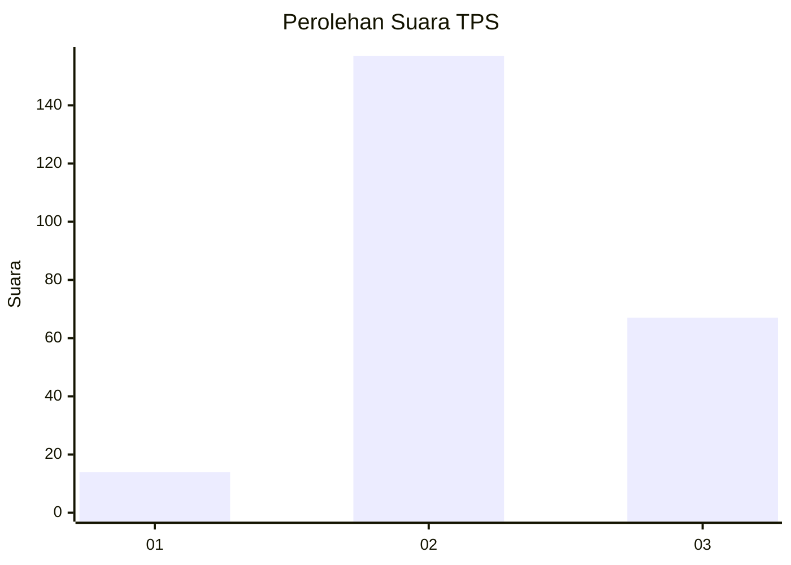
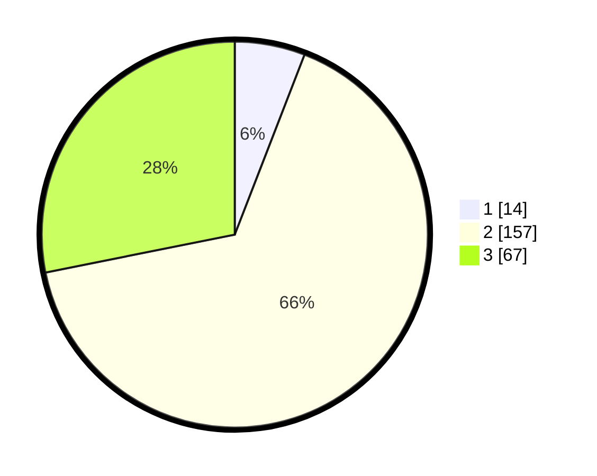

# Hasil

## Grafik

## Tabel

| No. | Nama Paslon    | Suara | Suara (raw) | Persentase |
|:--- |:-------------- | -----:| -----------:| ----------:|
| 1   | ANIES MUHAIMIN | 14    | [14][p-1]   | 5,88       |
| 2   | PRABOWO GIBRAN | 157   | [157][p-2]  | 65,97      |
| 3   | GANJAR MAHFUD  | 67    | [67][p-3]   | 28,15      |

[p-1]: https://github.com/gigit-pemilu/pemilu-2024/blob/main/pilpres/hitung-suara/sub/35-jawa-timur/sub/03-trenggalek/sub/11-trenggalek/sub/1006-surodakan/sub/018-tps/sub/paslon-1.txt
[p-2]: https://github.com/gigit-pemilu/pemilu-2024/blob/main/pilpres/hitung-suara/sub/35-jawa-timur/sub/03-trenggalek/sub/11-trenggalek/sub/1006-surodakan/sub/018-tps/sub/paslon-2.txt
[p-3]: https://github.com/gigit-pemilu/pemilu-2024/blob/main/pilpres/hitung-suara/sub/35-jawa-timur/sub/03-trenggalek/sub/11-trenggalek/sub/1006-surodakan/sub/018-tps/sub/paslon-3.txt

## Foto C Plano

https://sirekap-obj-formc.kpu.go.id/fef2/pemilu/ppwp/35/03/11/10/06/3503111006018-20240216-173340--8b7c41f8-1ed9-4601-af94-98c75c60d35f.jpg

https://sirekap-obj-formc.kpu.go.id/fef2/pemilu/ppwp/35/03/11/10/06/3503111006018-20240216-173508--2ef78551-1573-450d-8602-91260afacdb0.jpg

https://sirekap-obj-formc.kpu.go.id/fef2/pemilu/ppwp/35/03/11/10/06/3503111006018-20240216-172735--bf0539d0-8cd3-458a-b3b4-7425c7f12b3e.jpg

## Metadata

| Key        | Value               |
| ---------- | ------------------- |
| Time Stamp | 2024-02-17 18:00:00 |

