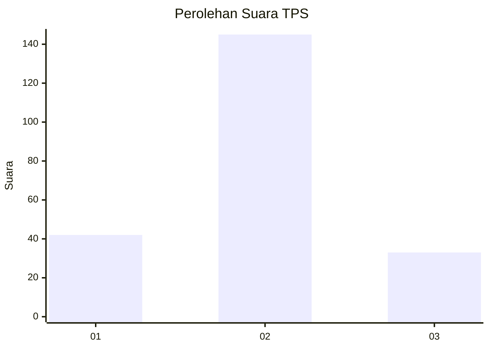
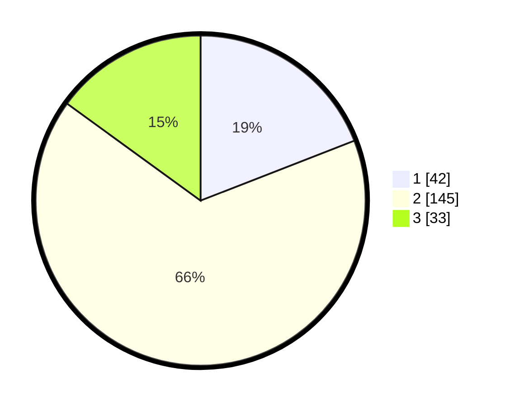

# Hasil

## Grafik

## Tabel

| No. | Nama Paslon    | Suara | Suara (raw) | Persentase |
|:--- |:-------------- | -----:| -----------:| ----------:|
| 1   | ANIES MUHAIMIN | 42    | [42][p-1]   | 19,09      |
| 2   | PRABOWO GIBRAN | 145   | [145][p-2]  | 65,91      |
| 3   | GANJAR MAHFUD  | 33    | [33][p-3]   | 15,00      |

[p-1]: https://github.com/gigit-pemilu/pemilu-2024/blob/main/pilpres/hitung-suara/sub/35-jawa-timur/sub/03-trenggalek/sub/11-trenggalek/sub/1007-sumbergedong/sub/014-tps/sub/paslon-1.txt
[p-2]: https://github.com/gigit-pemilu/pemilu-2024/blob/main/pilpres/hitung-suara/sub/35-jawa-timur/sub/03-trenggalek/sub/11-trenggalek/sub/1007-sumbergedong/sub/014-tps/sub/paslon-2.txt
[p-3]: https://github.com/gigit-pemilu/pemilu-2024/blob/main/pilpres/hitung-suara/sub/35-jawa-timur/sub/03-trenggalek/sub/11-trenggalek/sub/1007-sumbergedong/sub/014-tps/sub/paslon-3.txt

## Foto C Plano

https://sirekap-obj-formc.kpu.go.id/92c3/pemilu/ppwp/35/03/11/10/07/3503111007014-20240214-155751--1165fc56-945b-49c6-9525-3d9e509f8ef4.jpg

https://sirekap-obj-formc.kpu.go.id/92c3/pemilu/ppwp/35/03/11/10/07/3503111007014-20240214-155549--2fe5c7b8-f5e8-4dd1-8180-e205c7f2d0e7.jpg

https://sirekap-obj-formc.kpu.go.id/92c3/pemilu/ppwp/35/03/11/10/07/3503111007014-20240214-155249--06d5ec7c-06d4-43eb-b2ee-0f7df63000a3.jpg

## Metadata

| Key        | Value               |
| ---------- | ------------------- |
| Time Stamp | 2024-02-15 05:00:24 |

