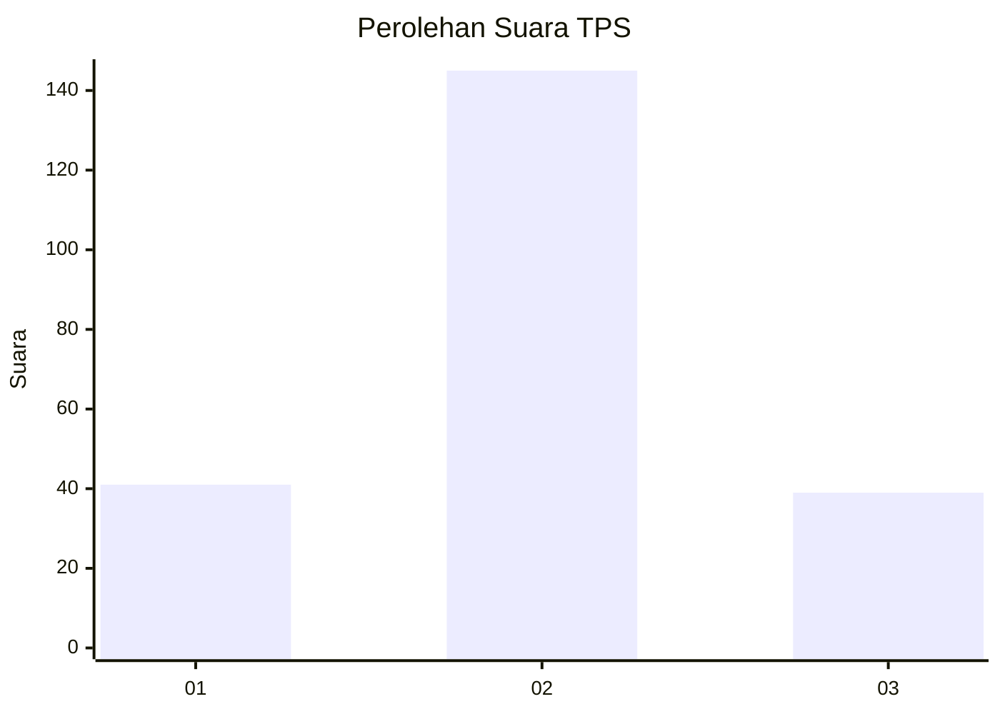
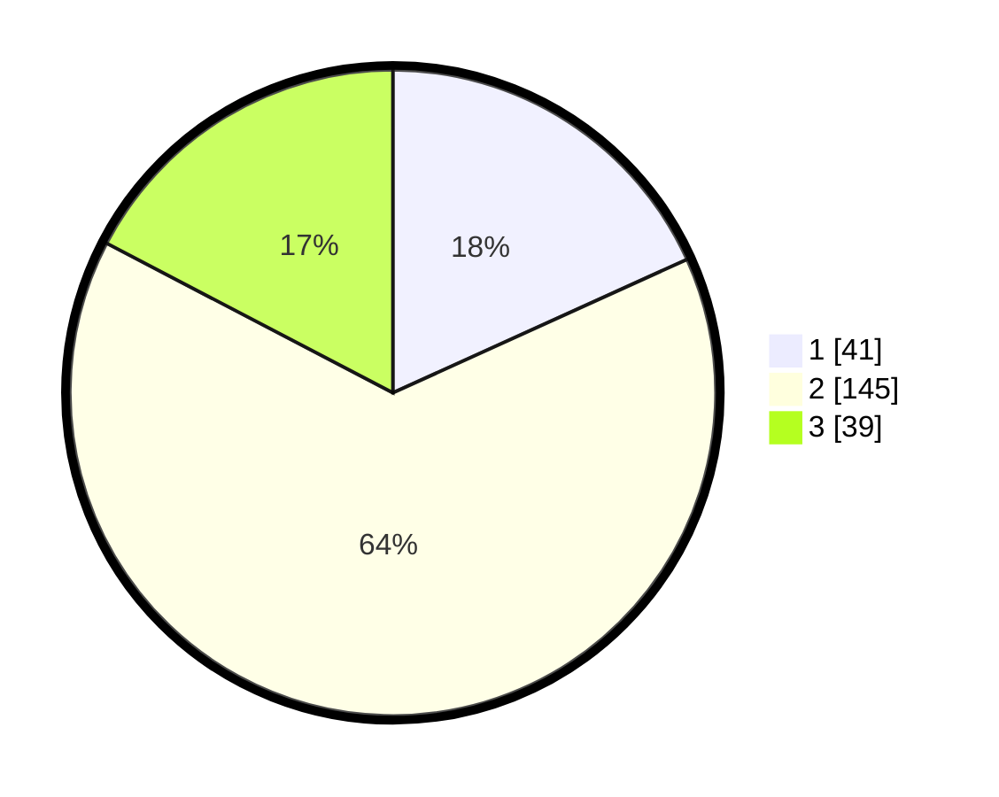

# Hasil

## Grafik

## Tabel

| No. | Nama Paslon    | Suara | Suara (raw) | Persentase |
|:--- |:-------------- | -----:| -----------:| ----------:|
| 1   | ANIES MUHAIMIN | 41    | [41][p-1]   | 18,22      |
| 2   | PRABOWO GIBRAN | 145   | [145][p-2]  | 64,44      |
| 3   | GANJAR MAHFUD  | 39    | [39][p-3]   | 17,33      |

[p-1]: https://github.com/gigit-pemilu/pemilu-2024-35-jawa-timur/blob/main/pilpres/hitung-suara/sub/35-jawa-timur/sub/03-trenggalek/sub/11-trenggalek/sub/1007-sumbergedong/sub/016-tps/sub/paslon-1.txt
[p-2]: https://github.com/gigit-pemilu/pemilu-2024-35-jawa-timur/blob/main/pilpres/hitung-suara/sub/35-jawa-timur/sub/03-trenggalek/sub/11-trenggalek/sub/1007-sumbergedong/sub/016-tps/sub/paslon-2.txt
[p-3]: https://github.com/gigit-pemilu/pemilu-2024-35-jawa-timur/blob/main/pilpres/hitung-suara/sub/35-jawa-timur/sub/03-trenggalek/sub/11-trenggalek/sub/1007-sumbergedong/sub/016-tps/sub/paslon-3.txt

## Foto C Plano

https://sirekap-obj-formc.kpu.go.id/6a33/pemilu/ppwp/35/03/11/10/07/3503111007016-20240219-083728--6a101846-8016-46d6-a413-d2a1226bd3f4.jpg

https://sirekap-obj-formc.kpu.go.id/6a33/pemilu/ppwp/35/03/11/10/07/3503111007016-20240215-094721--7b675a5a-ec61-400b-89ab-dbb0fa785ecb.jpg

https://sirekap-obj-formc.kpu.go.id/6a33/pemilu/ppwp/35/03/11/10/07/3503111007016-20240219-084339--d31e1933-0397-4a25-bf49-6f9a20930816.jpg

## Metadata

| Key        | Value               |
| ---------- | ------------------- |
| Time Stamp | 2024-02-19 09:00:00 |

