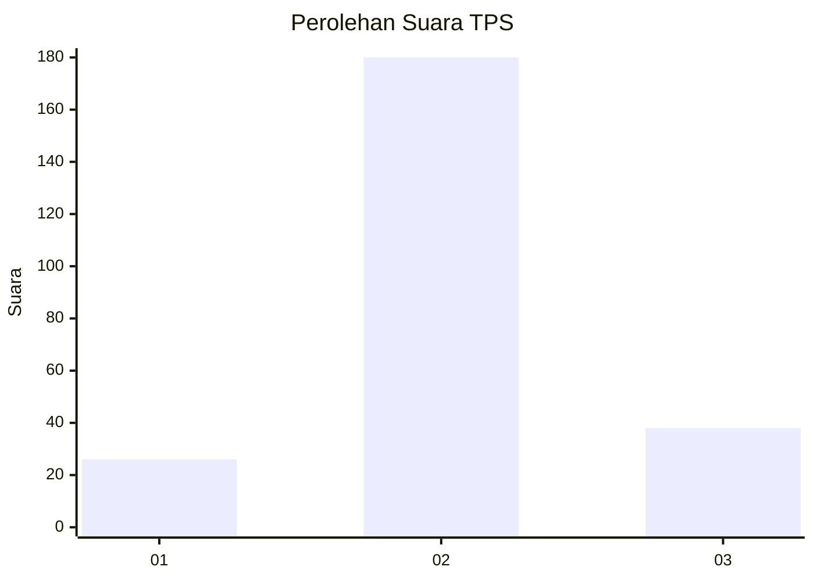
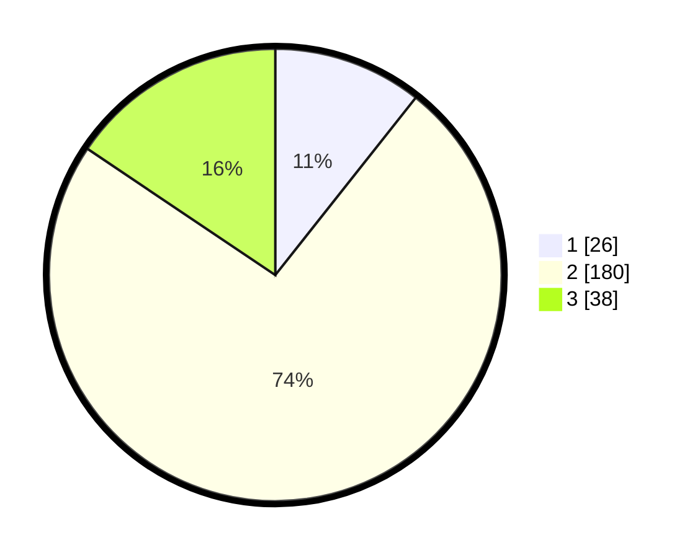

# Hasil

## Grafik

## Tabel

| No. | Nama Paslon    | Suara | Suara (raw) | Persentase |
|:--- |:-------------- | -----:| -----------:| ----------:|
| 1   | ANIES MUHAIMIN | 26    | [26][p-1]   | 10,66      |
| 2   | PRABOWO GIBRAN | 180   | [180][p-2]  | 73,77      |
| 3   | GANJAR MAHFUD  | 38    | [38][p-3]   | 15,57      |

[p-1]: https://github.com/gigit-pemilu/pemilu-2024/blob/main/pilpres/hitung-suara/sub/35-jawa-timur/sub/03-trenggalek/sub/11-trenggalek/sub/2001-ngares/sub/003-tps/sub/paslon-1.txt
[p-2]: https://github.com/gigit-pemilu/pemilu-2024/blob/main/pilpres/hitung-suara/sub/35-jawa-timur/sub/03-trenggalek/sub/11-trenggalek/sub/2001-ngares/sub/003-tps/sub/paslon-2.txt
[p-3]: https://github.com/gigit-pemilu/pemilu-2024/blob/main/pilpres/hitung-suara/sub/35-jawa-timur/sub/03-trenggalek/sub/11-trenggalek/sub/2001-ngares/sub/003-tps/sub/paslon-3.txt

## Foto C Plano

https://sirekap-obj-formc.kpu.go.id/231b/pemilu/ppwp/35/03/11/20/01/3503112001003-20240216-230039--ed143ff4-8342-4acd-a247-fb5d08ab8233.jpg

https://sirekap-obj-formc.kpu.go.id/231b/pemilu/ppwp/35/03/11/20/01/3503112001003-20240215-162710--076f67cb-6e75-4b97-a332-1c07de3d6cfa.jpg

https://sirekap-obj-formc.kpu.go.id/231b/pemilu/ppwp/35/03/11/20/01/3503112001003-20240215-162748--29edb2d4-9d77-4f54-9acf-376bb960f7c3.jpg

## Metadata

| Key        | Value               |
| ---------- | ------------------- |
| Time Stamp | 2024-02-25 14:00:00 |

