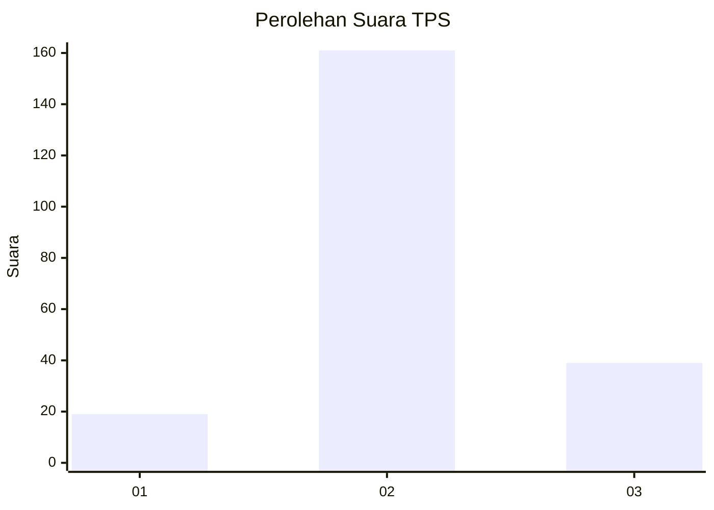

# Hasil

## Grafik

## Tabel

| No. | Nama Paslon    | Suara | Suara (raw) | Persentase |
|:--- |:-------------- | -----:| -----------:| ----------:|
| 1   | ANIES MUHAIMIN | 19    | [19][p-1]   | 8,68       |
| 2   | PRABOWO GIBRAN | 161   | [161][p-2]  | 73,52      |
| 3   | GANJAR MAHFUD  | 39    | [39][p-3]   | 17,81      |

[p-1]: https://github.com/gigit-pemilu/pemilu-2024/blob/main/pilpres/hitung-suara/sub/35-jawa-timur/sub/03-trenggalek/sub/11-trenggalek/sub/2001-ngares/sub/012-tps/sub/paslon-1.txt
[p-2]: https://github.com/gigit-pemilu/pemilu-2024/blob/main/pilpres/hitung-suara/sub/35-jawa-timur/sub/03-trenggalek/sub/11-trenggalek/sub/2001-ngares/sub/012-tps/sub/paslon-2.txt
[p-3]: https://github.com/gigit-pemilu/pemilu-2024/blob/main/pilpres/hitung-suara/sub/35-jawa-timur/sub/03-trenggalek/sub/11-trenggalek/sub/2001-ngares/sub/012-tps/sub/paslon-3.txt

## Foto C Plano

https://sirekap-obj-formc.kpu.go.id/a219/pemilu/ppwp/35/03/11/20/01/3503112001012-20240218-172205--3eebb708-9656-4bab-9af8-69380e13fbc2.jpg

https://sirekap-obj-formc.kpu.go.id/a219/pemilu/ppwp/35/03/11/20/01/3503112001012-20240218-163138--cfa7a393-4519-4249-88ca-9aa905398a9f.jpg

https://sirekap-obj-formc.kpu.go.id/a219/pemilu/ppwp/35/03/11/20/01/3503112001012-20240218-163250--8d040afc-ed67-43a5-971d-7ea573465170.jpg

## Metadata

| Key        | Value               |
| ---------- | ------------------- |
| Time Stamp | 2024-02-20 12:00:00 |

## DATA PEMILIH TETAP

Jumlah pemilih dalam DPT: **555**.
 * L: **563**.
 * P: **525**.

## DATA PENGGUNA HAK PILIH

Jumlah pengguna hak pilih dalam DPT: **446**.
 * L: **544**.
 * P: **464**.

Jumlah pengguna hak pilih dalam DPTb: **322**.
 * L: **323**.
 * P: **522**.

Jumlah pengguna hak pilih dalam DPK: **555**.
 * L: **444**.
 * P: **424**.

Jumlah pengguna hak pilih: **82**.
 * L: **655**.
 * P: **503**.

## JUMLAH SUARA SAH DAN TIDAK SAH

JUMLAH SELURUH SUARA SAH: **213**.

JUMLAH SUARA TIDAK SAH: **9**.

JUMLAH SELURUH SUARA SAH DAN SUARA TIDAK SAH: **222**.

