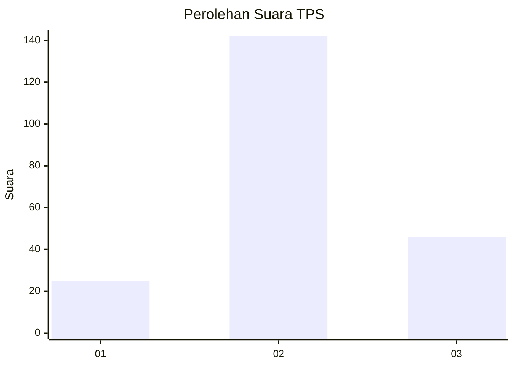
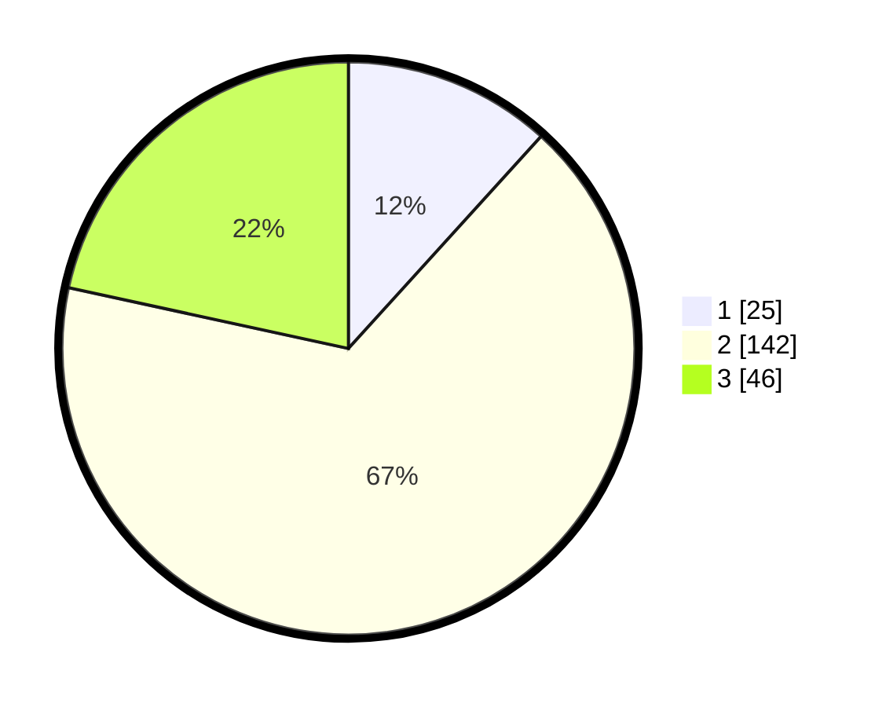

# Hasil

## Grafik

## Tabel

| No. | Nama Paslon    | Suara | Suara (raw) | Persentase |
|:--- |:-------------- | -----:| -----------:| ----------:|
| 1   | ANIES MUHAIMIN | 25    | [25][p-1]   | 11,74      |
| 2   | PRABOWO GIBRAN | 142   | [142][p-2]  | 66,67      |
| 3   | GANJAR MAHFUD  | 46    | [46][p-3]   | 21,60      |

[p-1]: https://github.com/gigit-pemilu/pemilu-2024/blob/main/pilpres/hitung-suara/sub/35-jawa-timur/sub/03-trenggalek/sub/11-trenggalek/sub/2004-karangsoko/sub/003-tps/sub/paslon-1.txt
[p-2]: https://github.com/gigit-pemilu/pemilu-2024/blob/main/pilpres/hitung-suara/sub/35-jawa-timur/sub/03-trenggalek/sub/11-trenggalek/sub/2004-karangsoko/sub/003-tps/sub/paslon-2.txt
[p-3]: https://github.com/gigit-pemilu/pemilu-2024/blob/main/pilpres/hitung-suara/sub/35-jawa-timur/sub/03-trenggalek/sub/11-trenggalek/sub/2004-karangsoko/sub/003-tps/sub/paslon-3.txt

## Foto C Plano

https://sirekap-obj-formc.kpu.go.id/0d12/pemilu/ppwp/35/03/11/20/04/3503112004003-20240215-092533--1d9541bb-61bc-4c13-8edf-a04b06c07f52.jpg

https://sirekap-obj-formc.kpu.go.id/0d12/pemilu/ppwp/35/03/11/20/04/3503112004003-20240215-092712--86a9d26f-6122-488d-8a1e-03749102f359.jpg

https://sirekap-obj-formc.kpu.go.id/0d12/pemilu/ppwp/35/03/11/20/04/3503112004003-20240215-092801--81ad7f79-2044-4a1e-a3ba-afffcd779c4f.jpg

## Metadata

| Key        | Value               |
| ---------- | ------------------- |
| Time Stamp | 2024-02-15 22:40:13 |

