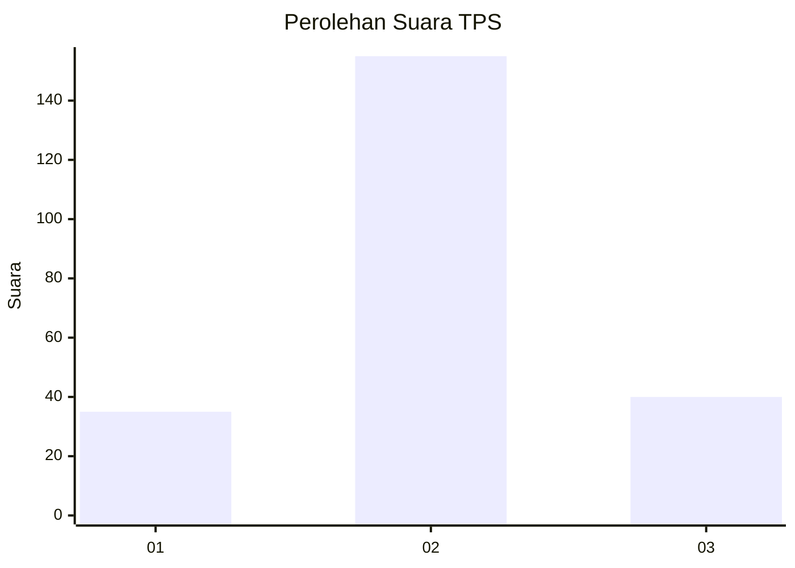
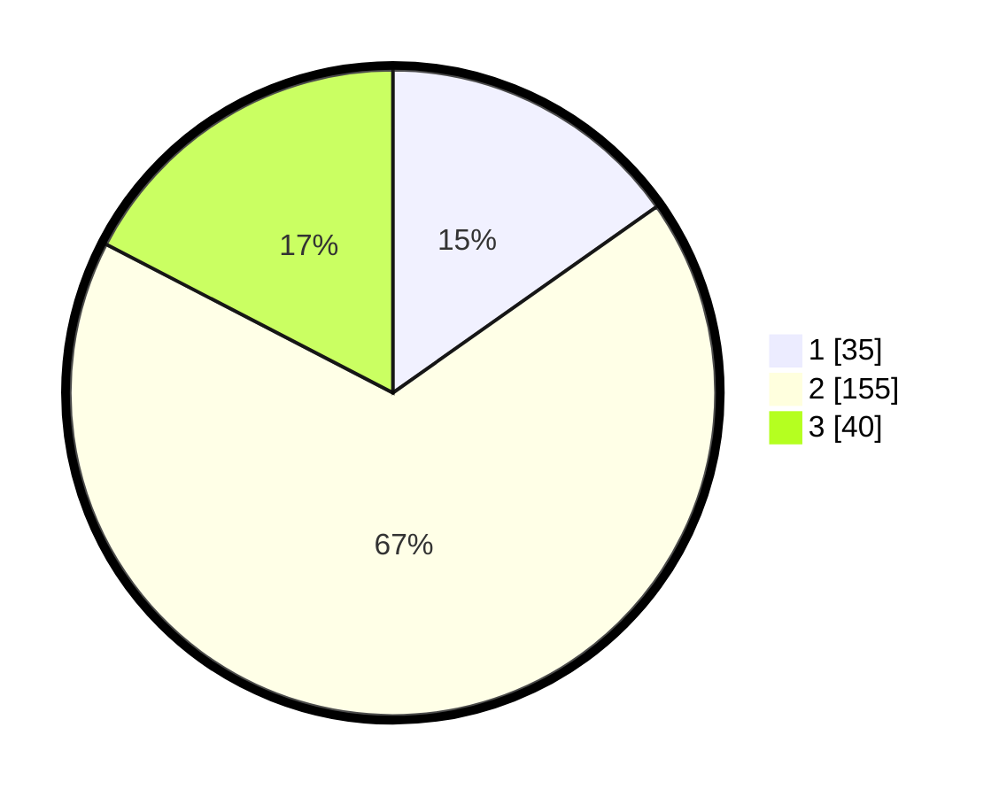

# Hasil

## Grafik

## Tabel

| No. | Nama Paslon    | Suara | Suara (raw) | Persentase |
|:--- |:-------------- | -----:| -----------:| ----------:|
| 1   | ANIES MUHAIMIN | 35    | [35][p-1]   | 15,22      |
| 2   | PRABOWO GIBRAN | 155   | [155][p-2]  | 67,39      |
| 3   | GANJAR MAHFUD  | 40    | [40][p-3]   | 17,39      |

[p-1]: https://github.com/gigit-pemilu/pemilu-2024/blob/main/pilpres/hitung-suara/sub/35-jawa-timur/sub/03-trenggalek/sub/11-trenggalek/sub/2004-karangsoko/sub/005-tps/sub/paslon-1.txt
[p-2]: https://github.com/gigit-pemilu/pemilu-2024/blob/main/pilpres/hitung-suara/sub/35-jawa-timur/sub/03-trenggalek/sub/11-trenggalek/sub/2004-karangsoko/sub/005-tps/sub/paslon-2.txt
[p-3]: https://github.com/gigit-pemilu/pemilu-2024/blob/main/pilpres/hitung-suara/sub/35-jawa-timur/sub/03-trenggalek/sub/11-trenggalek/sub/2004-karangsoko/sub/005-tps/sub/paslon-3.txt

## Foto C Plano

https://sirekap-obj-formc.kpu.go.id/e0f4/pemilu/ppwp/35/03/11/20/04/3503112004005-20240223-195356--50f2e814-6bfb-454d-ad3c-2998f9b82ce6.jpg

https://sirekap-obj-formc.kpu.go.id/e0f4/pemilu/ppwp/35/03/11/20/04/3503112004005-20240214-232350--2ef37ad4-730c-4274-b7c5-5ba5a123b537.jpg

https://sirekap-obj-formc.kpu.go.id/e0f4/pemilu/ppwp/35/03/11/20/04/3503112004005-20240214-232455--b0371dae-d972-4cba-922a-c485f9f95e0b.jpg

## Metadata

| Key        | Value               |
| ---------- | ------------------- |
| Time Stamp | 2024-02-24 22:31:28 |

