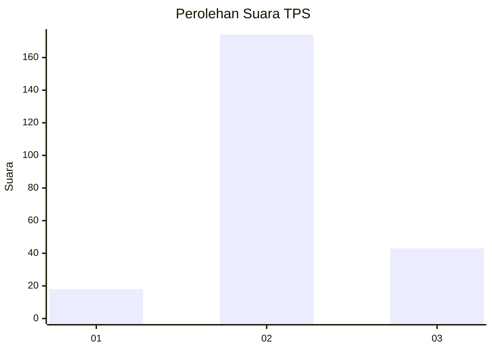
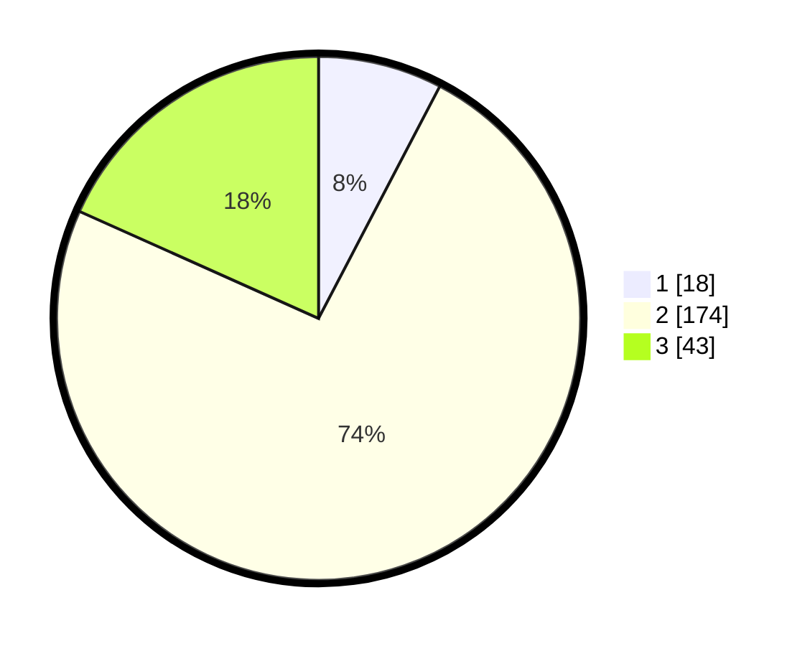

# Hasil

## Grafik

## Tabel

| No. | Nama Paslon    | Suara | Suara (raw) | Persentase |
|:--- |:-------------- | -----:| -----------:| ----------:|
| 1   | ANIES MUHAIMIN | 18    | [18][p-1]   | 7,66       |
| 2   | PRABOWO GIBRAN | 174   | [174][p-2]  | 74,04      |
| 3   | GANJAR MAHFUD  | 43    | [43][p-3]   | 18,30      |

[p-1]: https://github.com/gigit-pemilu/pemilu-2024/blob/main/pilpres/hitung-suara/sub/35-jawa-timur/sub/03-trenggalek/sub/11-trenggalek/sub/2004-karangsoko/sub/013-tps/sub/paslon-1.txt
[p-2]: https://github.com/gigit-pemilu/pemilu-2024/blob/main/pilpres/hitung-suara/sub/35-jawa-timur/sub/03-trenggalek/sub/11-trenggalek/sub/2004-karangsoko/sub/013-tps/sub/paslon-2.txt
[p-3]: https://github.com/gigit-pemilu/pemilu-2024/blob/main/pilpres/hitung-suara/sub/35-jawa-timur/sub/03-trenggalek/sub/11-trenggalek/sub/2004-karangsoko/sub/013-tps/sub/paslon-3.txt

## Foto C Plano

https://sirekap-obj-formc.kpu.go.id/9521/pemilu/ppwp/35/03/11/20/04/3503112004013-20240216-191444--bb240624-8a3b-4b69-9554-69d7b10fb752.jpg

https://sirekap-obj-formc.kpu.go.id/9521/pemilu/ppwp/35/03/11/20/04/3503112004013-20240216-191255--b14217f0-a965-4381-a4de-17f5cb8f4a94.jpg

https://sirekap-obj-formc.kpu.go.id/9521/pemilu/ppwp/35/03/11/20/04/3503112004013-20240214-194200--987ca013-ff88-40c0-addb-5c4be505e42e.jpg

## Metadata

| Key        | Value               |
| ---------- | ------------------- |
| Time Stamp | 2024-02-21 19:00:00 |

