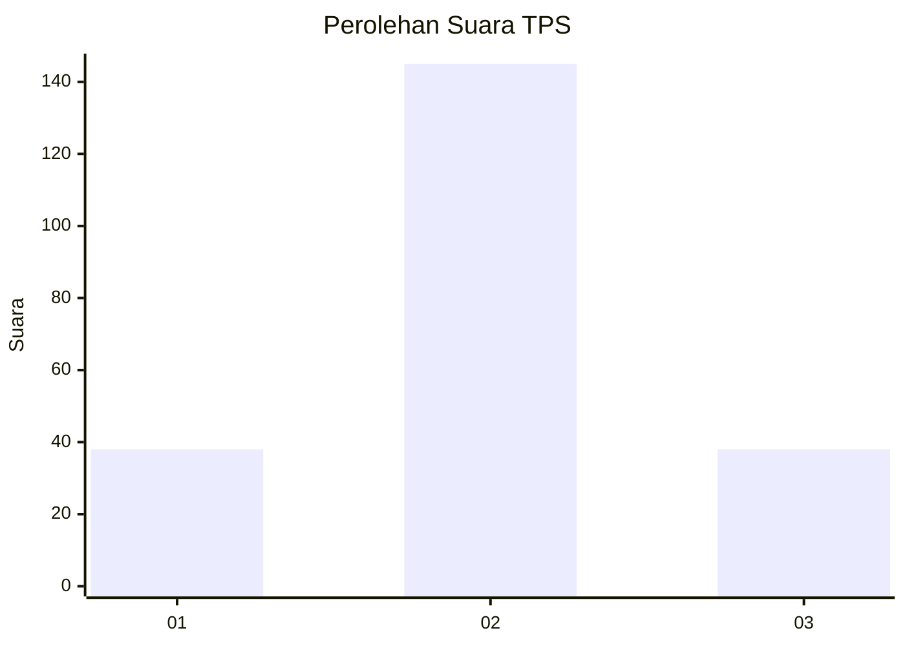
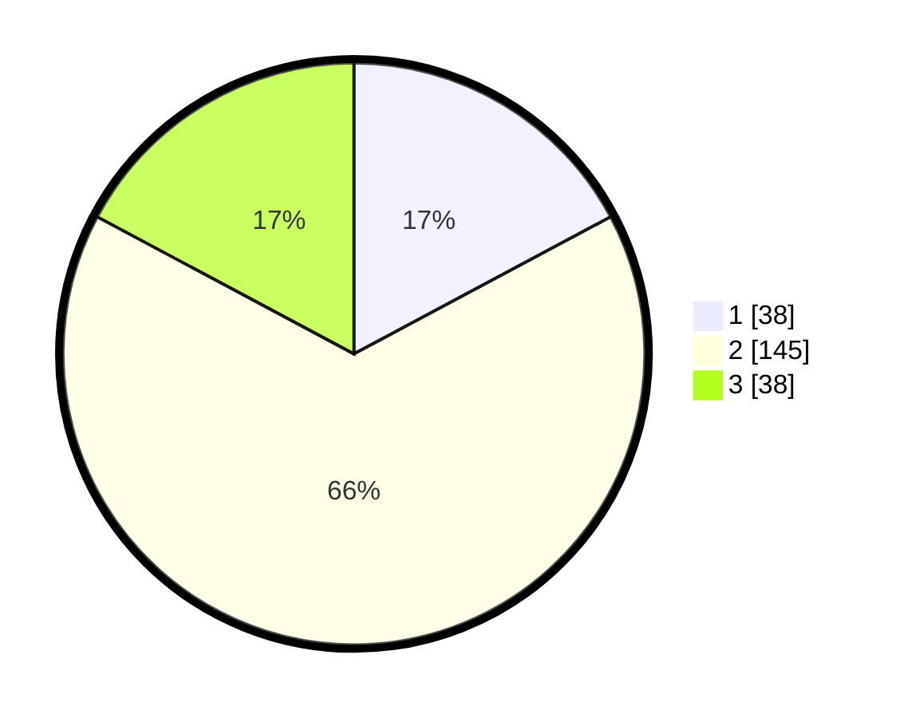

# Hasil

## Grafik

## Tabel

| No. | Nama Paslon    | Suara | Suara (raw) | Persentase |
|:--- |:-------------- | -----:| -----------:| ----------:|
| 1   | ANIES MUHAIMIN | 38    | [38][p-1]   | 17,19      |
| 2   | PRABOWO GIBRAN | 145   | [145][p-2]  | 65,61      |
| 3   | GANJAR MAHFUD  | 38    | [38][p-3]   | 17,19      |

[p-1]: https://github.com/gigit-pemilu/pemilu-2024/blob/main/pilpres/hitung-suara/sub/35-jawa-timur/sub/03-trenggalek/sub/11-trenggalek/sub/2004-karangsoko/sub/016-tps/sub/paslon-1.txt
[p-2]: https://github.com/gigit-pemilu/pemilu-2024/blob/main/pilpres/hitung-suara/sub/35-jawa-timur/sub/03-trenggalek/sub/11-trenggalek/sub/2004-karangsoko/sub/016-tps/sub/paslon-2.txt
[p-3]: https://github.com/gigit-pemilu/pemilu-2024/blob/main/pilpres/hitung-suara/sub/35-jawa-timur/sub/03-trenggalek/sub/11-trenggalek/sub/2004-karangsoko/sub/016-tps/sub/paslon-3.txt

## Foto C Plano

https://sirekap-obj-formc.kpu.go.id/b87b/pemilu/ppwp/35/03/11/20/04/3503112004016-20240217-192812--6f2f5d7c-5c61-4eae-b390-a086adead42d.jpg

https://sirekap-obj-formc.kpu.go.id/b87b/pemilu/ppwp/35/03/11/20/04/3503112004016-20240214-203125--7b9701fb-b864-45f6-941e-1b0302b30753.jpg

https://sirekap-obj-formc.kpu.go.id/b87b/pemilu/ppwp/35/03/11/20/04/3503112004016-20240214-230511--d4cfd4a6-59dc-4ecb-acd9-71655da93c36.jpg

## Metadata

| Key        | Value               |
| ---------- | ------------------- |
| Time Stamp | 2024-02-19 06:16:00 |

