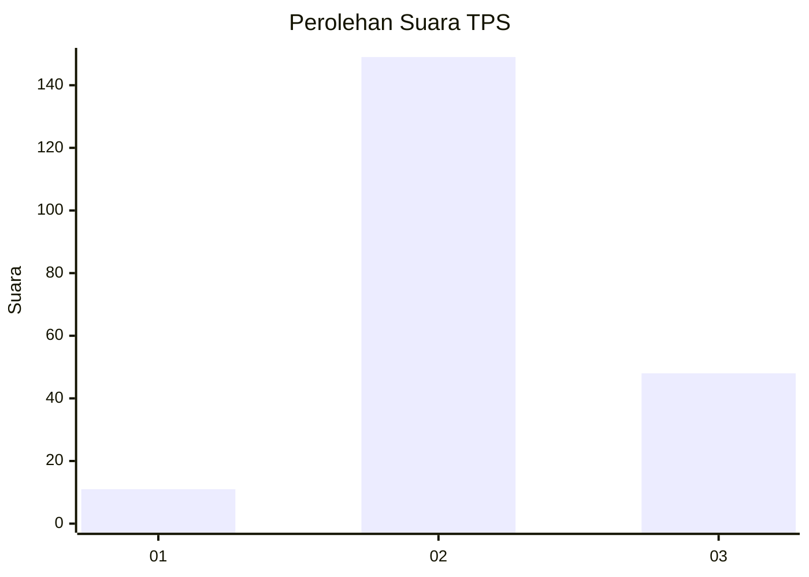
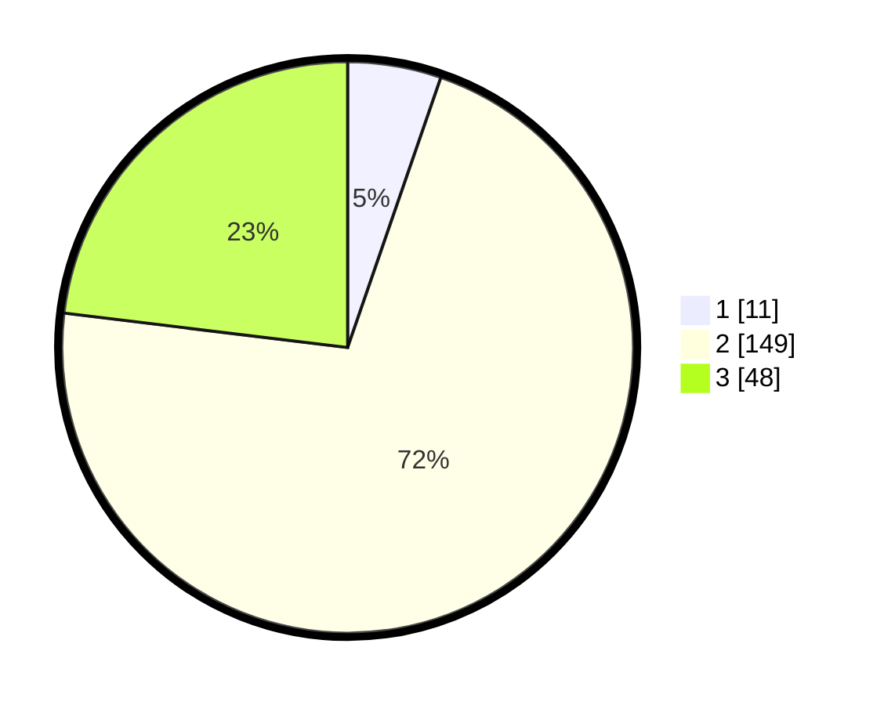

# Hasil

## Grafik

## Tabel

| No. | Nama Paslon    | Suara | Suara (raw) | Persentase |
|:--- |:-------------- | -----:| -----------:| ----------:|
| 1   | ANIES MUHAIMIN | 11    | [11][p-1]   | 5,29       |
| 2   | PRABOWO GIBRAN | 149   | [149][p-2]  | 71,63      |
| 3   | GANJAR MAHFUD  | 48    | [48][p-3]   | 23,08      |

[p-1]: https://github.com/gigit-pemilu/pemilu-2024-35-jawa-timur/blob/main/pilpres/hitung-suara/sub/35-jawa-timur/sub/03-trenggalek/sub/11-trenggalek/sub/2009-sumberdadi/sub/002-tps/sub/paslon-1.txt
[p-2]: https://github.com/gigit-pemilu/pemilu-2024-35-jawa-timur/blob/main/pilpres/hitung-suara/sub/35-jawa-timur/sub/03-trenggalek/sub/11-trenggalek/sub/2009-sumberdadi/sub/002-tps/sub/paslon-2.txt
[p-3]: https://github.com/gigit-pemilu/pemilu-2024-35-jawa-timur/blob/main/pilpres/hitung-suara/sub/35-jawa-timur/sub/03-trenggalek/sub/11-trenggalek/sub/2009-sumberdadi/sub/002-tps/sub/paslon-3.txt

## Foto C Plano

https://sirekap-obj-formc.kpu.go.id/ffdd/pemilu/ppwp/35/03/11/20/09/3503112009002-20240219-210005--9e185a3b-2532-4118-8cd2-c4f7b02f63bf.jpg

https://sirekap-obj-formc.kpu.go.id/ffdd/pemilu/ppwp/35/03/11/20/09/3503112009002-20240219-205021--6764af12-9db3-449a-a6b9-143869db0bb0.jpg

https://sirekap-obj-formc.kpu.go.id/ffdd/pemilu/ppwp/35/03/11/20/09/3503112009002-20240219-205256--07af1cf2-2050-4b6e-ad06-c4969ae80925.jpg

## Metadata

| Key        | Value               |
| ---------- | ------------------- |
| Time Stamp | 2024-02-25 14:00:00 |

