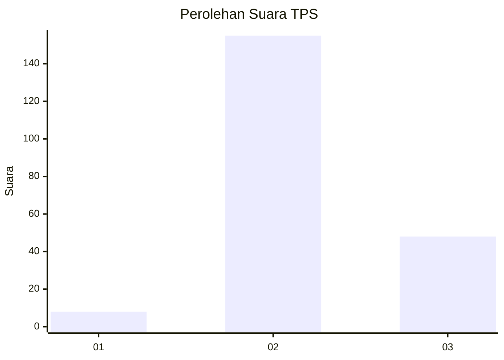
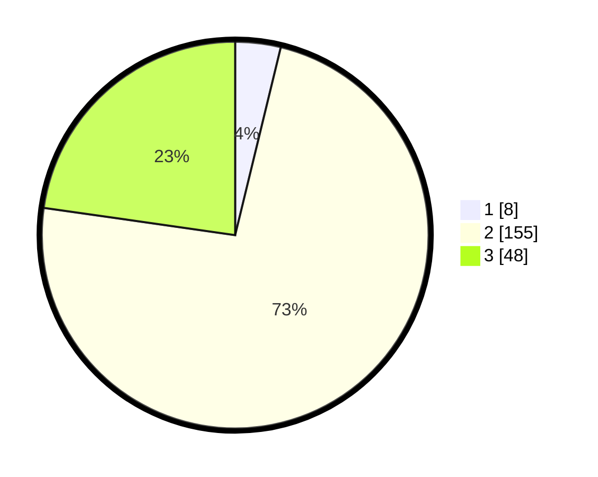

# Hasil

## Grafik

## Tabel

| No. | Nama Paslon    | Suara | Suara (raw) | Persentase |
|:--- |:-------------- | -----:| -----------:| ----------:|
| 1   | ANIES MUHAIMIN | 8     | [8][p-1]    | 3,79       |
| 2   | PRABOWO GIBRAN | 155   | [155][p-2]  | 73,46      |
| 3   | GANJAR MAHFUD  | 48    | [48][p-3]   | 22,75      |

[p-1]: https://github.com/gigit-pemilu/pemilu-2024/blob/main/pilpres/hitung-suara/sub/35-jawa-timur/sub/03-trenggalek/sub/11-trenggalek/sub/2009-sumberdadi/sub/004-tps/sub/paslon-1.txt
[p-2]: https://github.com/gigit-pemilu/pemilu-2024/blob/main/pilpres/hitung-suara/sub/35-jawa-timur/sub/03-trenggalek/sub/11-trenggalek/sub/2009-sumberdadi/sub/004-tps/sub/paslon-2.txt
[p-3]: https://github.com/gigit-pemilu/pemilu-2024/blob/main/pilpres/hitung-suara/sub/35-jawa-timur/sub/03-trenggalek/sub/11-trenggalek/sub/2009-sumberdadi/sub/004-tps/sub/paslon-3.txt

## Foto C Plano

https://sirekap-obj-formc.kpu.go.id/3008/pemilu/ppwp/35/03/11/20/09/3503112009004-20240216-113730--b0f42b0e-dba5-48b7-9f3d-711852d7e064.jpg

https://sirekap-obj-formc.kpu.go.id/3008/pemilu/ppwp/35/03/11/20/09/3503112009004-20240216-113734--07bd4918-5aab-4687-b6de-eb2a5ec9a810.jpg

https://sirekap-obj-formc.kpu.go.id/3008/pemilu/ppwp/35/03/11/20/09/3503112009004-20240216-114724--d34619df-7073-48b9-b07f-cc1628c083ab.jpg

## Metadata

| Key        | Value               |
| ---------- | ------------------- |
| Time Stamp | 2024-02-24 22:31:28 |

