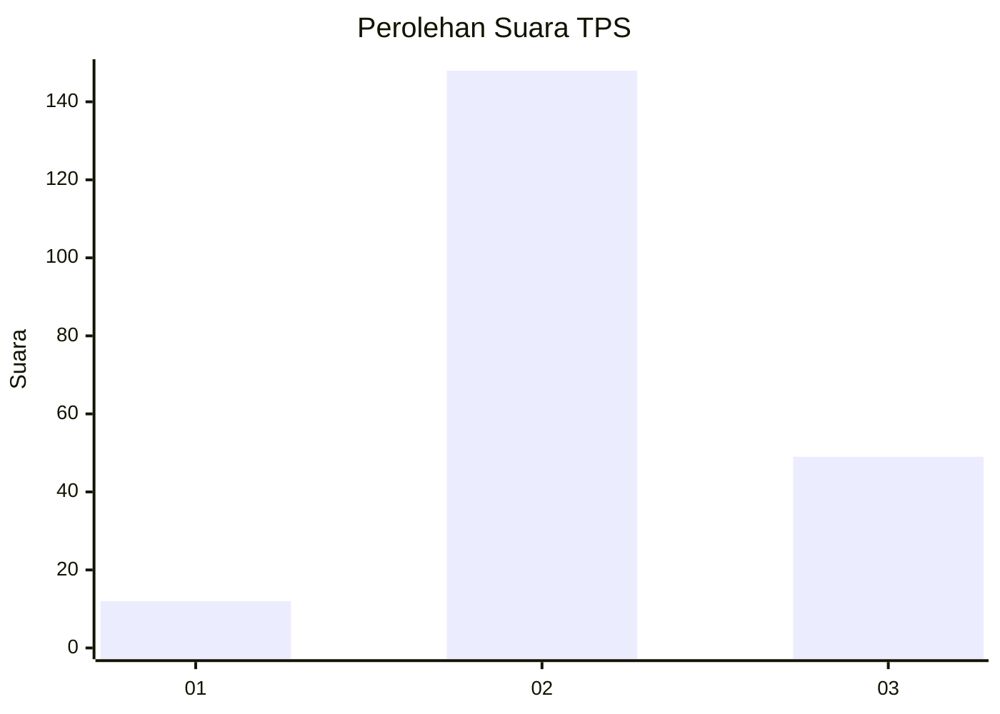
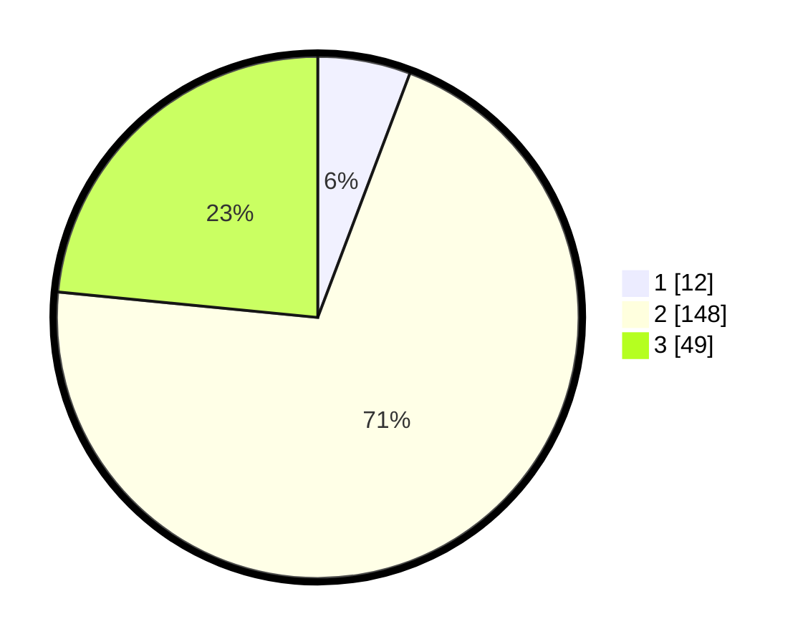

# Hasil

## Grafik

## Tabel

| No. | Nama Paslon    | Suara | Suara (raw) | Persentase |
|:--- |:-------------- | -----:| -----------:| ----------:|
| 1   | ANIES MUHAIMIN | 12    | [12][p-1]   | 5,74       |
| 2   | PRABOWO GIBRAN | 148   | [148][p-2]  | 70,81      |
| 3   | GANJAR MAHFUD  | 49    | [49][p-3]   | 23,44      |

[p-1]: https://github.com/gigit-pemilu/pemilu-2024/blob/main/pilpres/hitung-suara/sub/35-jawa-timur/sub/03-trenggalek/sub/11-trenggalek/sub/2009-sumberdadi/sub/008-tps/sub/paslon-1.txt
[p-2]: https://github.com/gigit-pemilu/pemilu-2024/blob/main/pilpres/hitung-suara/sub/35-jawa-timur/sub/03-trenggalek/sub/11-trenggalek/sub/2009-sumberdadi/sub/008-tps/sub/paslon-2.txt
[p-3]: https://github.com/gigit-pemilu/pemilu-2024/blob/main/pilpres/hitung-suara/sub/35-jawa-timur/sub/03-trenggalek/sub/11-trenggalek/sub/2009-sumberdadi/sub/008-tps/sub/paslon-3.txt

## Foto C Plano

https://sirekap-obj-formc.kpu.go.id/a7e4/pemilu/ppwp/35/03/11/20/09/3503112009008-20240214-160058--69f68cd3-f125-43b1-8a5f-6d2b2995b2fb.jpg

https://sirekap-obj-formc.kpu.go.id/a7e4/pemilu/ppwp/35/03/11/20/09/3503112009008-20240214-160125--2d730583-60f1-47ed-836f-45c9afc17b09.jpg

https://sirekap-obj-formc.kpu.go.id/a7e4/pemilu/ppwp/35/03/11/20/09/3503112009008-20240214-155701--c31e0939-1e80-4532-86ff-b769c2ebc66c.jpg

## Metadata

| Key        | Value               |
| ---------- | ------------------- |
| Time Stamp | 2024-02-15 22:00:27 |

