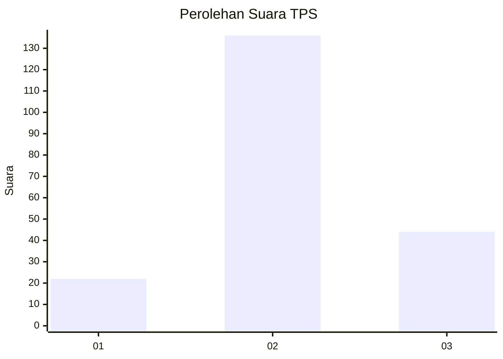
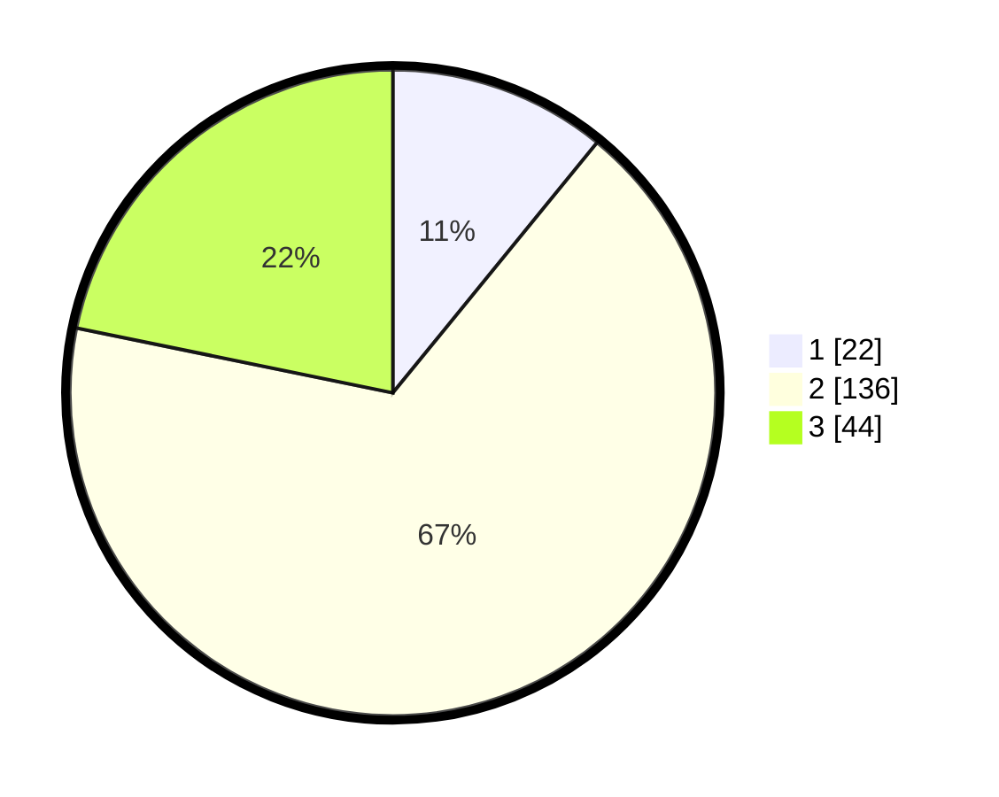

# Hasil

## Grafik

## Tabel

| No. | Nama Paslon    | Suara | Suara (raw) | Persentase |
|:--- |:-------------- | -----:| -----------:| ----------:|
| 1   | ANIES MUHAIMIN | 22    | [22][p-1]   | 10,89      |
| 2   | PRABOWO GIBRAN | 136   | [136][p-2]  | 67,33      |
| 3   | GANJAR MAHFUD  | 44    | [44][p-3]   | 21,78      |

[p-1]: https://github.com/gigit-pemilu/pemilu-2024-35-jawa-timur/blob/main/pilpres/hitung-suara/sub/35-jawa-timur/sub/03-trenggalek/sub/11-trenggalek/sub/2010-rejowinangun/sub/007-tps/sub/paslon-1.txt
[p-2]: https://github.com/gigit-pemilu/pemilu-2024-35-jawa-timur/blob/main/pilpres/hitung-suara/sub/35-jawa-timur/sub/03-trenggalek/sub/11-trenggalek/sub/2010-rejowinangun/sub/007-tps/sub/paslon-2.txt
[p-3]: https://github.com/gigit-pemilu/pemilu-2024-35-jawa-timur/blob/main/pilpres/hitung-suara/sub/35-jawa-timur/sub/03-trenggalek/sub/11-trenggalek/sub/2010-rejowinangun/sub/007-tps/sub/paslon-3.txt

## Foto C Plano

https://sirekap-obj-formc.kpu.go.id/7336/pemilu/ppwp/35/03/11/20/10/3503112010007-20240218-204058--959f4e53-28df-41f6-9d81-7de4dd7492f2.jpg

https://sirekap-obj-formc.kpu.go.id/7336/pemilu/ppwp/35/03/11/20/10/3503112010007-20240218-204248--313d59ce-4cc1-4aab-b921-7e3bf89ef650.jpg

https://sirekap-obj-formc.kpu.go.id/7336/pemilu/ppwp/35/03/11/20/10/3503112010007-20240218-204623--f787bd32-05cb-44dc-89cf-86ba78eebd9f.jpg

## Metadata

| Key        | Value               |
| ---------- | ------------------- |
| Time Stamp | 2024-02-25 18:00:00 |

