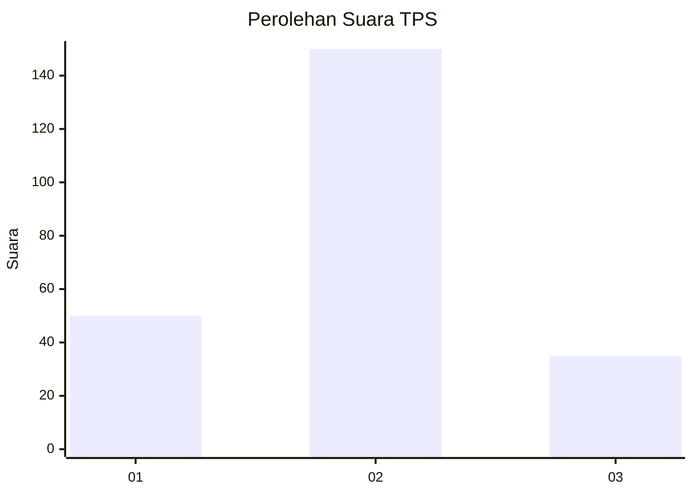
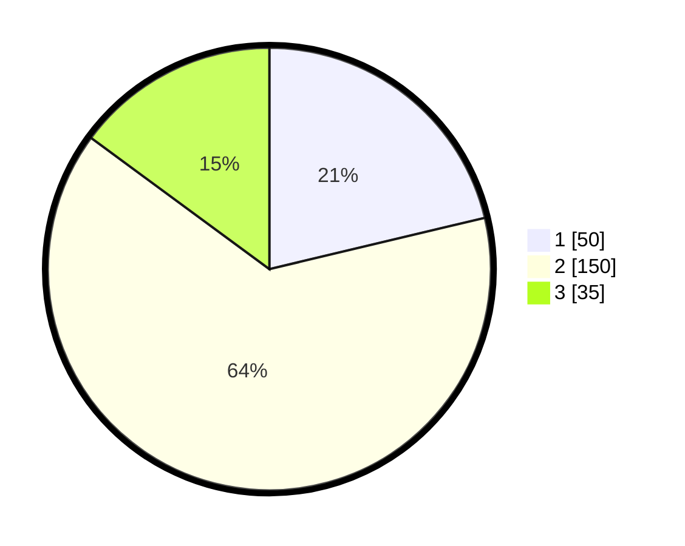

# Hasil

## Grafik

## Tabel

| No. | Nama Paslon    | Suara | Suara (raw) | Persentase |
|:--- |:-------------- | -----:| -----------:| ----------:|
| 1   | ANIES MUHAIMIN | 50    | [50][p-1]   | 21,28      |
| 2   | PRABOWO GIBRAN | 150   | [150][p-2]  | 63,83      |
| 3   | GANJAR MAHFUD  | 35    | [35][p-3]   | 14,89      |

[p-1]: https://github.com/gigit-pemilu/pemilu-2024/blob/main/pilpres/hitung-suara/sub/35-jawa-timur/sub/03-trenggalek/sub/11-trenggalek/sub/2012-parakan/sub/007-tps/sub/paslon-1.txt
[p-2]: https://github.com/gigit-pemilu/pemilu-2024/blob/main/pilpres/hitung-suara/sub/35-jawa-timur/sub/03-trenggalek/sub/11-trenggalek/sub/2012-parakan/sub/007-tps/sub/paslon-2.txt
[p-3]: https://github.com/gigit-pemilu/pemilu-2024/blob/main/pilpres/hitung-suara/sub/35-jawa-timur/sub/03-trenggalek/sub/11-trenggalek/sub/2012-parakan/sub/007-tps/sub/paslon-3.txt

## Foto C Plano

https://sirekap-obj-formc.kpu.go.id/576e/pemilu/ppwp/35/03/11/20/12/3503112012007-20240214-204520--969ccf61-01f7-4ca1-9422-cc684a9f2a88.jpg

https://sirekap-obj-formc.kpu.go.id/576e/pemilu/ppwp/35/03/11/20/12/3503112012007-20240214-201448--8e2c488e-14b4-457d-bb0c-f99c7dbd0082.jpg

https://sirekap-obj-formc.kpu.go.id/576e/pemilu/ppwp/35/03/11/20/12/3503112012007-20240214-201617--2cdf61f4-2d62-434f-94f9-b8f7385126df.jpg

## Metadata

| Key        | Value               |
| ---------- | ------------------- |
| Time Stamp | 2024-02-15 17:30:25 |

