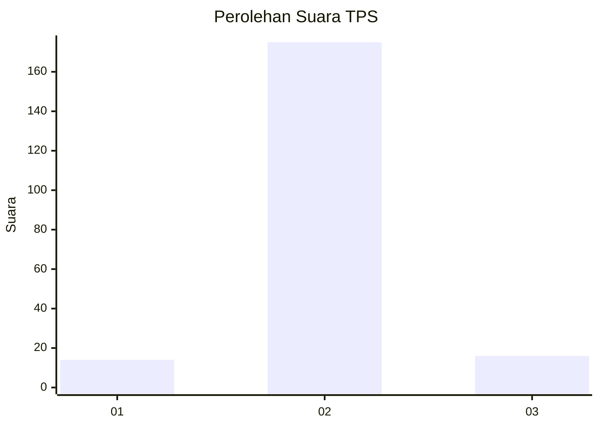
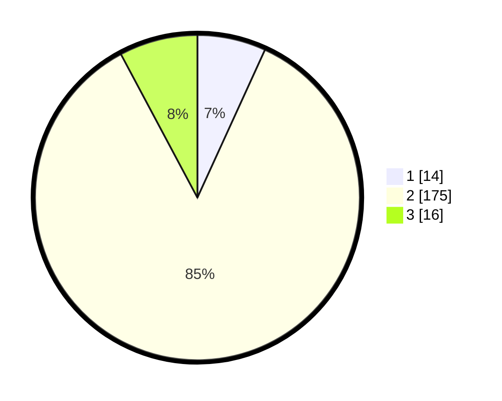

# Hasil

## Grafik

## Tabel

| No. | Nama Paslon    | Suara | Suara (raw) | Persentase |
|:--- |:-------------- | -----:| -----------:| ----------:|
| 1   | ANIES MUHAIMIN | 14    | [14][p-1]   | 6,83       |
| 2   | PRABOWO GIBRAN | 175   | [175][p-2]  | 85,37      |
| 3   | GANJAR MAHFUD  | 16    | [16][p-3]   | 7,80       |

[p-1]: https://github.com/gigit-pemilu/pemilu-2024-35-jawa-timur/blob/main/pilpres/hitung-suara/sub/35-jawa-timur/sub/03-trenggalek/sub/11-trenggalek/sub/2013-dawuhan/sub/007-tps/sub/paslon-1.txt
[p-2]: https://github.com/gigit-pemilu/pemilu-2024-35-jawa-timur/blob/main/pilpres/hitung-suara/sub/35-jawa-timur/sub/03-trenggalek/sub/11-trenggalek/sub/2013-dawuhan/sub/007-tps/sub/paslon-2.txt
[p-3]: https://github.com/gigit-pemilu/pemilu-2024-35-jawa-timur/blob/main/pilpres/hitung-suara/sub/35-jawa-timur/sub/03-trenggalek/sub/11-trenggalek/sub/2013-dawuhan/sub/007-tps/sub/paslon-3.txt

## Foto C Plano

https://sirekap-obj-formc.kpu.go.id/6f9a/pemilu/ppwp/35/03/11/20/13/3503112013007-20240214-202412--3ba0bff5-2326-4275-ab43-1096adaa7275.jpg

https://sirekap-obj-formc.kpu.go.id/6f9a/pemilu/ppwp/35/03/11/20/13/3503112013007-20240214-202518--cdc21fe9-c9e9-4229-85d4-34783f965e93.jpg

https://sirekap-obj-formc.kpu.go.id/6f9a/pemilu/ppwp/35/03/11/20/13/3503112013007-20240214-210509--8bf69578-df9a-4abc-803f-2427fe313b6e.jpg

## Metadata

| Key        | Value               |
| ---------- | ------------------- |
| Time Stamp | 2024-02-15 21:30:27 |

