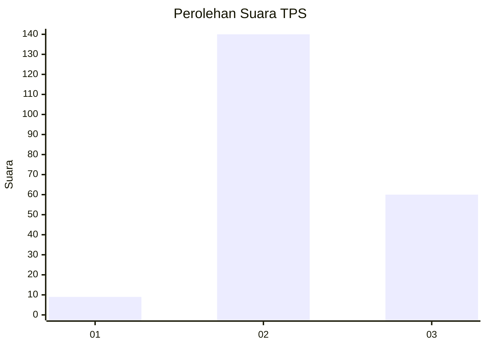
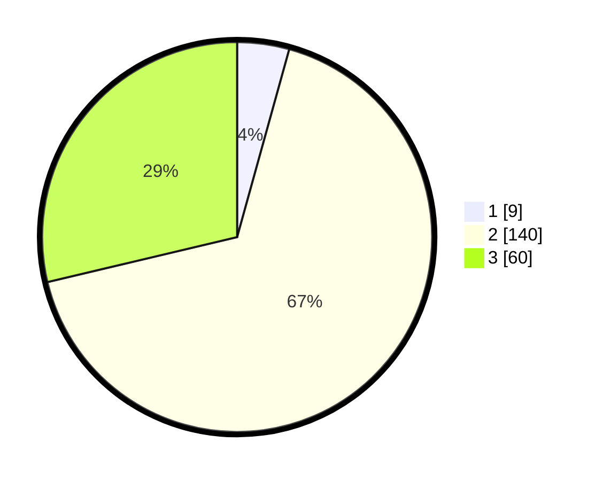

# Hasil

## Grafik

## Tabel

| No. | Nama Paslon    | Suara | Suara (raw) | Persentase |
|:--- |:-------------- | -----:| -----------:| ----------:|
| 1   | ANIES MUHAIMIN | 9     | [9][p-1]    | 4,31       |
| 2   | PRABOWO GIBRAN | 140   | [140][p-2]  | 66,99      |
| 3   | GANJAR MAHFUD  | 60    | [60][p-3]   | 28,71      |

[p-1]: https://github.com/gigit-pemilu/pemilu-2024-35-jawa-timur/blob/main/pilpres/hitung-suara/sub/35-jawa-timur/sub/03-trenggalek/sub/11-trenggalek/sub/2013-dawuhan/sub/015-tps/sub/paslon-1.txt
[p-2]: https://github.com/gigit-pemilu/pemilu-2024-35-jawa-timur/blob/main/pilpres/hitung-suara/sub/35-jawa-timur/sub/03-trenggalek/sub/11-trenggalek/sub/2013-dawuhan/sub/015-tps/sub/paslon-2.txt
[p-3]: https://github.com/gigit-pemilu/pemilu-2024-35-jawa-timur/blob/main/pilpres/hitung-suara/sub/35-jawa-timur/sub/03-trenggalek/sub/11-trenggalek/sub/2013-dawuhan/sub/015-tps/sub/paslon-3.txt

## Foto C Plano

https://sirekap-obj-formc.kpu.go.id/dfbf/pemilu/ppwp/35/03/11/20/13/3503112013015-20240216-174448--f85a830d-6629-461f-a7b0-93610aaa6ac4.jpg

https://sirekap-obj-formc.kpu.go.id/dfbf/pemilu/ppwp/35/03/11/20/13/3503112013015-20240216-174845--5c41c977-46d4-4036-817c-d2b4635329db.jpg

https://sirekap-obj-formc.kpu.go.id/dfbf/pemilu/ppwp/35/03/11/20/13/3503112013015-20240214-155758--60b0f7ac-b212-4957-9bb8-e86442ad01ba.jpg

## Metadata

| Key        | Value               |
| ---------- | ------------------- |
| Time Stamp | 2024-02-17 17:30:00 |

