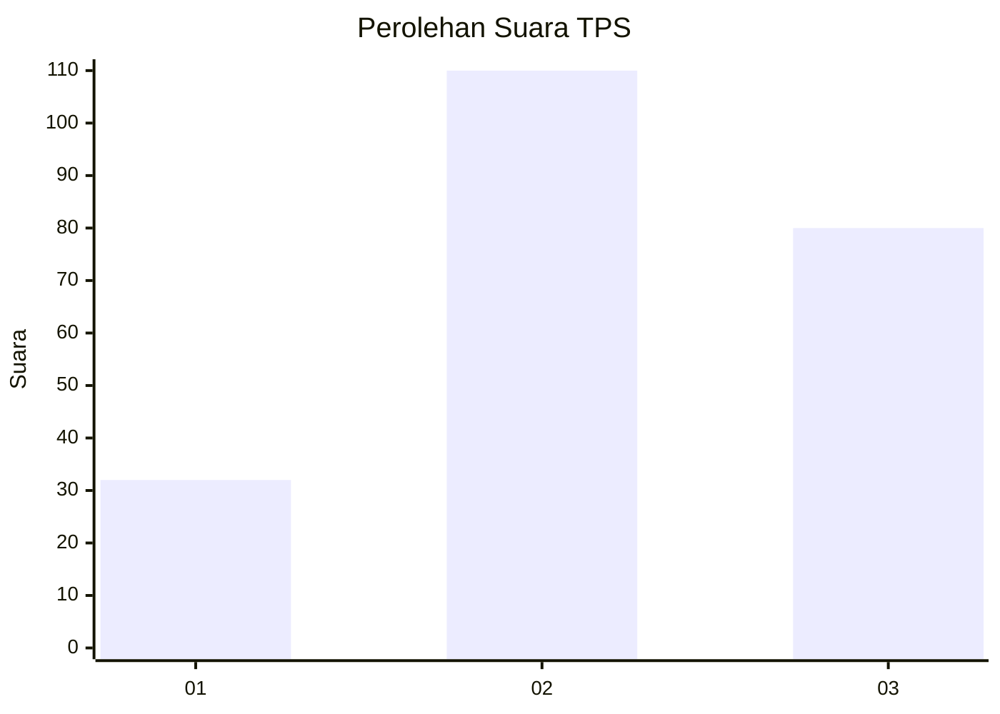
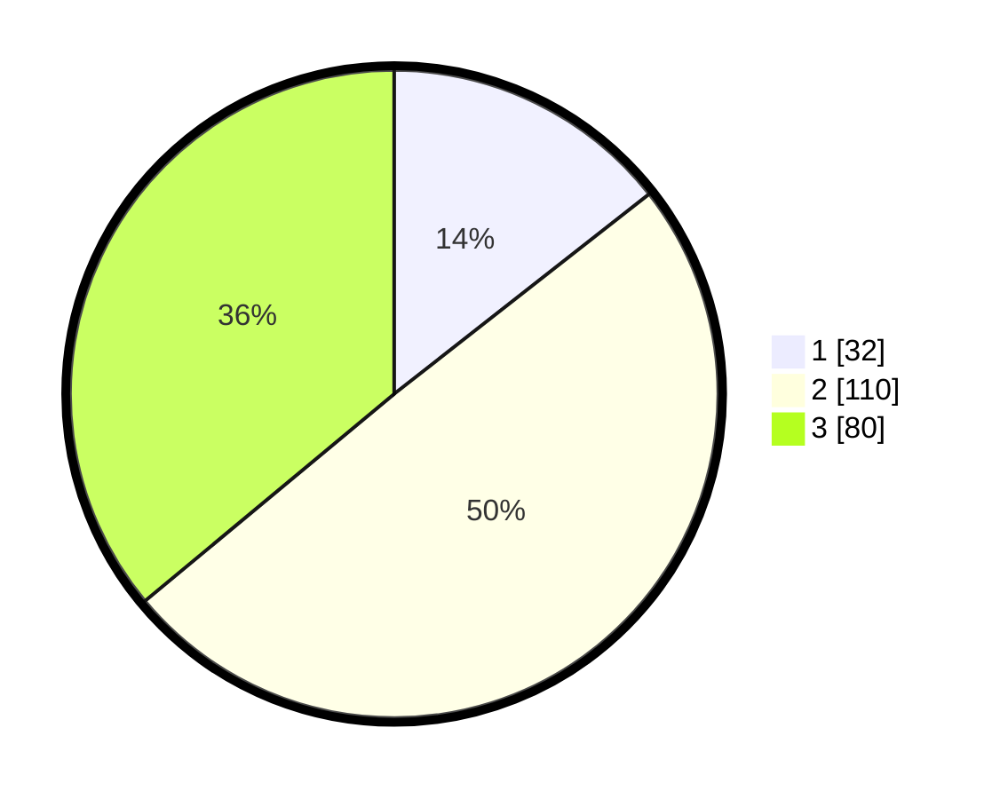

# Hasil

## Grafik

## Tabel

| No. | Nama Paslon    | Suara | Suara (raw) | Persentase |
|:--- |:-------------- | -----:| -----------:| ----------:|
| 1   | ANIES MUHAIMIN | 32    | [32][p-1]   | 14,41      |
| 2   | PRABOWO GIBRAN | 110   | [110][p-2]  | 49,55      |
| 3   | GANJAR MAHFUD  | 80    | [80][p-3]   | 36,04      |

[p-1]: https://github.com/gigit-pemilu/pemilu-2024-35-jawa-timur/blob/main/pilpres/hitung-suara/sub/35-jawa-timur/sub/03-trenggalek/sub/12-pogalan/sub/2001-wonocoyo/sub/003-tps/sub/paslon-1.txt
[p-2]: https://github.com/gigit-pemilu/pemilu-2024-35-jawa-timur/blob/main/pilpres/hitung-suara/sub/35-jawa-timur/sub/03-trenggalek/sub/12-pogalan/sub/2001-wonocoyo/sub/003-tps/sub/paslon-2.txt
[p-3]: https://github.com/gigit-pemilu/pemilu-2024-35-jawa-timur/blob/main/pilpres/hitung-suara/sub/35-jawa-timur/sub/03-trenggalek/sub/12-pogalan/sub/2001-wonocoyo/sub/003-tps/sub/paslon-3.txt

## Foto C Plano

https://sirekap-obj-formc.kpu.go.id/946e/pemilu/ppwp/35/03/12/20/01/3503122001003-20240219-235051--21abefb1-8013-46f8-9e0c-d6134c76d1dc.jpg

https://sirekap-obj-formc.kpu.go.id/946e/pemilu/ppwp/35/03/12/20/01/3503122001003-20240220-023144--856d3593-9ce7-40bf-b89b-4f0f8bf3bc11.jpg

https://sirekap-obj-formc.kpu.go.id/946e/pemilu/ppwp/35/03/12/20/01/3503122001003-20240220-020429--012d3bfb-5371-4488-86d1-aa9d155e81dc.jpg

## Metadata

| Key        | Value               |
| ---------- | ------------------- |
| Time Stamp | 2024-02-21 19:00:00 |

