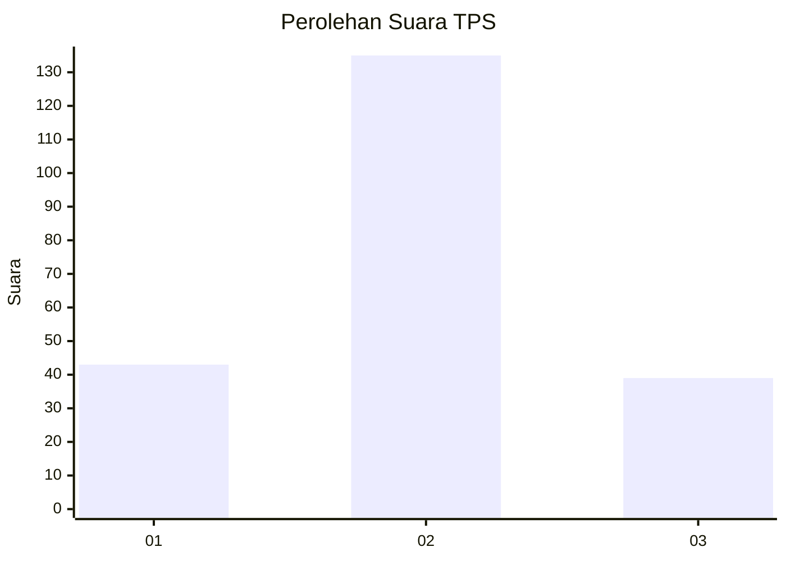
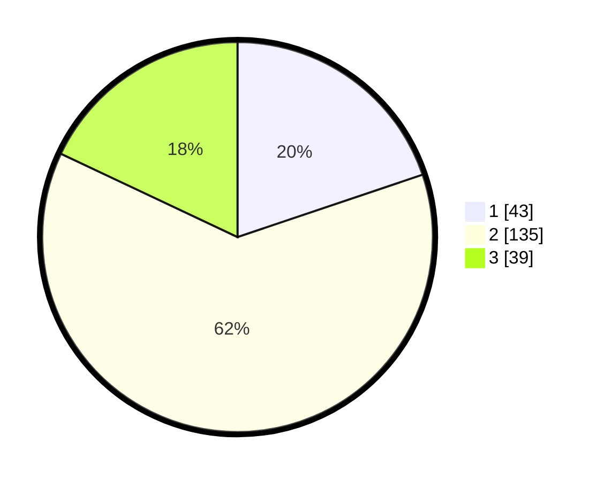

# Hasil

## Grafik

## Tabel

| No. | Nama Paslon    | Suara | Suara (raw) | Persentase |
|:--- |:-------------- | -----:| -----------:| ----------:|
| 1   | ANIES MUHAIMIN | 43    | [43][p-1]   | 19,82      |
| 2   | PRABOWO GIBRAN | 135   | [135][p-2]  | 62,21      |
| 3   | GANJAR MAHFUD  | 39    | [39][p-3]   | 17,97      |

[p-1]: https://github.com/gigit-pemilu/pemilu-2024/blob/main/pilpres/hitung-suara/sub/35-jawa-timur/sub/03-trenggalek/sub/12-pogalan/sub/2002-ngetal/sub/002-tps/sub/paslon-1.txt
[p-2]: https://github.com/gigit-pemilu/pemilu-2024/blob/main/pilpres/hitung-suara/sub/35-jawa-timur/sub/03-trenggalek/sub/12-pogalan/sub/2002-ngetal/sub/002-tps/sub/paslon-2.txt
[p-3]: https://github.com/gigit-pemilu/pemilu-2024/blob/main/pilpres/hitung-suara/sub/35-jawa-timur/sub/03-trenggalek/sub/12-pogalan/sub/2002-ngetal/sub/002-tps/sub/paslon-3.txt

## Foto C Plano

https://sirekap-obj-formc.kpu.go.id/0587/pemilu/ppwp/35/03/12/20/02/3503122002002-20240219-080633--88386577-9693-4fa9-bdf7-d56fc7c2bf31.jpg

https://sirekap-obj-formc.kpu.go.id/0587/pemilu/ppwp/35/03/12/20/02/3503122002002-20240219-183426--68b4eaa0-6675-4529-b4a5-1291531a1f9f.jpg

https://sirekap-obj-formc.kpu.go.id/0587/pemilu/ppwp/35/03/12/20/02/3503122002002-20240219-001635--4d1df3d1-69fa-4d28-9be8-3650203ad706.jpg

## Metadata

| Key        | Value               |
| ---------- | ------------------- |
| Time Stamp | 2024-02-19 19:00:00 |

