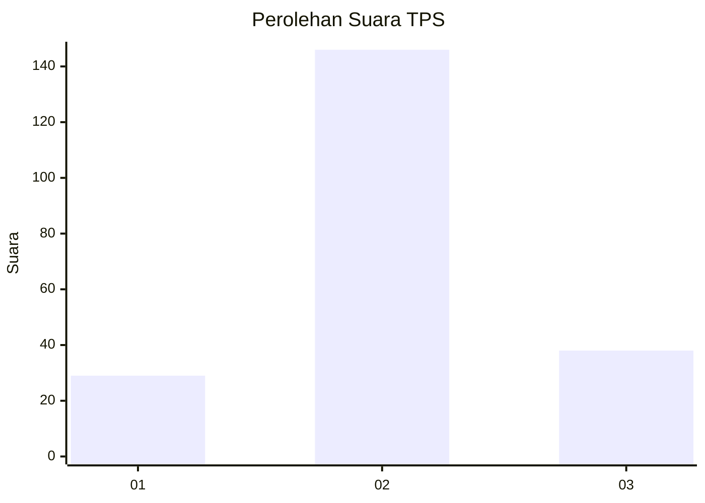
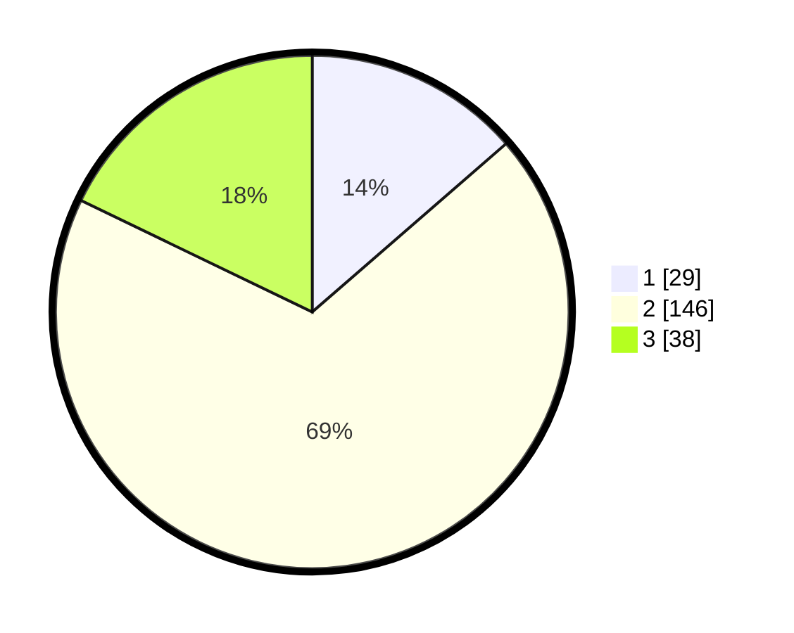

# Hasil

## Grafik

## Tabel

| No. | Nama Paslon    | Suara | Suara (raw) | Persentase |
|:--- |:-------------- | -----:| -----------:| ----------:|
| 1   | ANIES MUHAIMIN | 29    | [29][p-1]   | 13,62      |
| 2   | PRABOWO GIBRAN | 146   | [146][p-2]  | 68,54      |
| 3   | GANJAR MAHFUD  | 38    | [38][p-3]   | 17,84      |

[p-1]: https://github.com/gigit-pemilu/pemilu-2024-35-jawa-timur/blob/main/pilpres/hitung-suara/sub/35-jawa-timur/sub/03-trenggalek/sub/12-pogalan/sub/2002-ngetal/sub/004-tps/sub/paslon-1.txt
[p-2]: https://github.com/gigit-pemilu/pemilu-2024-35-jawa-timur/blob/main/pilpres/hitung-suara/sub/35-jawa-timur/sub/03-trenggalek/sub/12-pogalan/sub/2002-ngetal/sub/004-tps/sub/paslon-2.txt
[p-3]: https://github.com/gigit-pemilu/pemilu-2024-35-jawa-timur/blob/main/pilpres/hitung-suara/sub/35-jawa-timur/sub/03-trenggalek/sub/12-pogalan/sub/2002-ngetal/sub/004-tps/sub/paslon-3.txt

## Foto C Plano

https://sirekap-obj-formc.kpu.go.id/e8f8/pemilu/ppwp/35/03/12/20/02/3503122002004-20240215-055349--8cc71648-3074-4435-b57e-36552f0f9331.jpg

https://sirekap-obj-formc.kpu.go.id/e8f8/pemilu/ppwp/35/03/12/20/02/3503122002004-20240215-055447--6d7a8253-a240-4954-8987-168f0131fa95.jpg

https://sirekap-obj-formc.kpu.go.id/e8f8/pemilu/ppwp/35/03/12/20/02/3503122002004-20240215-055521--922fa0c9-1954-4090-80ee-2edeea933440.jpg

## Metadata

| Key        | Value               |
| ---------- | ------------------- |
| Time Stamp | 2024-02-15 21:30:27 |

