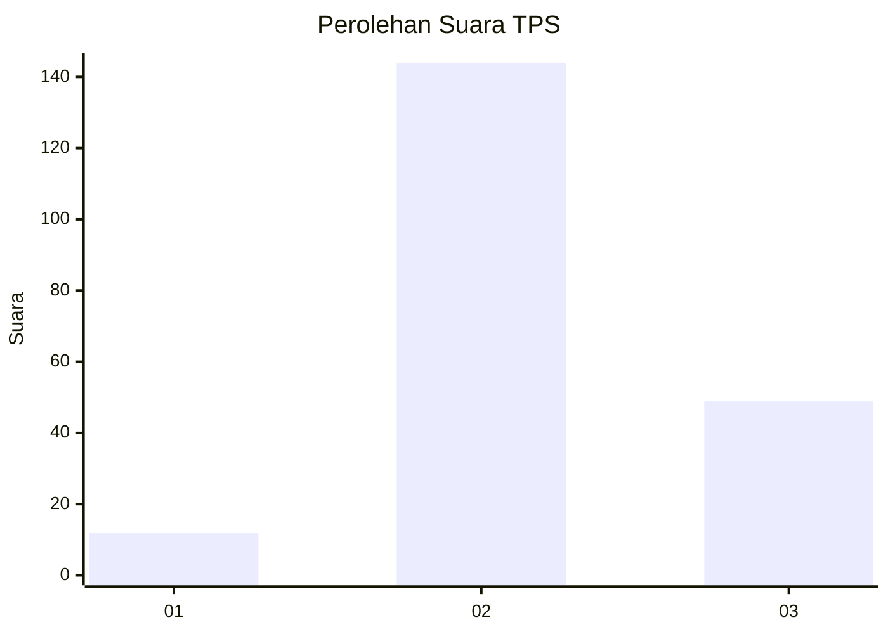
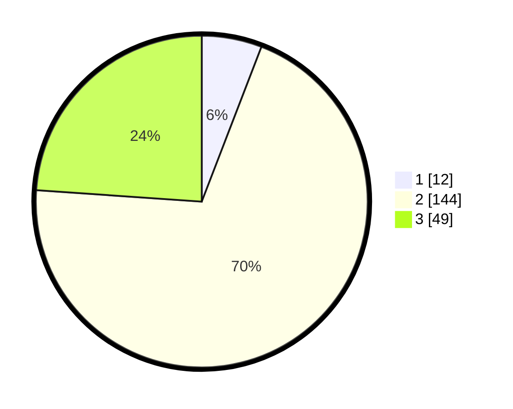

# Hasil

## Grafik

## Tabel

| No. | Nama Paslon    | Suara | Suara (raw) | Persentase |
|:--- |:-------------- | -----:| -----------:| ----------:|
| 1   | ANIES MUHAIMIN | 12    | [12][p-1]   | 5,85       |
| 2   | PRABOWO GIBRAN | 144   | [144][p-2]  | 70,24      |
| 3   | GANJAR MAHFUD  | 49    | [49][p-3]   | 23,90      |

[p-1]: https://github.com/gigit-pemilu/pemilu-2024-35-jawa-timur/blob/main/pilpres/hitung-suara/sub/35-jawa-timur/sub/03-trenggalek/sub/12-pogalan/sub/2003-ngadirenggo/sub/011-tps/sub/paslon-1.txt
[p-2]: https://github.com/gigit-pemilu/pemilu-2024-35-jawa-timur/blob/main/pilpres/hitung-suara/sub/35-jawa-timur/sub/03-trenggalek/sub/12-pogalan/sub/2003-ngadirenggo/sub/011-tps/sub/paslon-2.txt
[p-3]: https://github.com/gigit-pemilu/pemilu-2024-35-jawa-timur/blob/main/pilpres/hitung-suara/sub/35-jawa-timur/sub/03-trenggalek/sub/12-pogalan/sub/2003-ngadirenggo/sub/011-tps/sub/paslon-3.txt

## Foto C Plano

https://sirekap-obj-formc.kpu.go.id/5931/pemilu/ppwp/35/03/12/20/03/3503122003011-20240215-012518--3db7a875-bcb4-485a-9bd0-755d5c450ecb.jpg

https://sirekap-obj-formc.kpu.go.id/5931/pemilu/ppwp/35/03/12/20/03/3503122003011-20240215-012613--3407a9d8-6cb7-45e0-af67-81a5b3e813ac.jpg

https://sirekap-obj-formc.kpu.go.id/5931/pemilu/ppwp/35/03/12/20/03/3503122003011-20240215-012734--4f48115c-04c6-44e6-a2ae-153b07af7fcf.jpg

## Metadata

| Key        | Value               |
| ---------- | ------------------- |
| Time Stamp | 2024-02-15 16:30:25 |

