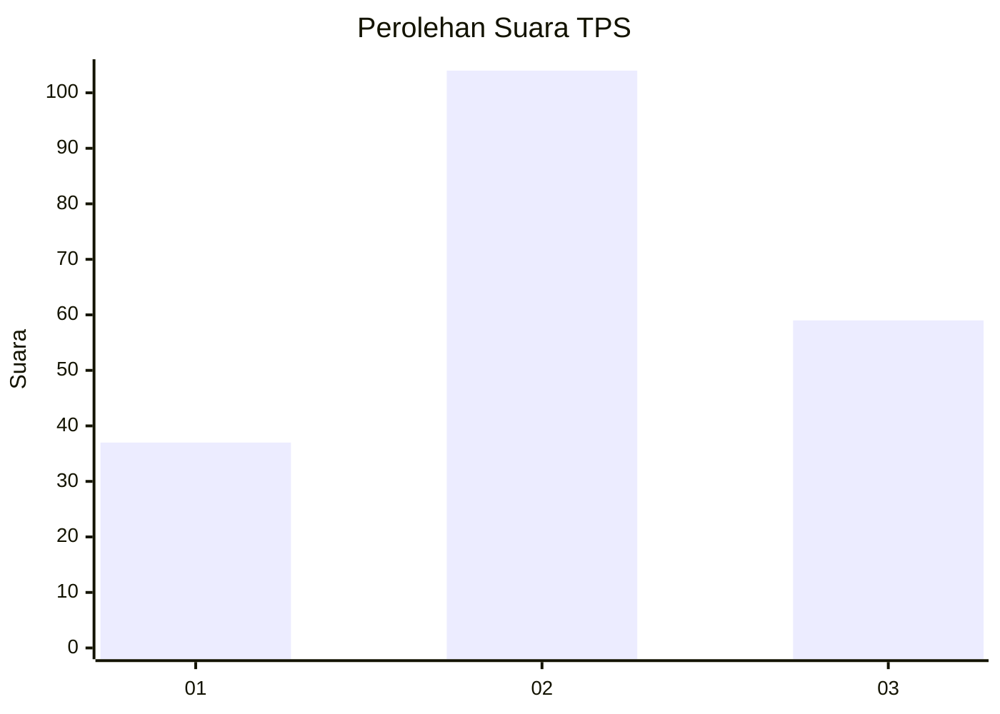
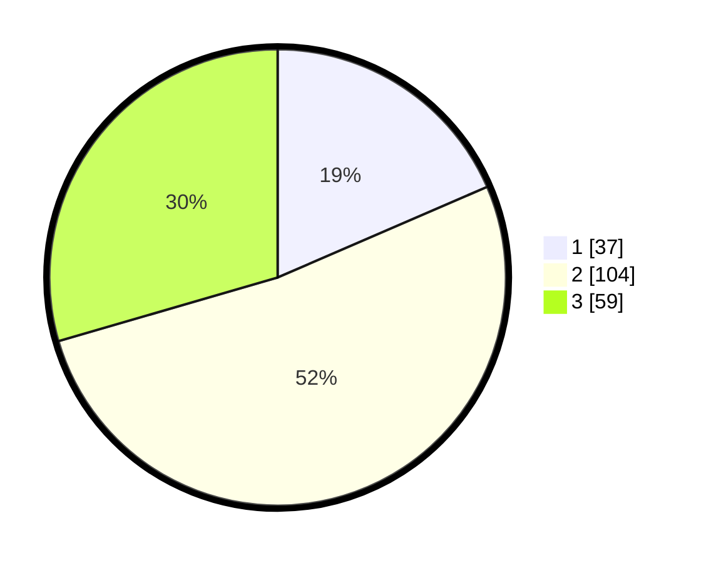

# Hasil

## Grafik

## Tabel

| No. | Nama Paslon    | Suara | Suara (raw) | Persentase |
|:--- |:-------------- | -----:| -----------:| ----------:|
| 1   | ANIES MUHAIMIN | 37    | [37][p-1]   | 18,50      |
| 2   | PRABOWO GIBRAN | 104   | [104][p-2]  | 52,00      |
| 3   | GANJAR MAHFUD  | 59    | [59][p-3]   | 29,50      |

[p-1]: https://github.com/gigit-pemilu/pemilu-2024/blob/main/pilpres/hitung-suara/sub/35-jawa-timur/sub/03-trenggalek/sub/12-pogalan/sub/2004-pogalan/sub/016-tps/sub/paslon-1.txt
[p-2]: https://github.com/gigit-pemilu/pemilu-2024/blob/main/pilpres/hitung-suara/sub/35-jawa-timur/sub/03-trenggalek/sub/12-pogalan/sub/2004-pogalan/sub/016-tps/sub/paslon-2.txt
[p-3]: https://github.com/gigit-pemilu/pemilu-2024/blob/main/pilpres/hitung-suara/sub/35-jawa-timur/sub/03-trenggalek/sub/12-pogalan/sub/2004-pogalan/sub/016-tps/sub/paslon-3.txt

## Foto C Plano

https://sirekap-obj-formc.kpu.go.id/4447/pemilu/ppwp/35/03/12/20/04/3503122004016-20240219-212251--cdc09831-0a16-47b0-a67f-f1d1e403ca3d.jpg

https://sirekap-obj-formc.kpu.go.id/4447/pemilu/ppwp/35/03/12/20/04/3503122004016-20240219-213215--6af79add-809a-4102-add6-c990dd6fa19b.jpg

https://sirekap-obj-formc.kpu.go.id/4447/pemilu/ppwp/35/03/12/20/04/3503122004016-20240219-212745--5c537e64-5016-4a7e-81e5-0e5628501557.jpg

## Metadata

| Key        | Value               |
| ---------- | ------------------- |
| Time Stamp | 2024-02-21 21:00:04 |

## DATA PEMILIH TETAP

Jumlah pemilih dalam DPT: **266**.
 * L: **136**.
 * P: **130**.

## DATA PENGGUNA HAK PILIH

Jumlah pengguna hak pilih dalam DPT: **266**.
 * L: **130**.
 * P: **136**.

Jumlah pengguna hak pilih dalam DPTb: **206**.
 * L: **101**.
 * P: **105**.

Jumlah pengguna hak pilih dalam DPK: **1**.
 * L: **1**.
 * P: **0**.

Jumlah pengguna hak pilih: **207**.
 * L: **102**.
 * P: **105**.

## JUMLAH SUARA SAH DAN TIDAK SAH

JUMLAH SELURUH SUARA SAH: **200**.

JUMLAH SUARA TIDAK SAH: **7**.

JUMLAH SELURUH SUARA SAH DAN SUARA TIDAK SAH: **207**.

