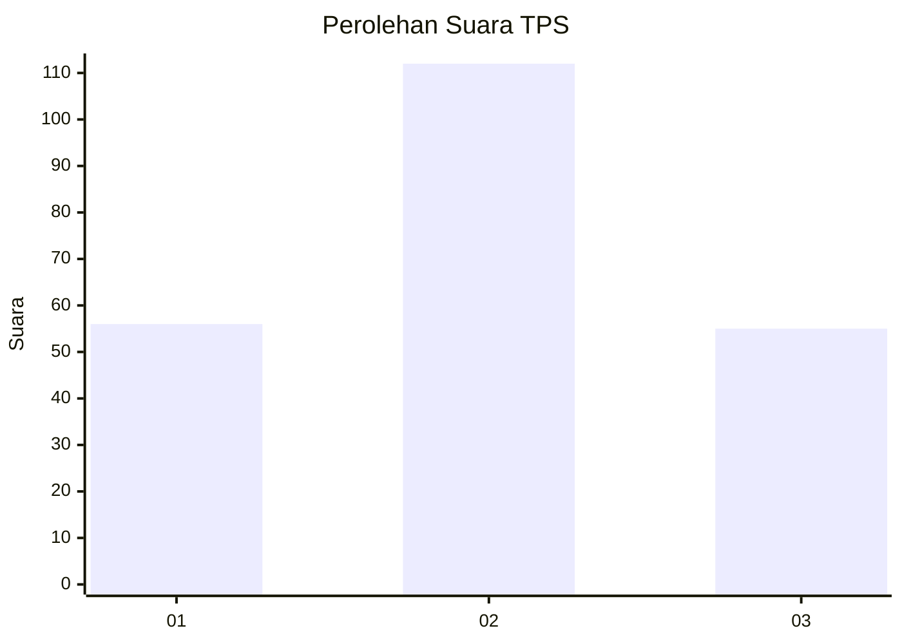
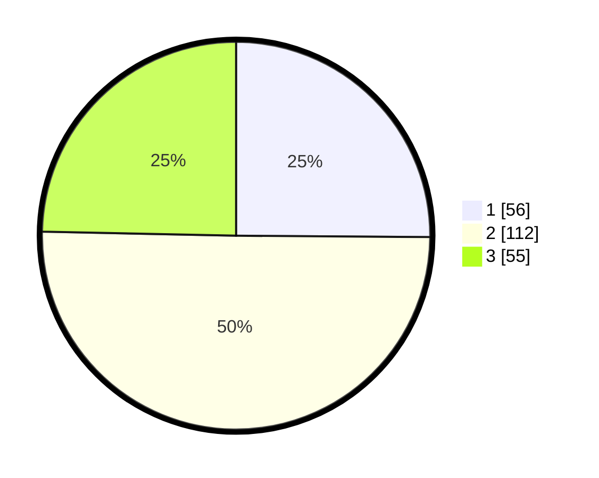

# Hasil

## Grafik

## Tabel

| No. | Nama Paslon    | Suara | Suara (raw) | Persentase |
|:--- |:-------------- | -----:| -----------:| ----------:|
| 1   | ANIES MUHAIMIN | 56    | [56][p-1]   | 25,11      |
| 2   | PRABOWO GIBRAN | 112   | [112][p-2]  | 50,22      |
| 3   | GANJAR MAHFUD  | 55    | [55][p-3]   | 24,66      |

[p-1]: https://github.com/gigit-pemilu/pemilu-2024/blob/main/pilpres/hitung-suara/sub/35-jawa-timur/sub/03-trenggalek/sub/12-pogalan/sub/2006-bendorejo/sub/002-tps/sub/paslon-1.txt
[p-2]: https://github.com/gigit-pemilu/pemilu-2024/blob/main/pilpres/hitung-suara/sub/35-jawa-timur/sub/03-trenggalek/sub/12-pogalan/sub/2006-bendorejo/sub/002-tps/sub/paslon-2.txt
[p-3]: https://github.com/gigit-pemilu/pemilu-2024/blob/main/pilpres/hitung-suara/sub/35-jawa-timur/sub/03-trenggalek/sub/12-pogalan/sub/2006-bendorejo/sub/002-tps/sub/paslon-3.txt

## Foto C Plano

https://sirekap-obj-formc.kpu.go.id/d4fe/pemilu/ppwp/35/03/12/20/06/3503122006002-20240214-223029--5eedf5d7-53dc-44f7-9cfe-bdb030289aa5.jpg

https://sirekap-obj-formc.kpu.go.id/d4fe/pemilu/ppwp/35/03/12/20/06/3503122006002-20240214-223140--0f951659-d2c4-485a-aca0-a127801ce00c.jpg

https://sirekap-obj-formc.kpu.go.id/d4fe/pemilu/ppwp/35/03/12/20/06/3503122006002-20240214-223240--ba896946-c838-4c62-bbcf-7576138d168c.jpg

## Metadata

| Key        | Value               |
| ---------- | ------------------- |
| Time Stamp | 2024-02-15 19:00:26 |

