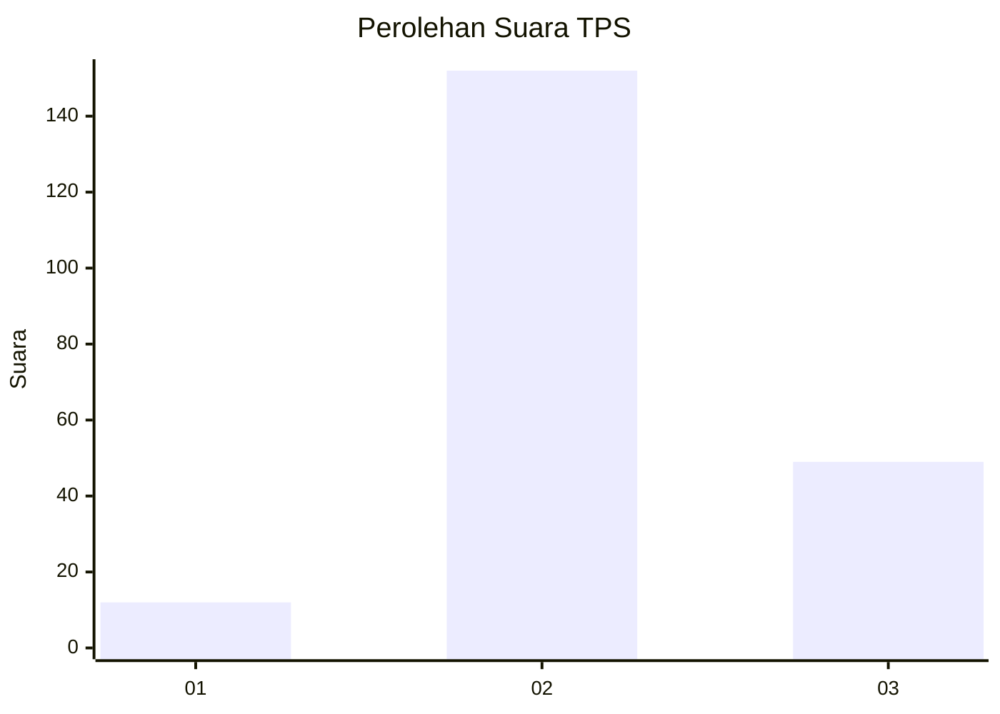
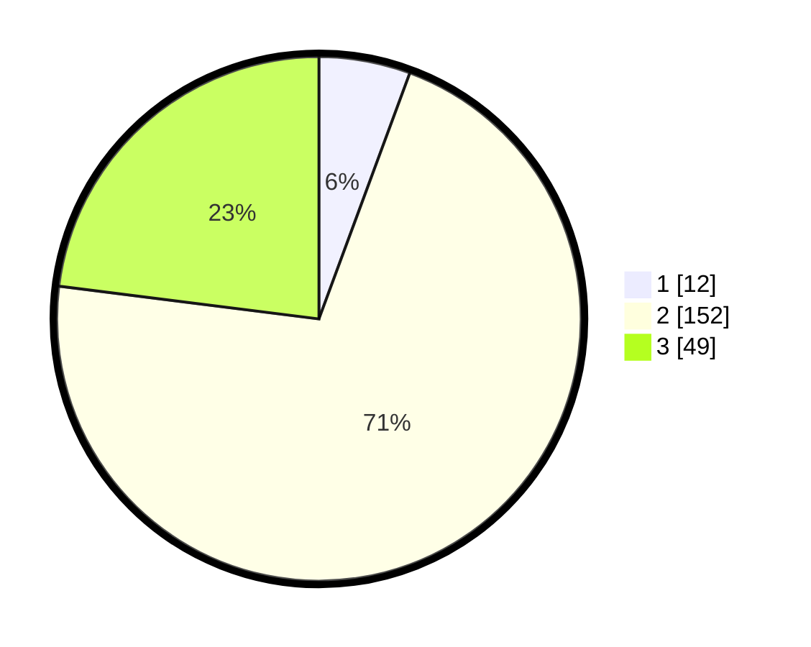

# Hasil

## Grafik

## Tabel

| No. | Nama Paslon    | Suara | Suara (raw) | Persentase |
|:--- |:-------------- | -----:| -----------:| ----------:|
| 1   | ANIES MUHAIMIN | 12    | [12][p-1]   | 5,63       |
| 2   | PRABOWO GIBRAN | 152   | [152][p-2]  | 71,36      |
| 3   | GANJAR MAHFUD  | 49    | [49][p-3]   | 23,00      |

[p-1]: https://github.com/gigit-pemilu/pemilu-2024-35-jawa-timur/blob/main/pilpres/hitung-suara/sub/35-jawa-timur/sub/03-trenggalek/sub/12-pogalan/sub/2006-bendorejo/sub/017-tps/sub/paslon-1.txt
[p-2]: https://github.com/gigit-pemilu/pemilu-2024-35-jawa-timur/blob/main/pilpres/hitung-suara/sub/35-jawa-timur/sub/03-trenggalek/sub/12-pogalan/sub/2006-bendorejo/sub/017-tps/sub/paslon-2.txt
[p-3]: https://github.com/gigit-pemilu/pemilu-2024-35-jawa-timur/blob/main/pilpres/hitung-suara/sub/35-jawa-timur/sub/03-trenggalek/sub/12-pogalan/sub/2006-bendorejo/sub/017-tps/sub/paslon-3.txt

## Foto C Plano

https://sirekap-obj-formc.kpu.go.id/f86c/pemilu/ppwp/35/03/12/20/06/3503122006017-20240215-001628--e942ba8a-92c6-4f30-9c65-e50f51b2be31.jpg

https://sirekap-obj-formc.kpu.go.id/f86c/pemilu/ppwp/35/03/12/20/06/3503122006017-20240215-001925--db025f51-5478-47bb-8cf5-453aa40cb01e.jpg

https://sirekap-obj-formc.kpu.go.id/f86c/pemilu/ppwp/35/03/12/20/06/3503122006017-20240219-122401--25bbb216-6ff1-47d8-a511-2263fa07b763.jpg

## Metadata

| Key        | Value               |
| ---------- | ------------------- |
| Time Stamp | 2024-02-19 13:00:00 |

