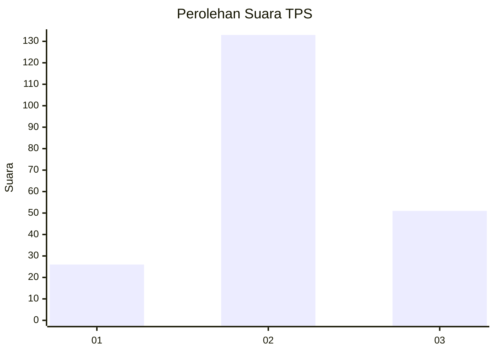
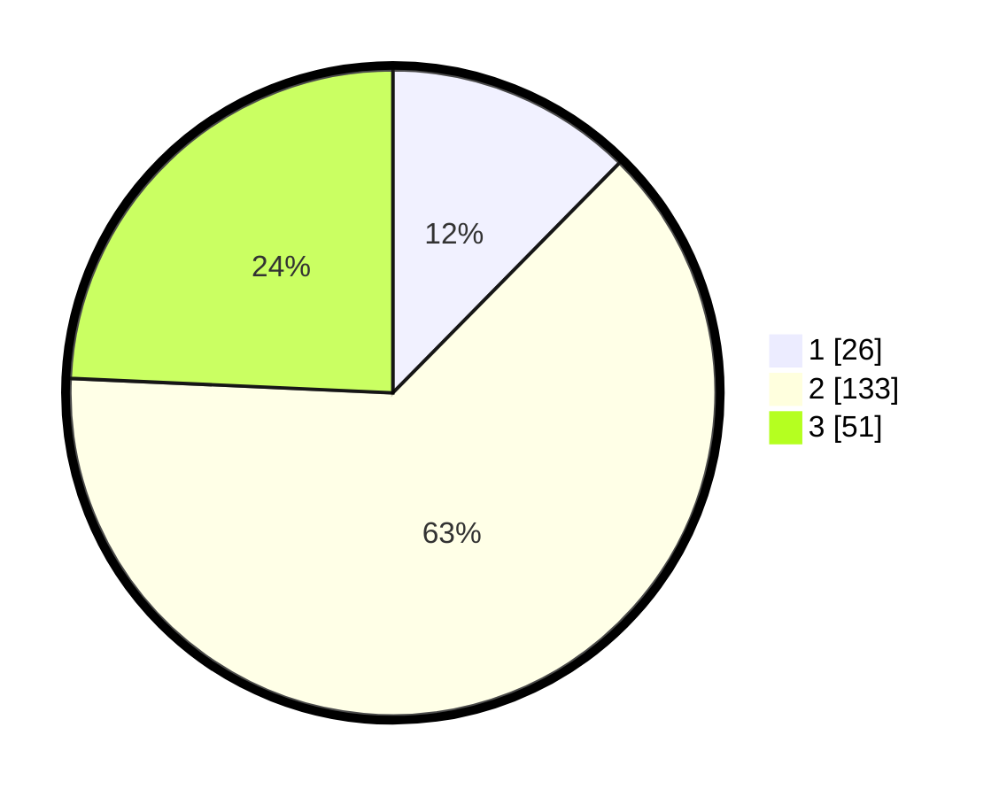

# Hasil

## Grafik

## Tabel

| No. | Nama Paslon    | Suara | Suara (raw) | Persentase |
|:--- |:-------------- | -----:| -----------:| ----------:|
| 1   | ANIES MUHAIMIN | 26    | [26][p-1]   | 12,38      |
| 2   | PRABOWO GIBRAN | 133   | [133][p-2]  | 63,33      |
| 3   | GANJAR MAHFUD  | 51    | [51][p-3]   | 24,29      |

[p-1]: https://github.com/gigit-pemilu/pemilu-2024/blob/main/pilpres/hitung-suara/sub/35-jawa-timur/sub/03-trenggalek/sub/12-pogalan/sub/2006-bendorejo/sub/019-tps/sub/paslon-1.txt
[p-2]: https://github.com/gigit-pemilu/pemilu-2024/blob/main/pilpres/hitung-suara/sub/35-jawa-timur/sub/03-trenggalek/sub/12-pogalan/sub/2006-bendorejo/sub/019-tps/sub/paslon-2.txt
[p-3]: https://github.com/gigit-pemilu/pemilu-2024/blob/main/pilpres/hitung-suara/sub/35-jawa-timur/sub/03-trenggalek/sub/12-pogalan/sub/2006-bendorejo/sub/019-tps/sub/paslon-3.txt

## Foto C Plano

https://sirekap-obj-formc.kpu.go.id/6722/pemilu/ppwp/35/03/12/20/06/3503122006019-20240214-205012--e1aa2908-aacc-491c-b89e-e5f7e29d437d.jpg

https://sirekap-obj-formc.kpu.go.id/6722/pemilu/ppwp/35/03/12/20/06/3503122006019-20240214-205034--23fb6e88-d08d-4813-8950-b45f3c5a44ca.jpg

https://sirekap-obj-formc.kpu.go.id/6722/pemilu/ppwp/35/03/12/20/06/3503122006019-20240214-205055--b574bd8e-2d9c-4728-a928-30da787928f2.jpg

## Metadata

| Key        | Value               |
| ---------- | ------------------- |
| Time Stamp | 2024-02-15 00:41:44 |

