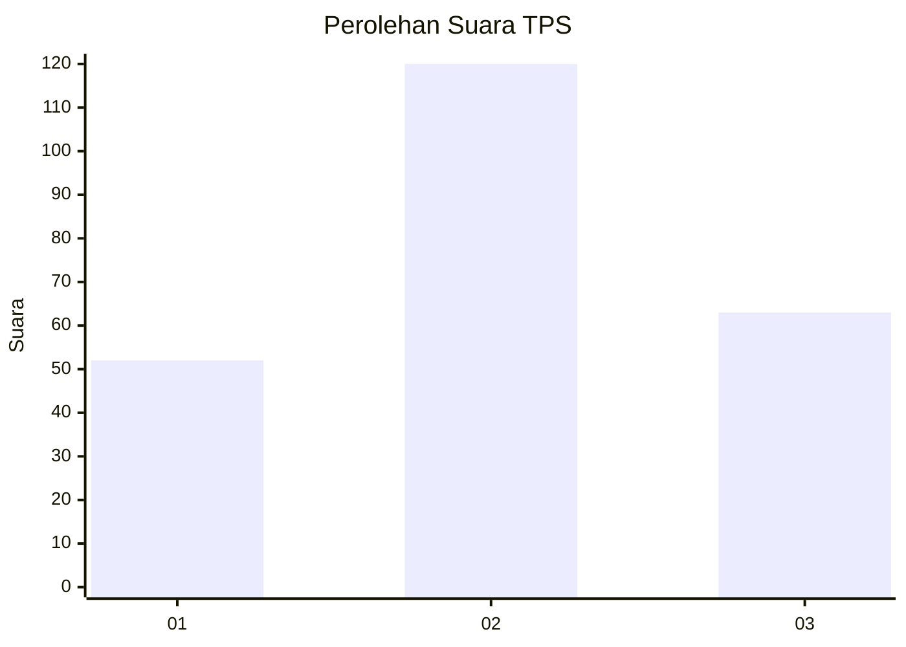
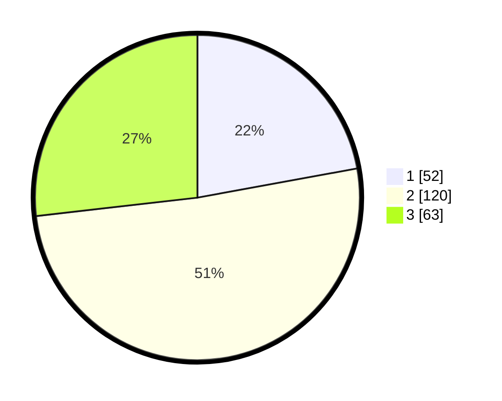

# Hasil

## Grafik

## Tabel

| No. | Nama Paslon    | Suara | Suara (raw) | Persentase |
|:--- |:-------------- | -----:| -----------:| ----------:|
| 1   | ANIES MUHAIMIN | 52    | [52][p-1]   | 22,13      |
| 2   | PRABOWO GIBRAN | 120   | [120][p-2]  | 51,06      |
| 3   | GANJAR MAHFUD  | 63    | [63][p-3]   | 26,81      |

[p-1]: https://github.com/gigit-pemilu/pemilu-2024-35-jawa-timur/blob/main/pilpres/hitung-suara/sub/35-jawa-timur/sub/03-trenggalek/sub/12-pogalan/sub/2007-gembleb/sub/015-tps/sub/paslon-1.txt
[p-2]: https://github.com/gigit-pemilu/pemilu-2024-35-jawa-timur/blob/main/pilpres/hitung-suara/sub/35-jawa-timur/sub/03-trenggalek/sub/12-pogalan/sub/2007-gembleb/sub/015-tps/sub/paslon-2.txt
[p-3]: https://github.com/gigit-pemilu/pemilu-2024-35-jawa-timur/blob/main/pilpres/hitung-suara/sub/35-jawa-timur/sub/03-trenggalek/sub/12-pogalan/sub/2007-gembleb/sub/015-tps/sub/paslon-3.txt

## Foto C Plano

https://sirekap-obj-formc.kpu.go.id/cb9f/pemilu/ppwp/35/03/12/20/07/3503122007015-20240214-202244--d44e93bc-bfc3-41bf-aa96-dd4508324ea2.jpg

https://sirekap-obj-formc.kpu.go.id/cb9f/pemilu/ppwp/35/03/12/20/07/3503122007015-20240214-202320--acf20c5c-4ee9-4b91-9e58-c65732822c07.jpg

https://sirekap-obj-formc.kpu.go.id/cb9f/pemilu/ppwp/35/03/12/20/07/3503122007015-20240214-202404--43aee833-aaf8-4c81-b2a3-ec4a455be105.jpg

## Metadata

| Key        | Value               |
| ---------- | ------------------- |
| Time Stamp | 2024-02-15 00:41:44 |

