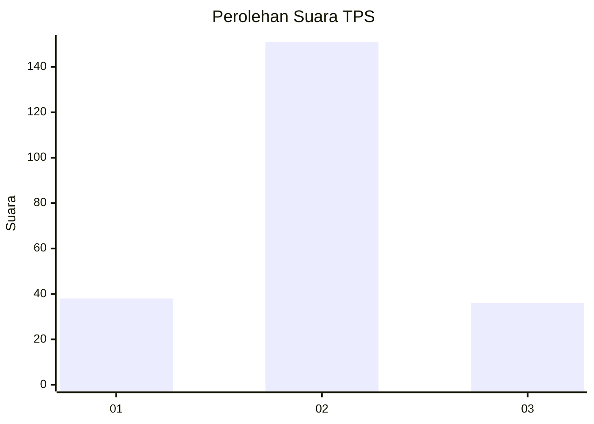
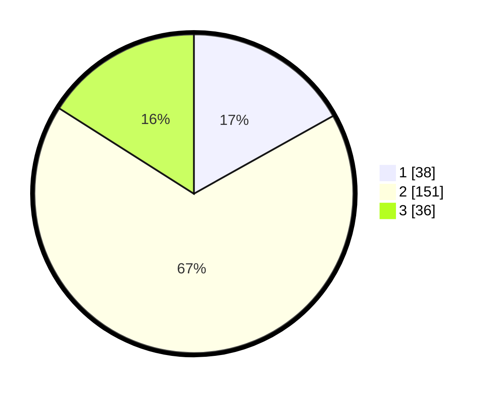

# Hasil

## Grafik

## Tabel

| No. | Nama Paslon    | Suara | Suara (raw) | Persentase |
|:--- |:-------------- | -----:| -----------:| ----------:|
| 1   | ANIES MUHAIMIN | 38    | [38][p-1]   | 16,89      |
| 2   | PRABOWO GIBRAN | 151   | [151][p-2]  | 67,11      |
| 3   | GANJAR MAHFUD  | 36    | [36][p-3]   | 16,00      |

[p-1]: https://github.com/gigit-pemilu/pemilu-2024-35-jawa-timur/blob/main/pilpres/hitung-suara/sub/35-jawa-timur/sub/03-trenggalek/sub/12-pogalan/sub/2008-ngadirejo/sub/006-tps/sub/paslon-1.txt
[p-2]: https://github.com/gigit-pemilu/pemilu-2024-35-jawa-timur/blob/main/pilpres/hitung-suara/sub/35-jawa-timur/sub/03-trenggalek/sub/12-pogalan/sub/2008-ngadirejo/sub/006-tps/sub/paslon-2.txt
[p-3]: https://github.com/gigit-pemilu/pemilu-2024-35-jawa-timur/blob/main/pilpres/hitung-suara/sub/35-jawa-timur/sub/03-trenggalek/sub/12-pogalan/sub/2008-ngadirejo/sub/006-tps/sub/paslon-3.txt

## Foto C Plano

https://sirekap-obj-formc.kpu.go.id/74f6/pemilu/ppwp/35/03/12/20/08/3503122008006-20240218-120215--395c8263-7549-4fee-b492-7f837b748e23.jpg

https://sirekap-obj-formc.kpu.go.id/74f6/pemilu/ppwp/35/03/12/20/08/3503122008006-20240218-120335--a4b3818a-5a82-43b4-bbc5-bcb57dfa52c1.jpg

https://sirekap-obj-formc.kpu.go.id/74f6/pemilu/ppwp/35/03/12/20/08/3503122008006-20240218-165801--6e0ec271-eeaa-436e-b9e2-de3254565b66.jpg

## Metadata

| Key        | Value               |
| ---------- | ------------------- |
| Time Stamp | 2024-02-19 06:16:00 |

