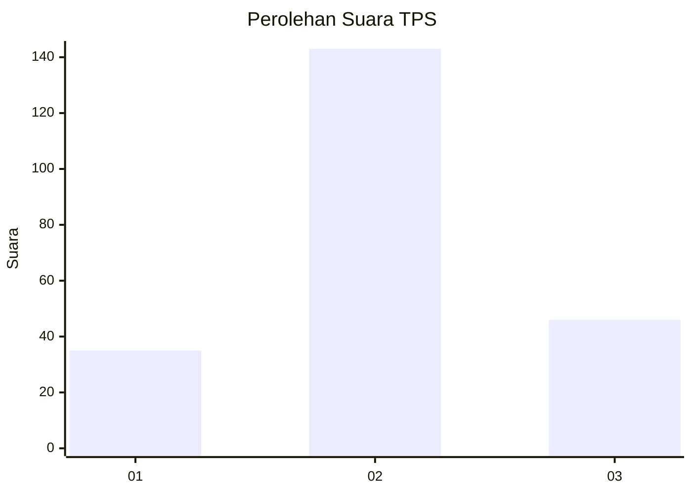
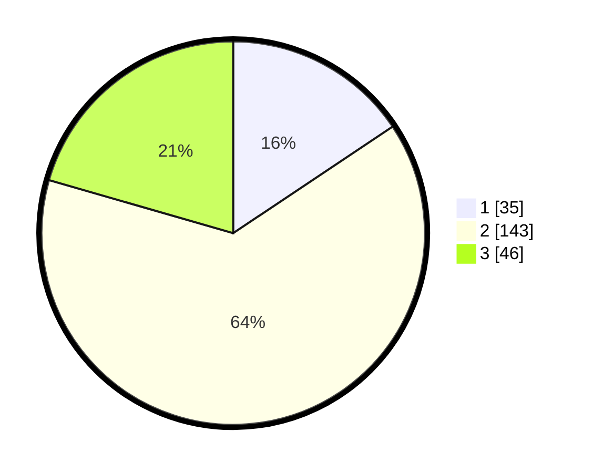

# Hasil

## Grafik

## Tabel

| No. | Nama Paslon    | Suara | Suara (raw) | Persentase |
|:--- |:-------------- | -----:| -----------:| ----------:|
| 1   | ANIES MUHAIMIN | 35    | [35][p-1]   | 15,63      |
| 2   | PRABOWO GIBRAN | 143   | [143][p-2]  | 63,84      |
| 3   | GANJAR MAHFUD  | 46    | [46][p-3]   | 20,54      |

[p-1]: https://github.com/gigit-pemilu/pemilu-2024-35-jawa-timur/blob/main/pilpres/hitung-suara/sub/35-jawa-timur/sub/03-trenggalek/sub/12-pogalan/sub/2010-kedunglurah/sub/007-tps/sub/paslon-1.txt
[p-2]: https://github.com/gigit-pemilu/pemilu-2024-35-jawa-timur/blob/main/pilpres/hitung-suara/sub/35-jawa-timur/sub/03-trenggalek/sub/12-pogalan/sub/2010-kedunglurah/sub/007-tps/sub/paslon-2.txt
[p-3]: https://github.com/gigit-pemilu/pemilu-2024-35-jawa-timur/blob/main/pilpres/hitung-suara/sub/35-jawa-timur/sub/03-trenggalek/sub/12-pogalan/sub/2010-kedunglurah/sub/007-tps/sub/paslon-3.txt

## Foto C Plano

https://sirekap-obj-formc.kpu.go.id/dbf7/pemilu/ppwp/35/03/12/20/10/3503122010007-20240223-133919--ebe3f497-520a-4fe9-a7f8-d7d7ab2d24c2.jpg

https://sirekap-obj-formc.kpu.go.id/dbf7/pemilu/ppwp/35/03/12/20/10/3503122010007-20240223-134448--d4744450-9f94-4189-85f6-315df8566306.jpg

https://sirekap-obj-formc.kpu.go.id/dbf7/pemilu/ppwp/35/03/12/20/10/3503122010007-20240223-140348--3b818a56-4693-4caf-9641-2cc11c6aae5c.jpg

## Metadata

| Key        | Value               |
| ---------- | ------------------- |
| Time Stamp | 2024-02-24 22:31:28 |

