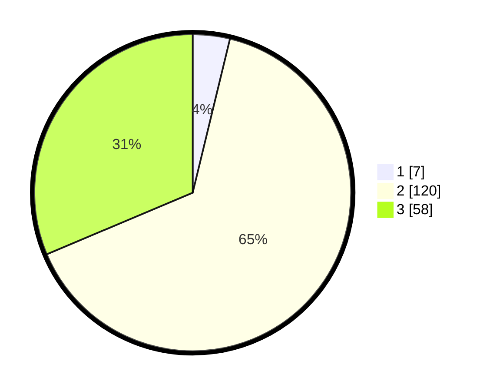

# Hasil

## Grafik

## Tabel

| No. | Nama Paslon    | Suara | Suara (raw) | Persentase |
|:--- |:-------------- | -----:| -----------:| ----------:|
| 1   | ANIES MUHAIMIN | 7     | [7][p-1]    | 3,78       |
| 2   | PRABOWO GIBRAN | 120   | [120][p-2]  | 64,86      |
| 3   | GANJAR MAHFUD  | 58    | [58][p-3]   | 31,35      |

[p-1]: https://github.com/gigit-pemilu/pemilu-2024/blob/main/pilpres/hitung-suara/sub/35-jawa-timur/sub/03-trenggalek/sub/13-durenan/sub/2005-sumberejo/sub/008-tps/sub/paslon-1.txt
[p-2]: https://github.com/gigit-pemilu/pemilu-2024/blob/main/pilpres/hitung-suara/sub/35-jawa-timur/sub/03-trenggalek/sub/13-durenan/sub/2005-sumberejo/sub/008-tps/sub/paslon-2.txt
[p-3]: https://github.com/gigit-pemilu/pemilu-2024/blob/main/pilpres/hitung-suara/sub/35-jawa-timur/sub/03-trenggalek/sub/13-durenan/sub/2005-sumberejo/sub/008-tps/sub/paslon-3.txt

## Foto C Plano

https://sirekap-obj-formc.kpu.go.id/f86d/pemilu/ppwp/35/03/13/20/05/3503132005008-20240217-165136--99c66e57-f2e7-4e13-80ab-ffd3981e1bcb.jpg

https://sirekap-obj-formc.kpu.go.id/f86d/pemilu/ppwp/35/03/13/20/05/3503132005008-20240215-022047--82147ddd-9154-43e3-8df0-3ea6818dcdaa.jpg

https://sirekap-obj-formc.kpu.go.id/f86d/pemilu/ppwp/35/03/13/20/05/3503132005008-20240215-022431--11c192c5-3b5c-4b59-9c71-ad81fed67eed.jpg

## Metadata

| Key        | Value               |
| ---------- | ------------------- |
| Time Stamp | 2024-02-17 16:52:47 |

