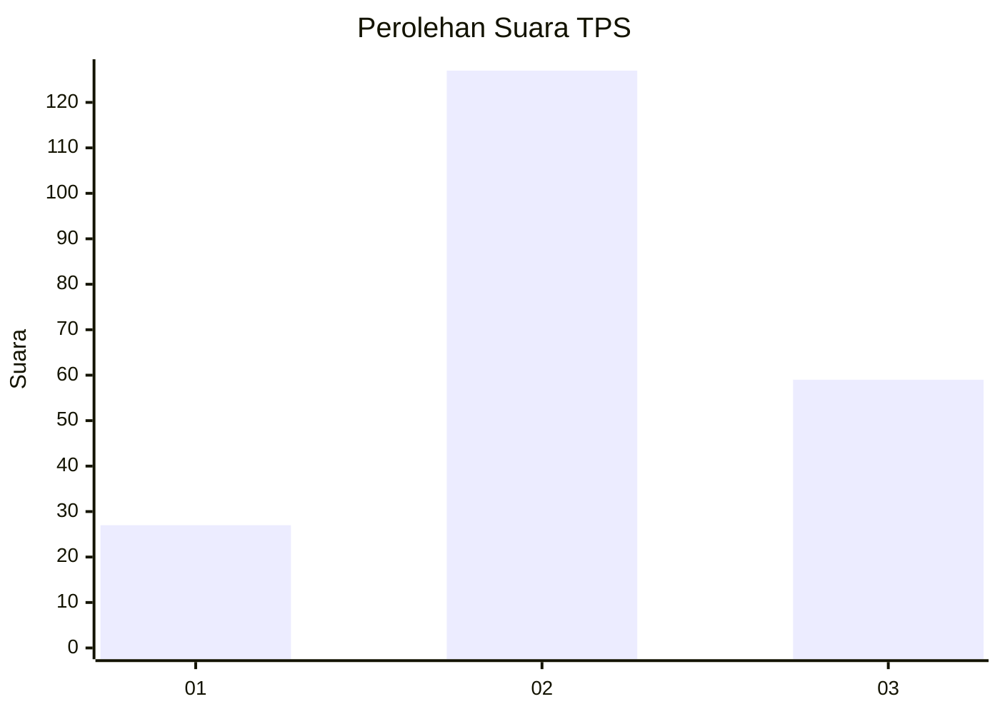
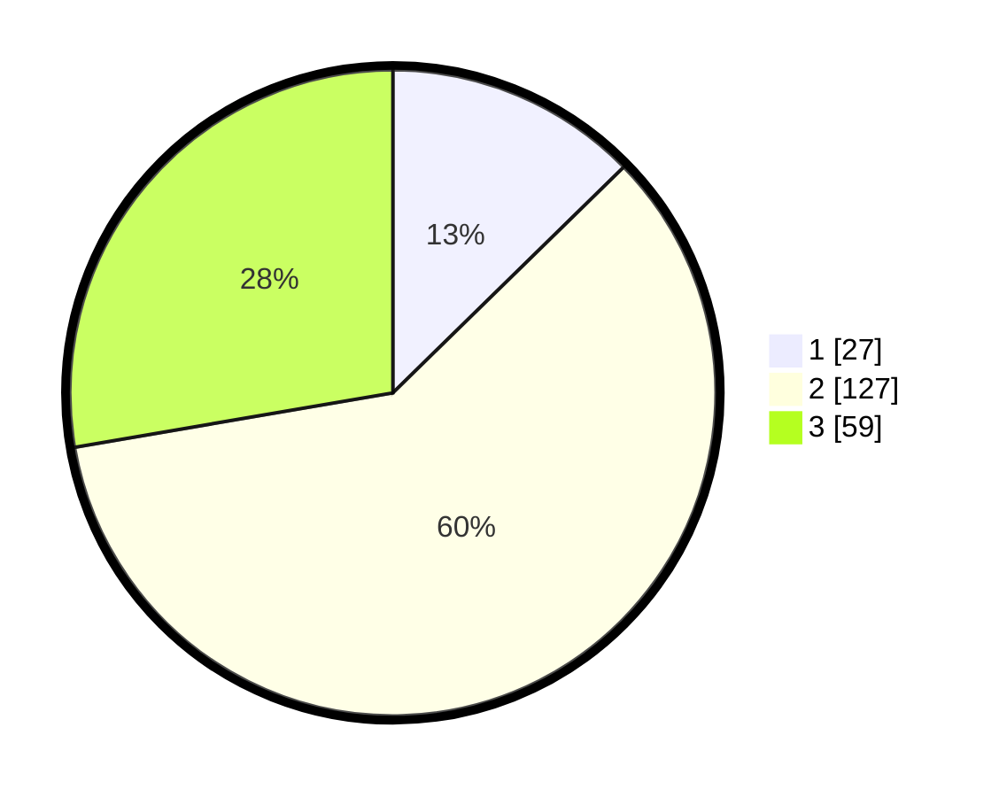

# Hasil

## Grafik

## Tabel

| No. | Nama Paslon    | Suara | Suara (raw) | Persentase |
|:--- |:-------------- | -----:| -----------:| ----------:|
| 1   | ANIES MUHAIMIN | 27    | [27][p-1]   | 12,68      |
| 2   | PRABOWO GIBRAN | 127   | [127][p-2]  | 59,62      |
| 3   | GANJAR MAHFUD  | 59    | [59][p-3]   | 27,70      |

[p-1]: https://github.com/gigit-pemilu/pemilu-2024-35-jawa-timur/blob/main/pilpres/hitung-suara/sub/35-jawa-timur/sub/03-trenggalek/sub/13-durenan/sub/2006-durenan/sub/002-tps/sub/paslon-1.txt
[p-2]: https://github.com/gigit-pemilu/pemilu-2024-35-jawa-timur/blob/main/pilpres/hitung-suara/sub/35-jawa-timur/sub/03-trenggalek/sub/13-durenan/sub/2006-durenan/sub/002-tps/sub/paslon-2.txt
[p-3]: https://github.com/gigit-pemilu/pemilu-2024-35-jawa-timur/blob/main/pilpres/hitung-suara/sub/35-jawa-timur/sub/03-trenggalek/sub/13-durenan/sub/2006-durenan/sub/002-tps/sub/paslon-3.txt

## Foto C Plano

https://sirekap-obj-formc.kpu.go.id/8996/pemilu/ppwp/35/03/13/20/06/3503132006002-20240215-001926--39be0fd2-a2a3-42ef-9609-29f91404d6e7.jpg

https://sirekap-obj-formc.kpu.go.id/8996/pemilu/ppwp/35/03/13/20/06/3503132006002-20240214-224035--41bb9b97-4a3c-4275-bf02-560e7100a54b.jpg

https://sirekap-obj-formc.kpu.go.id/8996/pemilu/ppwp/35/03/13/20/06/3503132006002-20240214-223912--f0dc422f-f288-424e-8e3e-4b161ee12b9a.jpg

## Metadata

| Key        | Value               |
| ---------- | ------------------- |
| Time Stamp | 2024-02-15 12:00:28 |

