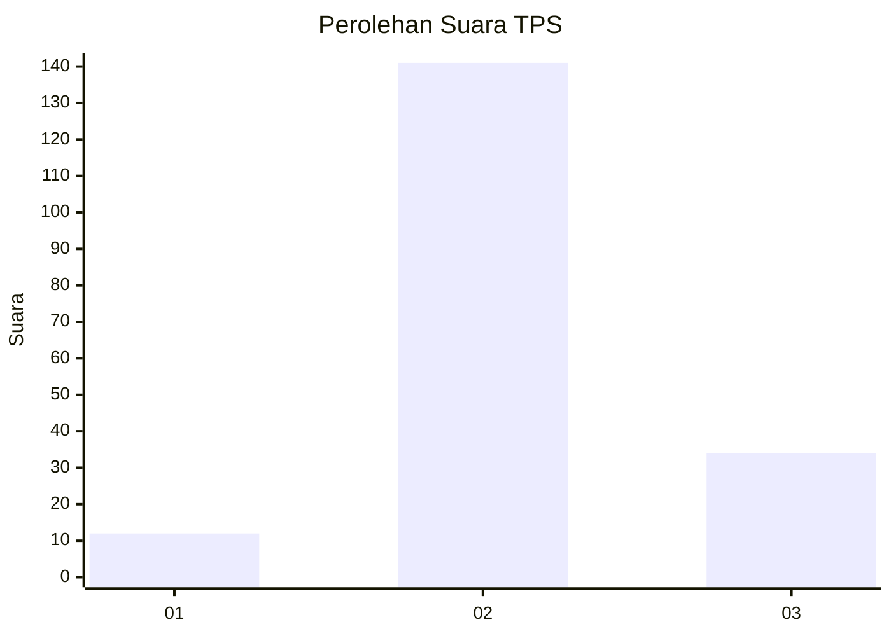

# Hasil

## Grafik

## Tabel

| No. | Nama Paslon    | Suara | Suara (raw) | Persentase |
|:--- |:-------------- | -----:| -----------:| ----------:|
| 1   | ANIES MUHAIMIN | 12    | [12][p-1]   | 6,42       |
| 2   | PRABOWO GIBRAN | 141   | [141][p-2]  | 75,40      |
| 3   | GANJAR MAHFUD  | 34    | [34][p-3]   | 18,18      |

[p-1]: https://github.com/gigit-pemilu/pemilu-2024/blob/main/pilpres/hitung-suara/sub/35-jawa-timur/sub/03-trenggalek/sub/13-durenan/sub/2006-durenan/sub/006-tps/sub/paslon-1.txt
[p-2]: https://github.com/gigit-pemilu/pemilu-2024/blob/main/pilpres/hitung-suara/sub/35-jawa-timur/sub/03-trenggalek/sub/13-durenan/sub/2006-durenan/sub/006-tps/sub/paslon-2.txt
[p-3]: https://github.com/gigit-pemilu/pemilu-2024/blob/main/pilpres/hitung-suara/sub/35-jawa-timur/sub/03-trenggalek/sub/13-durenan/sub/2006-durenan/sub/006-tps/sub/paslon-3.txt

## Foto C Plano

https://sirekap-obj-formc.kpu.go.id/6365/pemilu/ppwp/35/03/13/20/06/3503132006006-20240217-094552--8f9c24f0-a106-4ff8-b841-b551d8ca32a8.jpg

https://sirekap-obj-formc.kpu.go.id/6365/pemilu/ppwp/35/03/13/20/06/3503132006006-20240217-094718--a048b01d-a21b-44b2-9e7b-dc51262e7e3c.jpg

https://sirekap-obj-formc.kpu.go.id/6365/pemilu/ppwp/35/03/13/20/06/3503132006006-20240217-094847--eb244b0d-43a1-4bee-b741-6aa40789a513.jpg

## Metadata

| Key        | Value               |
| ---------- | ------------------- |
| Time Stamp | 2024-02-21 12:00:00 |

