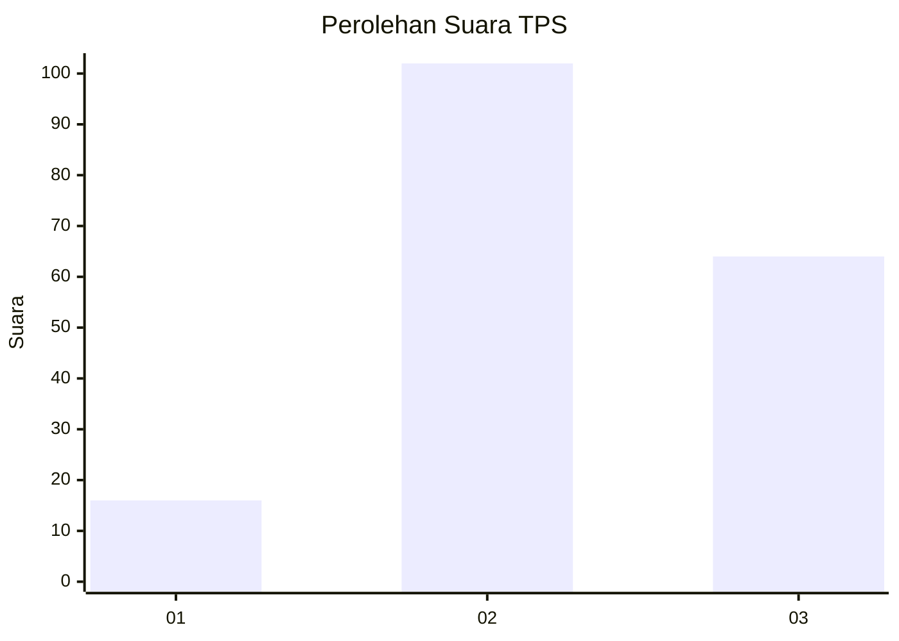
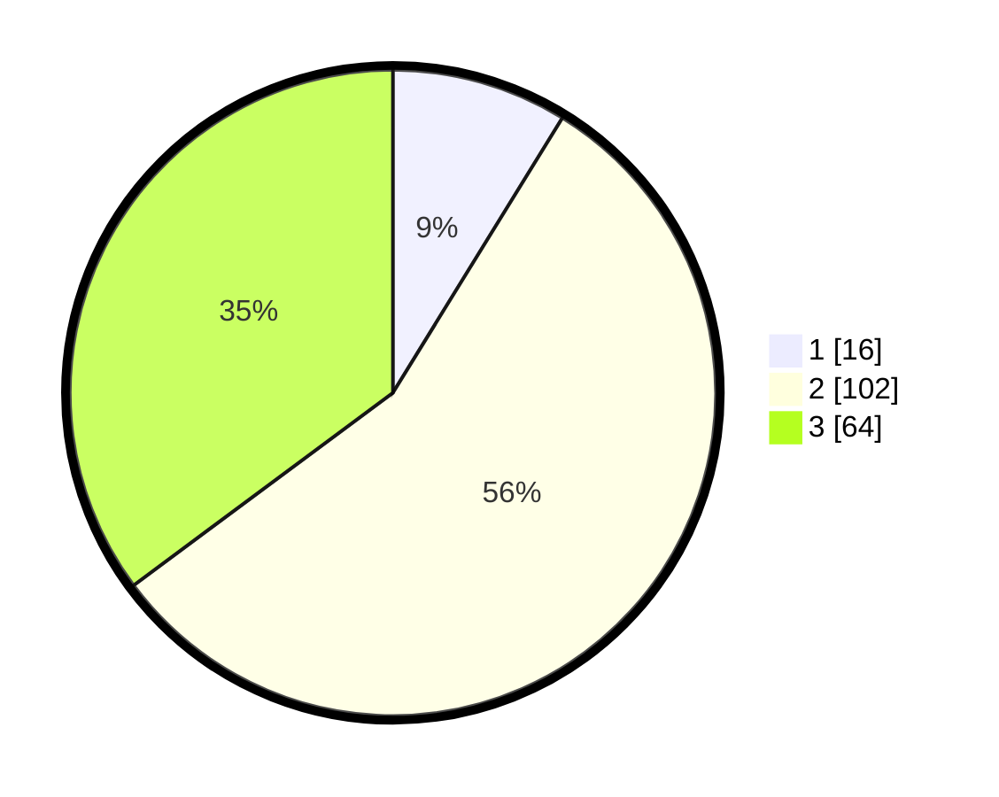

# Hasil

## Grafik

## Tabel

| No. | Nama Paslon    | Suara | Suara (raw) | Persentase |
|:--- |:-------------- | -----:| -----------:| ----------:|
| 1   | ANIES MUHAIMIN | 16    | [16][p-1]   | 8,79       |
| 2   | PRABOWO GIBRAN | 102   | [102][p-2]  | 56,04      |
| 3   | GANJAR MAHFUD  | 64    | [64][p-3]   | 35,16      |

[p-1]: https://github.com/gigit-pemilu/pemilu-2024/blob/main/pilpres/hitung-suara/sub/35-jawa-timur/sub/03-trenggalek/sub/13-durenan/sub/2007-pakis/sub/002-tps/sub/paslon-1.txt
[p-2]: https://github.com/gigit-pemilu/pemilu-2024/blob/main/pilpres/hitung-suara/sub/35-jawa-timur/sub/03-trenggalek/sub/13-durenan/sub/2007-pakis/sub/002-tps/sub/paslon-2.txt
[p-3]: https://github.com/gigit-pemilu/pemilu-2024/blob/main/pilpres/hitung-suara/sub/35-jawa-timur/sub/03-trenggalek/sub/13-durenan/sub/2007-pakis/sub/002-tps/sub/paslon-3.txt

## Foto C Plano

https://sirekap-obj-formc.kpu.go.id/6f67/pemilu/ppwp/35/03/13/20/07/3503132007002-20240217-101511--aa74b1ea-bca5-4b9b-94ab-30afafccd75a.jpg

https://sirekap-obj-formc.kpu.go.id/6f67/pemilu/ppwp/35/03/13/20/07/3503132007002-20240216-173215--205a20c4-f914-47d8-99bf-5435b7a306d0.jpg

https://sirekap-obj-formc.kpu.go.id/6f67/pemilu/ppwp/35/03/13/20/07/3503132007002-20240216-174008--004f2ba2-d6c7-476b-8dd7-57da115ffeea.jpg

## Metadata

| Key        | Value               |
| ---------- | ------------------- |
| Time Stamp | 2024-02-24 22:31:28 |

