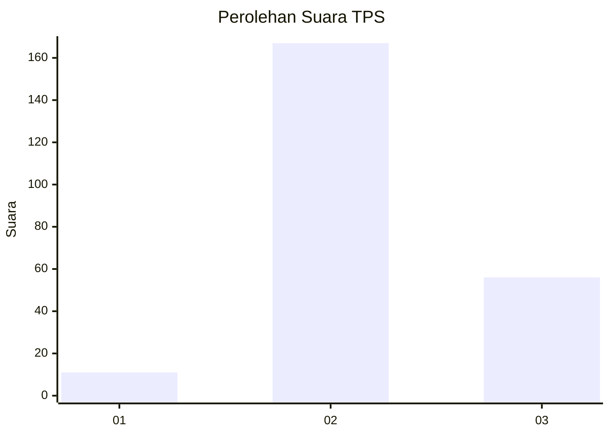
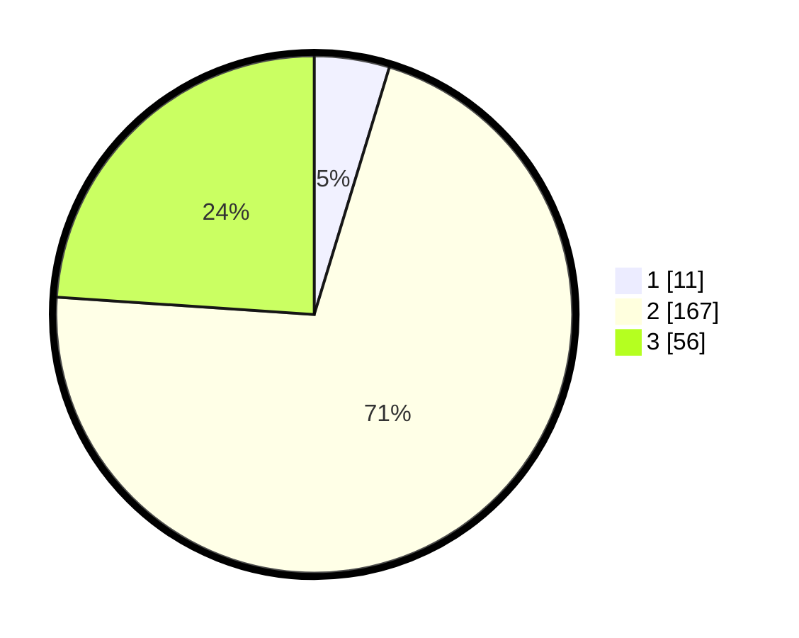

# Hasil

## Grafik

## Tabel

| No. | Nama Paslon    | Suara | Suara (raw) | Persentase |
|:--- |:-------------- | -----:| -----------:| ----------:|
| 1   | ANIES MUHAIMIN | 11    | [11][p-1]   | 4,70       |
| 2   | PRABOWO GIBRAN | 167   | [167][p-2]  | 71,37      |
| 3   | GANJAR MAHFUD  | 56    | [56][p-3]   | 23,93      |

[p-1]: https://github.com/gigit-pemilu/pemilu-2024/blob/main/pilpres/hitung-suara/sub/35-jawa-timur/sub/03-trenggalek/sub/13-durenan/sub/2007-pakis/sub/004-tps/sub/paslon-1.txt
[p-2]: https://github.com/gigit-pemilu/pemilu-2024/blob/main/pilpres/hitung-suara/sub/35-jawa-timur/sub/03-trenggalek/sub/13-durenan/sub/2007-pakis/sub/004-tps/sub/paslon-2.txt
[p-3]: https://github.com/gigit-pemilu/pemilu-2024/blob/main/pilpres/hitung-suara/sub/35-jawa-timur/sub/03-trenggalek/sub/13-durenan/sub/2007-pakis/sub/004-tps/sub/paslon-3.txt

## Foto C Plano

https://sirekap-obj-formc.kpu.go.id/0c30/pemilu/ppwp/35/03/13/20/07/3503132007004-20240217-123738--6cdc7f86-c344-4e51-9ea6-44d3ea9ede58.jpg

https://sirekap-obj-formc.kpu.go.id/0c30/pemilu/ppwp/35/03/13/20/07/3503132007004-20240215-033552--b25405a5-0a23-42b3-bc64-09852114a79d.jpg

https://sirekap-obj-formc.kpu.go.id/0c30/pemilu/ppwp/35/03/13/20/07/3503132007004-20240217-123012--995f663b-7a2f-47fd-872b-08572d76d97e.jpg

## Metadata

| Key        | Value               |
| ---------- | ------------------- |
| Time Stamp | 2024-02-17 13:37:34 |

