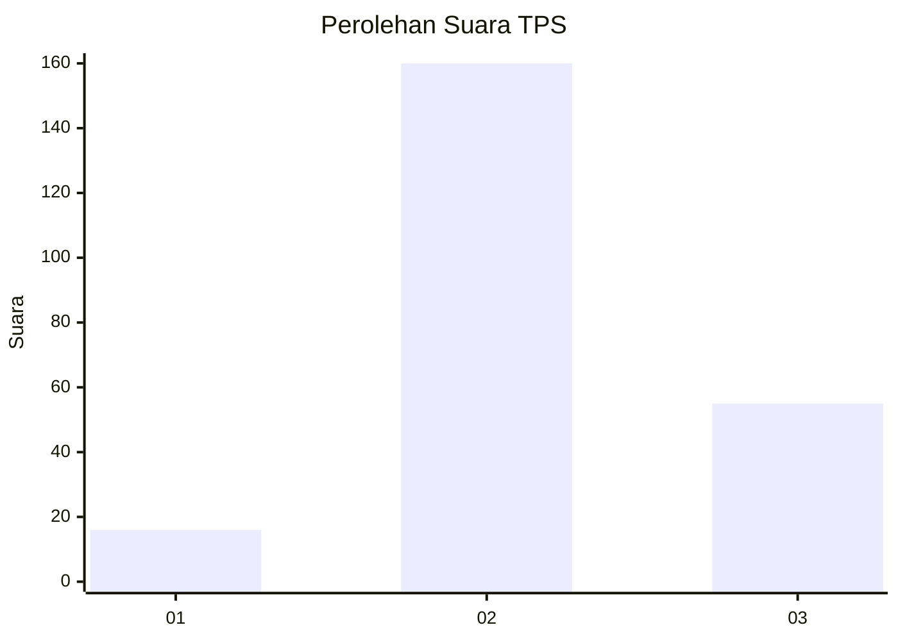
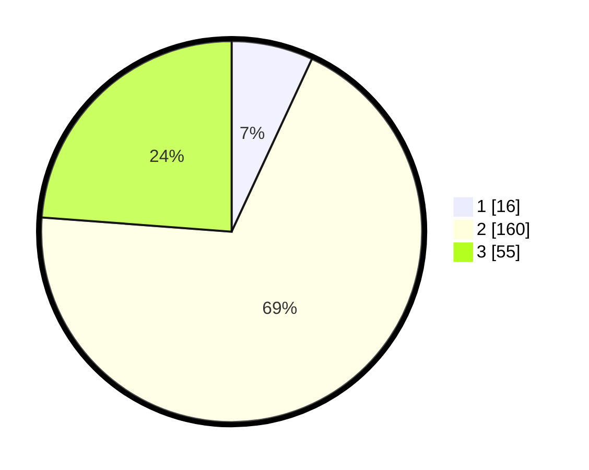

# Hasil

## Grafik

## Tabel

| No. | Nama Paslon    | Suara | Suara (raw) | Persentase |
|:--- |:-------------- | -----:| -----------:| ----------:|
| 1   | ANIES MUHAIMIN | 16    | [16][p-1]   | 6,93       |
| 2   | PRABOWO GIBRAN | 160   | [160][p-2]  | 69,26      |
| 3   | GANJAR MAHFUD  | 55    | [55][p-3]   | 23,81      |

[p-1]: https://github.com/gigit-pemilu/pemilu-2024-35-jawa-timur/blob/main/pilpres/hitung-suara/sub/35-jawa-timur/sub/03-trenggalek/sub/13-durenan/sub/2007-pakis/sub/005-tps/sub/paslon-1.txt
[p-2]: https://github.com/gigit-pemilu/pemilu-2024-35-jawa-timur/blob/main/pilpres/hitung-suara/sub/35-jawa-timur/sub/03-trenggalek/sub/13-durenan/sub/2007-pakis/sub/005-tps/sub/paslon-2.txt
[p-3]: https://github.com/gigit-pemilu/pemilu-2024-35-jawa-timur/blob/main/pilpres/hitung-suara/sub/35-jawa-timur/sub/03-trenggalek/sub/13-durenan/sub/2007-pakis/sub/005-tps/sub/paslon-3.txt

## Foto C Plano

https://sirekap-obj-formc.kpu.go.id/ce01/pemilu/ppwp/35/03/13/20/07/3503132007005-20240218-103742--b377eb84-9902-4302-8089-fc328def952e.jpg

https://sirekap-obj-formc.kpu.go.id/ce01/pemilu/ppwp/35/03/13/20/07/3503132007005-20240215-042936--e447f78c-4998-410a-8fc1-d0e38f44e12f.jpg

https://sirekap-obj-formc.kpu.go.id/ce01/pemilu/ppwp/35/03/13/20/07/3503132007005-20240215-043434--cfdaedb3-d076-4356-9828-0561ad188025.jpg

## Metadata

| Key        | Value               |
| ---------- | ------------------- |
| Time Stamp | 2024-02-21 16:00:00 |

