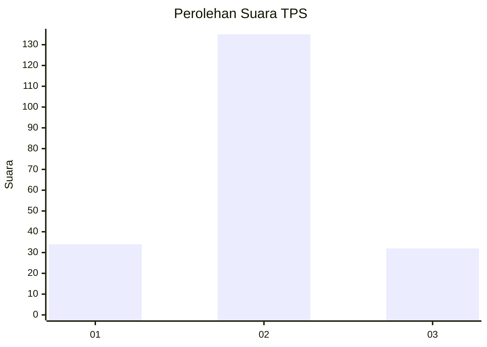
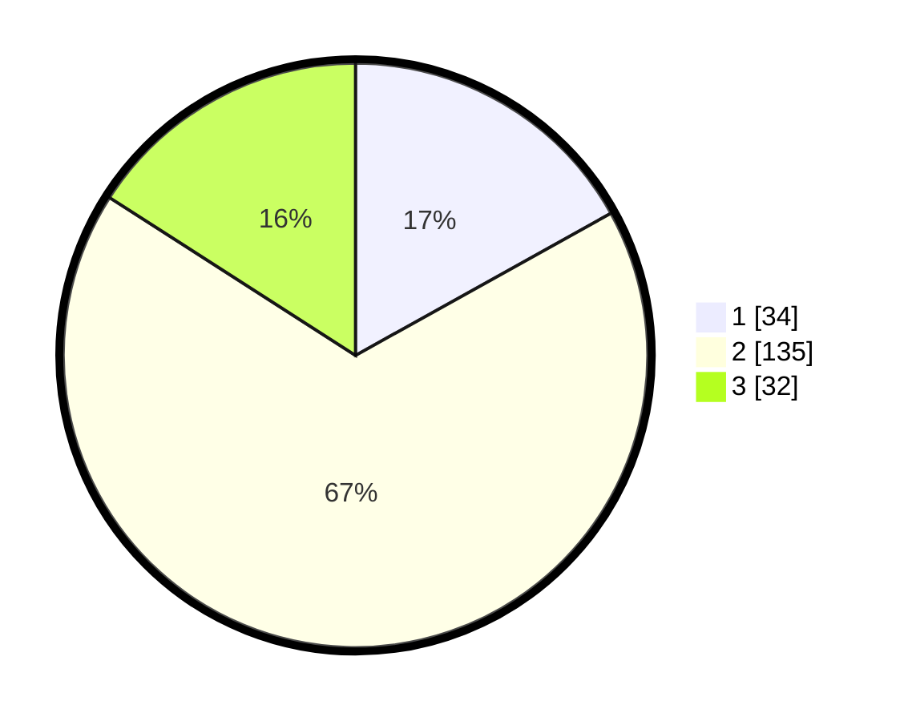

# Hasil

## Grafik

## Tabel

| No. | Nama Paslon    | Suara | Suara (raw) | Persentase |
|:--- |:-------------- | -----:| -----------:| ----------:|
| 1   | ANIES MUHAIMIN | 34    | [34][p-1]   | 16,92      |
| 2   | PRABOWO GIBRAN | 135   | [135][p-2]  | 67,16      |
| 3   | GANJAR MAHFUD  | 32    | [32][p-3]   | 15,92      |

[p-1]: https://github.com/gigit-pemilu/pemilu-2024-35-jawa-timur/blob/main/pilpres/hitung-suara/sub/35-jawa-timur/sub/03-trenggalek/sub/13-durenan/sub/2010-sumbergayam/sub/004-tps/sub/paslon-1.txt
[p-2]: https://github.com/gigit-pemilu/pemilu-2024-35-jawa-timur/blob/main/pilpres/hitung-suara/sub/35-jawa-timur/sub/03-trenggalek/sub/13-durenan/sub/2010-sumbergayam/sub/004-tps/sub/paslon-2.txt
[p-3]: https://github.com/gigit-pemilu/pemilu-2024-35-jawa-timur/blob/main/pilpres/hitung-suara/sub/35-jawa-timur/sub/03-trenggalek/sub/13-durenan/sub/2010-sumbergayam/sub/004-tps/sub/paslon-3.txt

## Foto C Plano

https://sirekap-obj-formc.kpu.go.id/e2c6/pemilu/ppwp/35/03/13/20/10/3503132010004-20240215-170138--b2b24caf-119e-4311-878a-ed43f96710ba.jpg

https://sirekap-obj-formc.kpu.go.id/e2c6/pemilu/ppwp/35/03/13/20/10/3503132010004-20240214-141856--999f35ec-ead8-4dfd-a2be-5fe289a395e0.jpg

## Metadata

| Key        | Value               |
| ---------- | ------------------- |
| Time Stamp | 2024-02-15 19:00:26 |

