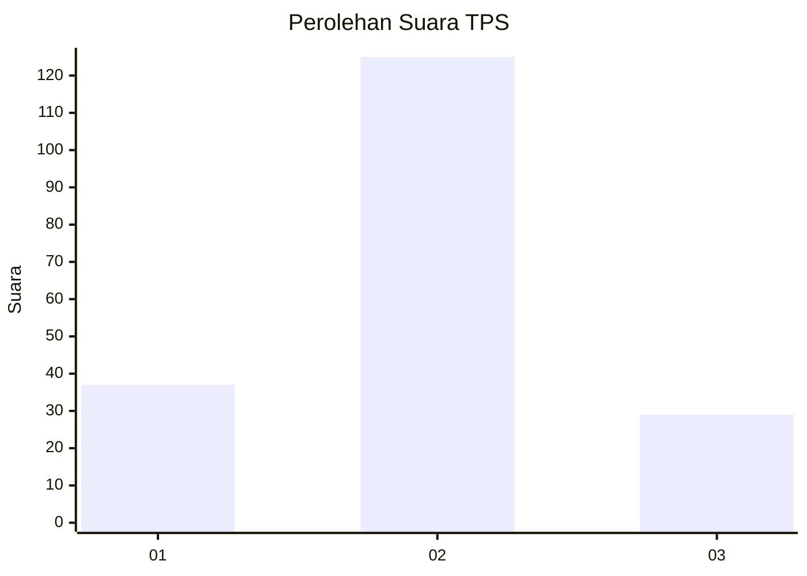
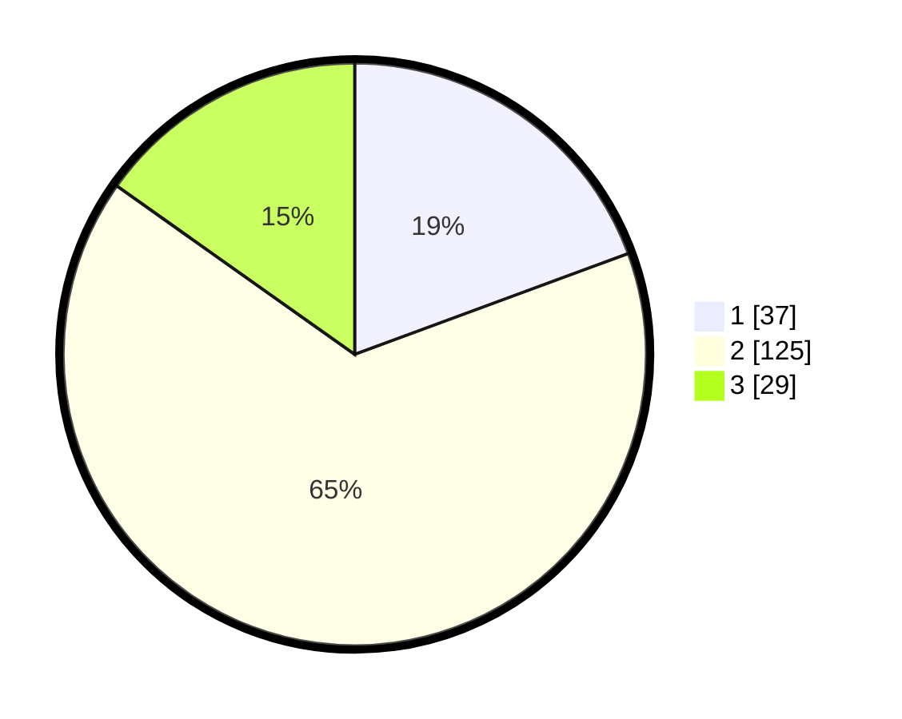

# Hasil

## Grafik

## Tabel

| No. | Nama Paslon    | Suara | Suara (raw) | Persentase |
|:--- |:-------------- | -----:| -----------:| ----------:|
| 1   | ANIES MUHAIMIN | 37    | [37][p-1]   | 19,37      |
| 2   | PRABOWO GIBRAN | 125   | [125][p-2]  | 65,45      |
| 3   | GANJAR MAHFUD  | 29    | [29][p-3]   | 15,18      |

[p-1]: https://github.com/gigit-pemilu/pemilu-2024-35-jawa-timur/blob/main/pilpres/hitung-suara/sub/35-jawa-timur/sub/03-trenggalek/sub/13-durenan/sub/2011-kamulan/sub/004-tps/sub/paslon-1.txt
[p-2]: https://github.com/gigit-pemilu/pemilu-2024-35-jawa-timur/blob/main/pilpres/hitung-suara/sub/35-jawa-timur/sub/03-trenggalek/sub/13-durenan/sub/2011-kamulan/sub/004-tps/sub/paslon-2.txt
[p-3]: https://github.com/gigit-pemilu/pemilu-2024-35-jawa-timur/blob/main/pilpres/hitung-suara/sub/35-jawa-timur/sub/03-trenggalek/sub/13-durenan/sub/2011-kamulan/sub/004-tps/sub/paslon-3.txt

## Foto C Plano

https://sirekap-obj-formc.kpu.go.id/38ab/pemilu/ppwp/35/03/13/20/11/3503132011004-20240214-193005--a9d2f5a1-f747-439b-b4da-32827d983a60.jpg

https://sirekap-obj-formc.kpu.go.id/38ab/pemilu/ppwp/35/03/13/20/11/3503132011004-20240214-193107--522ea436-0081-4322-ab40-aac6579dbaf9.jpg

https://sirekap-obj-formc.kpu.go.id/38ab/pemilu/ppwp/35/03/13/20/11/3503132011004-20240214-193239--9db85732-ff98-44c7-aba7-54584d411b10.jpg

## Metadata

| Key        | Value               |
| ---------- | ------------------- |
| Time Stamp | 2024-02-14 21:46:01 |

