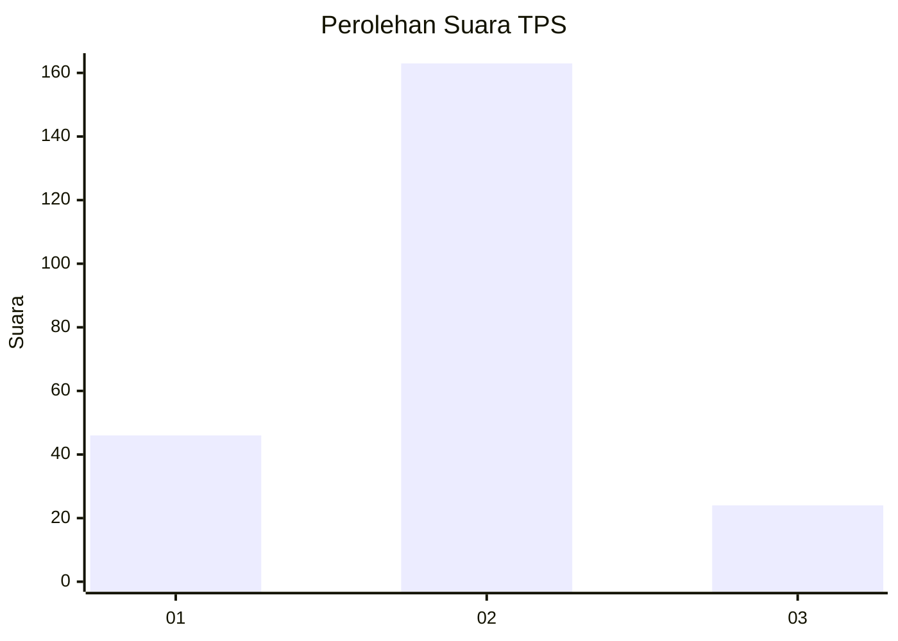
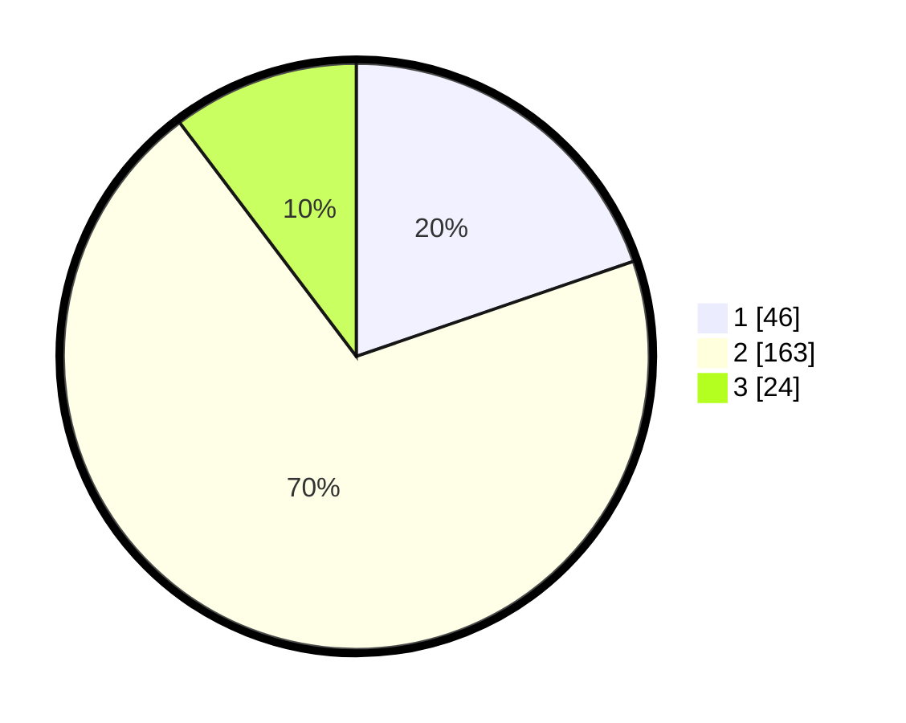

# Hasil

## Grafik

## Tabel

| No. | Nama Paslon    | Suara | Suara (raw) | Persentase |
|:--- |:-------------- | -----:| -----------:| ----------:|
| 1   | ANIES MUHAIMIN | 46    | [46][p-1]   | 19,74      |
| 2   | PRABOWO GIBRAN | 163   | [163][p-2]  | 69,96      |
| 3   | GANJAR MAHFUD  | 24    | [24][p-3]   | 10,30      |

[p-1]: https://github.com/gigit-pemilu/pemilu-2024/blob/main/pilpres/hitung-suara/sub/35-jawa-timur/sub/03-trenggalek/sub/13-durenan/sub/2013-baruharjo/sub/001-tps/sub/paslon-1.txt
[p-2]: https://github.com/gigit-pemilu/pemilu-2024/blob/main/pilpres/hitung-suara/sub/35-jawa-timur/sub/03-trenggalek/sub/13-durenan/sub/2013-baruharjo/sub/001-tps/sub/paslon-2.txt
[p-3]: https://github.com/gigit-pemilu/pemilu-2024/blob/main/pilpres/hitung-suara/sub/35-jawa-timur/sub/03-trenggalek/sub/13-durenan/sub/2013-baruharjo/sub/001-tps/sub/paslon-3.txt

## Foto C Plano

https://sirekap-obj-formc.kpu.go.id/8e34/pemilu/ppwp/35/03/13/20/13/3503132013001-20240214-221009--75f7f1e9-5bfd-4982-ae83-8ba1e7fe3b98.jpg

https://sirekap-obj-formc.kpu.go.id/8e34/pemilu/ppwp/35/03/13/20/13/3503132013001-20240214-155412--87fda691-6338-49cf-9eff-29ed53b32e9a.jpg

https://sirekap-obj-formc.kpu.go.id/8e34/pemilu/ppwp/35/03/13/20/13/3503132013001-20240214-190136--b9b3e90c-1d43-4bfd-a0c4-a5c808e1743d.jpg

## Metadata

| Key        | Value               |
| ---------- | ------------------- |
| Time Stamp | 2024-02-15 21:01:18 |

