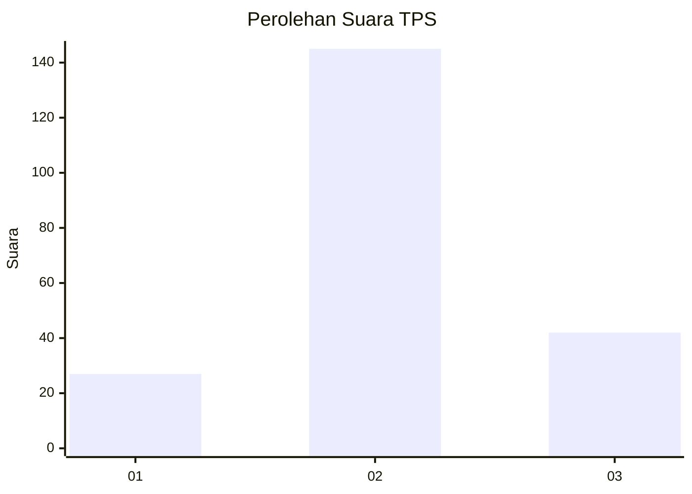
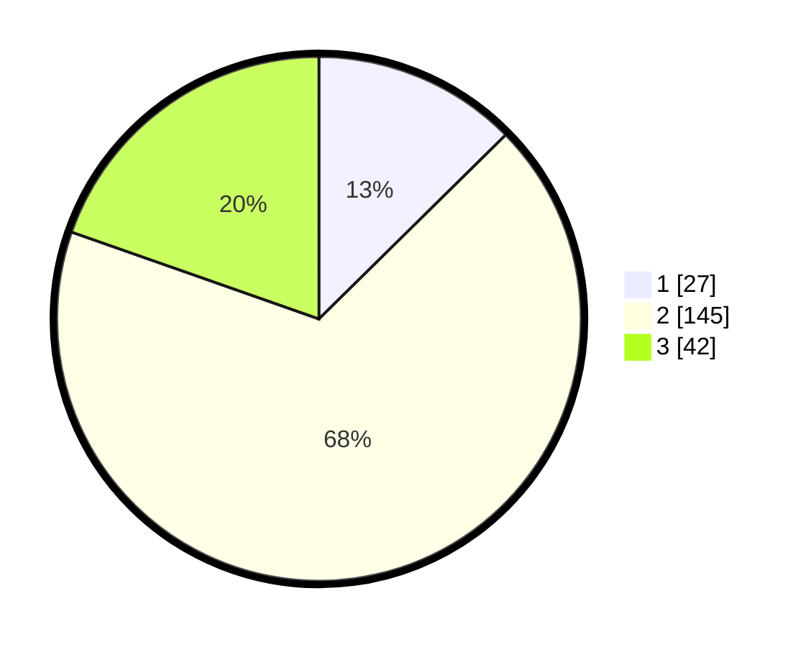

# Hasil

## Grafik

## Tabel

| No. | Nama Paslon    | Suara | Suara (raw) | Persentase |
|:--- |:-------------- | -----:| -----------:| ----------:|
| 1   | ANIES MUHAIMIN | 27    | [27][p-1]   | 12,62      |
| 2   | PRABOWO GIBRAN | 145   | [145][p-2]  | 67,76      |
| 3   | GANJAR MAHFUD  | 42    | [42][p-3]   | 19,63      |

[p-1]: https://github.com/gigit-pemilu/pemilu-2024/blob/main/pilpres/hitung-suara/sub/35-jawa-timur/sub/03-trenggalek/sub/13-durenan/sub/2013-baruharjo/sub/003-tps/sub/paslon-1.txt
[p-2]: https://github.com/gigit-pemilu/pemilu-2024/blob/main/pilpres/hitung-suara/sub/35-jawa-timur/sub/03-trenggalek/sub/13-durenan/sub/2013-baruharjo/sub/003-tps/sub/paslon-2.txt
[p-3]: https://github.com/gigit-pemilu/pemilu-2024/blob/main/pilpres/hitung-suara/sub/35-jawa-timur/sub/03-trenggalek/sub/13-durenan/sub/2013-baruharjo/sub/003-tps/sub/paslon-3.txt

## Foto C Plano

https://sirekap-obj-formc.kpu.go.id/2438/pemilu/ppwp/35/03/13/20/13/3503132013003-20240215-095054--140e808d-9fe1-4805-81bf-d78e0362a893.jpg

https://sirekap-obj-formc.kpu.go.id/2438/pemilu/ppwp/35/03/13/20/13/3503132013003-20240215-095324--681e8e31-b607-4032-a77e-dba40885c8e9.jpg

https://sirekap-obj-formc.kpu.go.id/2438/pemilu/ppwp/35/03/13/20/13/3503132013003-20240215-095416--c283b8d1-14c1-49de-a650-613ea9c45677.jpg

## Metadata

| Key        | Value               |
| ---------- | ------------------- |
| Time Stamp | 2024-02-15 21:30:27 |

