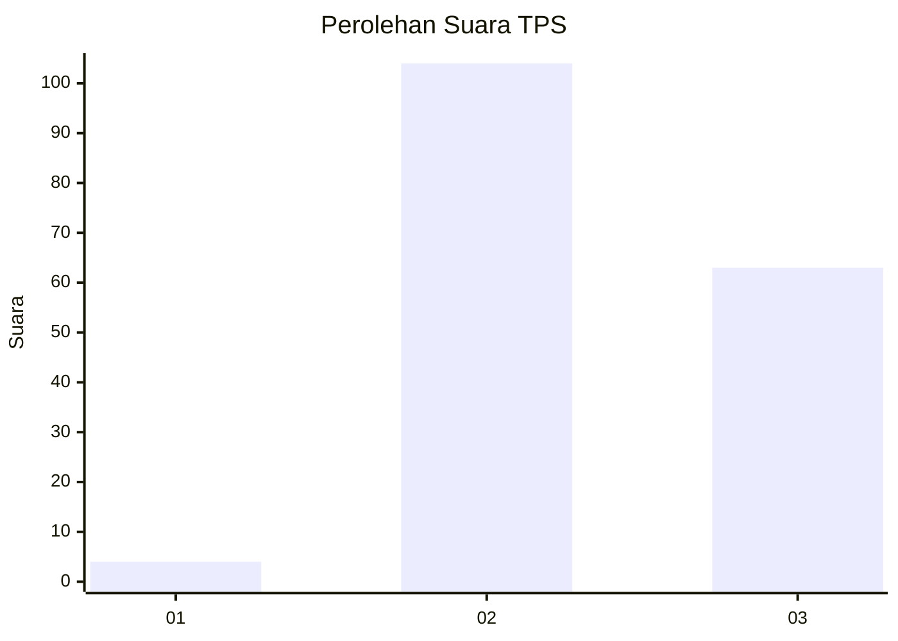
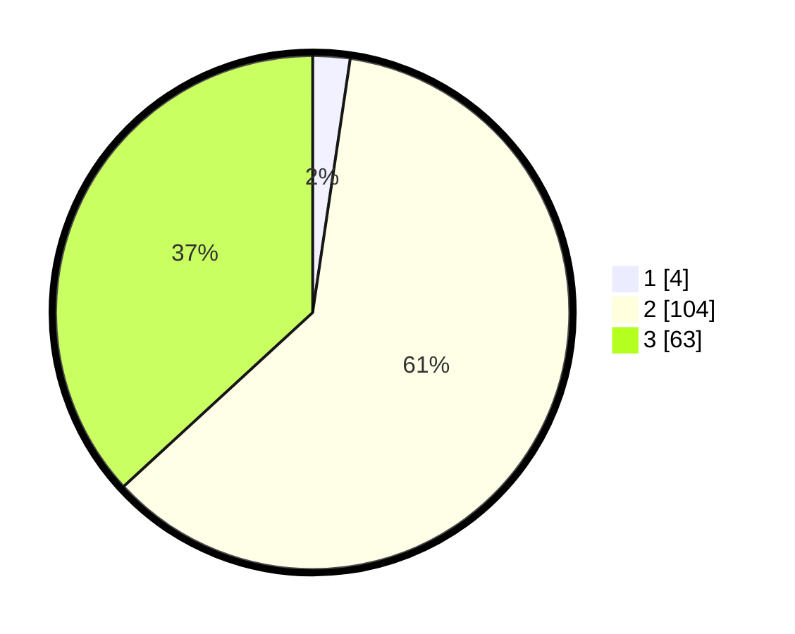

# Hasil

## Grafik

## Tabel

| No. | Nama Paslon    | Suara | Suara (raw) | Persentase |
|:--- |:-------------- | -----:| -----------:| ----------:|
| 1   | ANIES MUHAIMIN | 4     | [4][p-1]    | 2,34       |
| 2   | PRABOWO GIBRAN | 104   | [104][p-2]  | 60,82      |
| 3   | GANJAR MAHFUD  | 63    | [63][p-3]   | 36,84      |

[p-1]: https://github.com/gigit-pemilu/pemilu-2024/blob/main/pilpres/hitung-suara/sub/35-jawa-timur/sub/03-trenggalek/sub/14-suruh/sub/2001-puru/sub/006-tps/sub/paslon-1.txt
[p-2]: https://github.com/gigit-pemilu/pemilu-2024/blob/main/pilpres/hitung-suara/sub/35-jawa-timur/sub/03-trenggalek/sub/14-suruh/sub/2001-puru/sub/006-tps/sub/paslon-2.txt
[p-3]: https://github.com/gigit-pemilu/pemilu-2024/blob/main/pilpres/hitung-suara/sub/35-jawa-timur/sub/03-trenggalek/sub/14-suruh/sub/2001-puru/sub/006-tps/sub/paslon-3.txt

## Foto C Plano

https://sirekap-obj-formc.kpu.go.id/585f/pemilu/ppwp/35/03/14/20/01/3503142001006-20240308-143301--d38b8d36-c53e-42a9-b32c-b719783892cf.jpg

https://sirekap-obj-formc.kpu.go.id/585f/pemilu/ppwp/35/03/14/20/01/3503142001006-20240217-111828--fd62b0ef-a883-4ac0-b6ed-59facb1601ef.jpg

https://sirekap-obj-formc.kpu.go.id/585f/pemilu/ppwp/35/03/14/20/01/3503142001006-20240217-123554--9e3579fc-7b12-4359-b57e-b0db4e793061.jpg

## Metadata

| Key        | Value               |
| ---------- | ------------------- |
| Time Stamp | 2024-03-08 15:00:00 |

