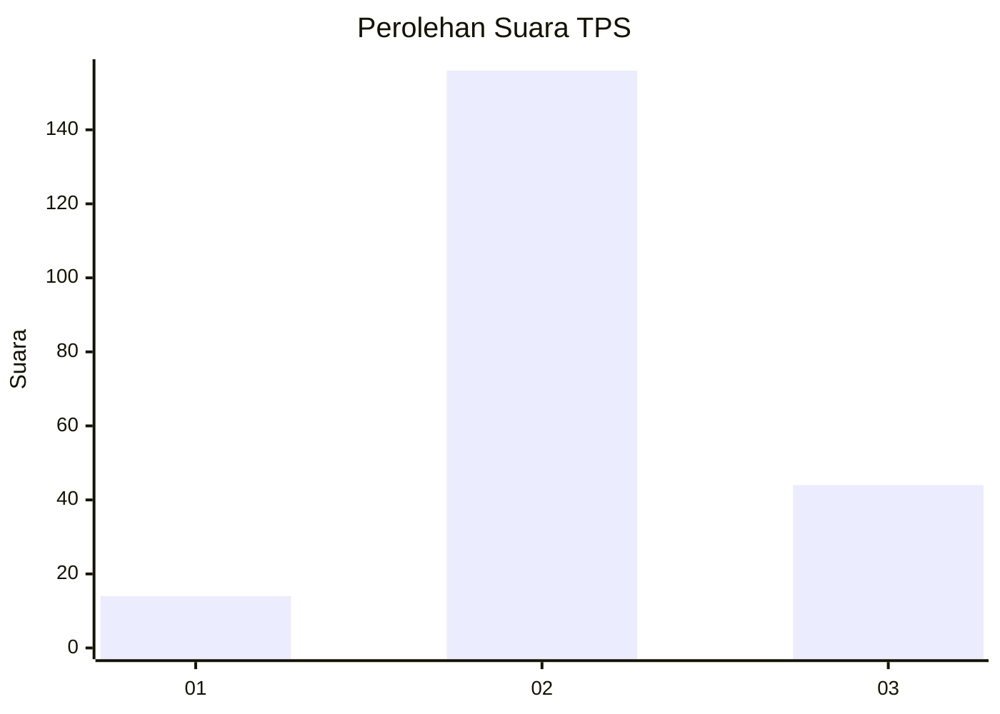

# Hasil

## Grafik

## Tabel

| No. | Nama Paslon    | Suara | Suara (raw) | Persentase |
|:--- |:-------------- | -----:| -----------:| ----------:|
| 1   | ANIES MUHAIMIN | 14    | [14][p-1]   | 6,54       |
| 2   | PRABOWO GIBRAN | 156   | [156][p-2]  | 72,90      |
| 3   | GANJAR MAHFUD  | 44    | [44][p-3]   | 20,56      |

[p-1]: https://github.com/gigit-pemilu/pemilu-2024/blob/main/pilpres/hitung-suara/sub/35-jawa-timur/sub/03-trenggalek/sub/14-suruh/sub/2002-wonokerto/sub/002-tps/sub/paslon-1.txt
[p-2]: https://github.com/gigit-pemilu/pemilu-2024/blob/main/pilpres/hitung-suara/sub/35-jawa-timur/sub/03-trenggalek/sub/14-suruh/sub/2002-wonokerto/sub/002-tps/sub/paslon-2.txt
[p-3]: https://github.com/gigit-pemilu/pemilu-2024/blob/main/pilpres/hitung-suara/sub/35-jawa-timur/sub/03-trenggalek/sub/14-suruh/sub/2002-wonokerto/sub/002-tps/sub/paslon-3.txt

## Foto C Plano

https://sirekap-obj-formc.kpu.go.id/e45d/pemilu/ppwp/35/03/14/20/02/3503142002002-20240216-110616--a7ce31b3-6661-43b3-9d4e-4fae4caff8eb.jpg

https://sirekap-obj-formc.kpu.go.id/e45d/pemilu/ppwp/35/03/14/20/02/3503142002002-20240216-132032--6f78fdec-ae7e-4a0a-84ae-ecd09d26c2c4.jpg

https://sirekap-obj-formc.kpu.go.id/e45d/pemilu/ppwp/35/03/14/20/02/3503142002002-20240216-113353--aa7cbea0-7396-4034-8c67-37ad3042ad1d.jpg

## Metadata

| Key        | Value               |
| ---------- | ------------------- |
| Time Stamp | 2024-02-16 21:01:00 |

