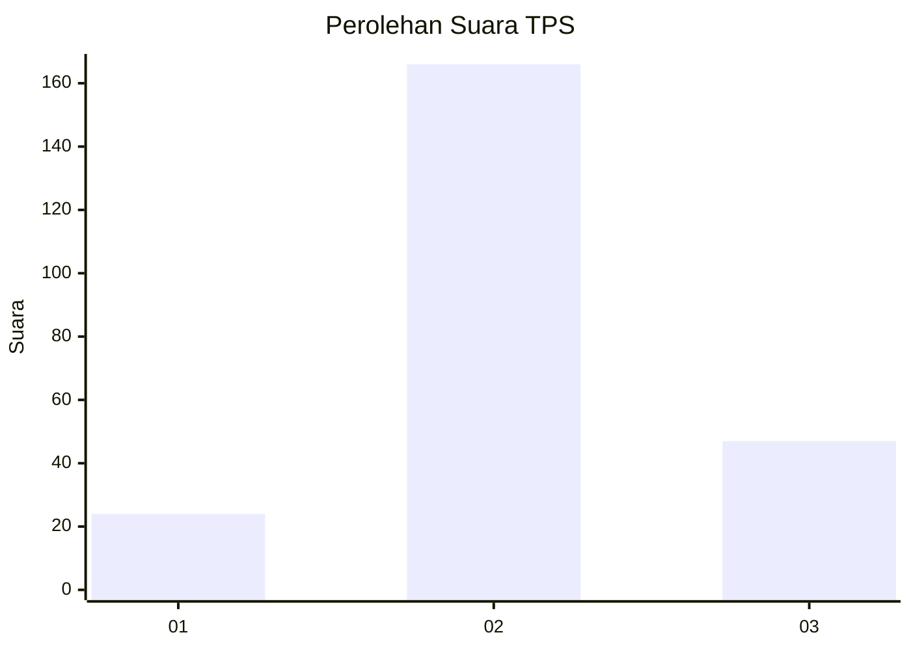
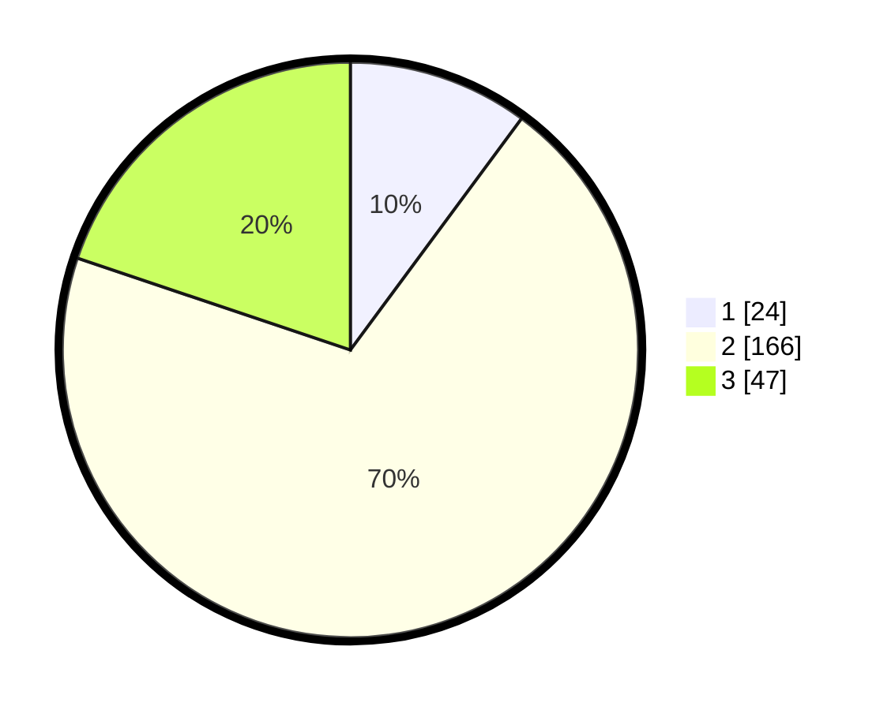

# Hasil

## Grafik

## Tabel

| No. | Nama Paslon    | Suara | Suara (raw) | Persentase |
|:--- |:-------------- | -----:| -----------:| ----------:|
| 1   | ANIES MUHAIMIN | 24    | [24][p-1]   | 10,13      |
| 2   | PRABOWO GIBRAN | 166   | [166][p-2]  | 70,04      |
| 3   | GANJAR MAHFUD  | 47    | [47][p-3]   | 19,83      |

[p-1]: https://github.com/gigit-pemilu/pemilu-2024-35-jawa-timur/blob/main/pilpres/hitung-suara/sub/35-jawa-timur/sub/04-tulungagung/sub/01-tulungagung/sub/1001-kedungsoko/sub/002-tps/sub/paslon-1.txt
[p-2]: https://github.com/gigit-pemilu/pemilu-2024-35-jawa-timur/blob/main/pilpres/hitung-suara/sub/35-jawa-timur/sub/04-tulungagung/sub/01-tulungagung/sub/1001-kedungsoko/sub/002-tps/sub/paslon-2.txt
[p-3]: https://github.com/gigit-pemilu/pemilu-2024-35-jawa-timur/blob/main/pilpres/hitung-suara/sub/35-jawa-timur/sub/04-tulungagung/sub/01-tulungagung/sub/1001-kedungsoko/sub/002-tps/sub/paslon-3.txt

## Foto C Plano

https://sirekap-obj-formc.kpu.go.id/86f8/pemilu/ppwp/35/04/01/10/01/3504011001002-20240216-134933--a4055288-d28c-4481-ad2f-b0f679bbf633.jpg

https://sirekap-obj-formc.kpu.go.id/86f8/pemilu/ppwp/35/04/01/10/01/3504011001002-20240216-134934--cf83c1e1-a6e9-43f5-8b92-f2c794fe9db2.jpg

https://sirekap-obj-formc.kpu.go.id/86f8/pemilu/ppwp/35/04/01/10/01/3504011001002-20240216-134933--fdaf8e13-cc97-43ed-bce8-97b7dfca411e.jpg

## Metadata

| Key        | Value               |
| ---------- | ------------------- |
| Time Stamp | 2024-02-16 22:01:00 |

## DATA PEMILIH TETAP

Jumlah pemilih dalam DPT: **261**.
 * L: **128**.
 * P: **133**.

## DATA PENGGUNA HAK PILIH

Jumlah pengguna hak pilih dalam DPT: **235**.
 * L: **110**.
 * P: **125**.

Jumlah pengguna hak pilih dalam DPTb: **2**.
 * L: **1**.
 * P: **1**.

Jumlah pengguna hak pilih dalam DPK: **2**.
 * L: **0**.
 * P: **2**.

Jumlah pengguna hak pilih: **239**.
 * L: **111**.
 * P: **128**.

## JUMLAH SUARA SAH DAN TIDAK SAH

JUMLAH SELURUH SUARA SAH: **237**.

JUMLAH SUARA TIDAK SAH: **2**.

JUMLAH SELURUH SUARA SAH DAN SUARA TIDAK SAH: **239**.

