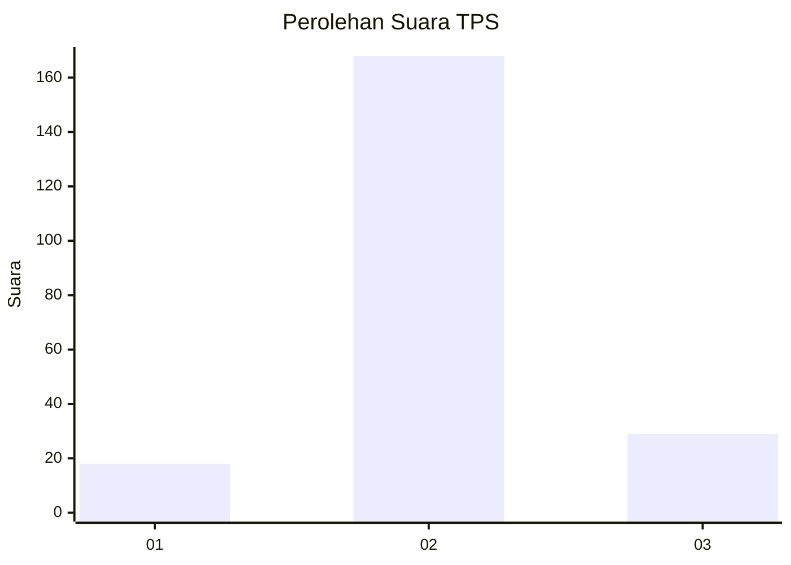
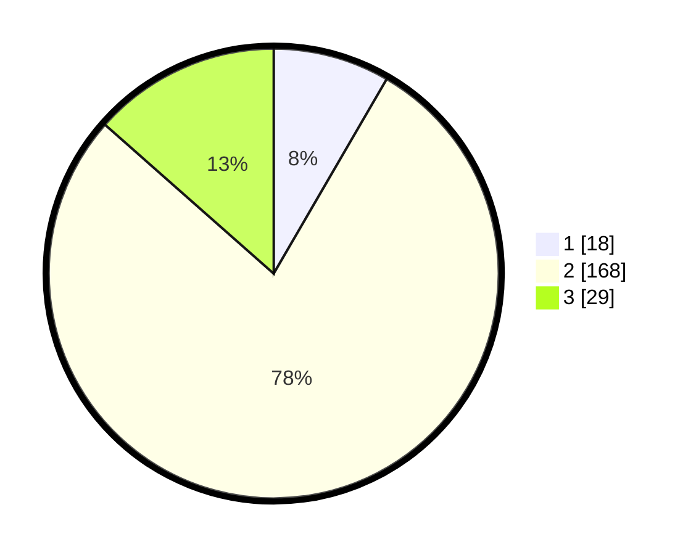

# Hasil

## Grafik

## Tabel

| No. | Nama Paslon    | Suara | Suara (raw) | Persentase |
|:--- |:-------------- | -----:| -----------:| ----------:|
| 1   | ANIES MUHAIMIN | 18    | [18][p-1]   | 8,37       |
| 2   | PRABOWO GIBRAN | 168   | [168][p-2]  | 78,14      |
| 3   | GANJAR MAHFUD  | 29    | [29][p-3]   | 13,49      |

[p-1]: https://github.com/gigit-pemilu/pemilu-2024-35-jawa-timur/blob/main/pilpres/hitung-suara/sub/35-jawa-timur/sub/04-tulungagung/sub/01-tulungagung/sub/1001-kedungsoko/sub/003-tps/sub/paslon-1.txt
[p-2]: https://github.com/gigit-pemilu/pemilu-2024-35-jawa-timur/blob/main/pilpres/hitung-suara/sub/35-jawa-timur/sub/04-tulungagung/sub/01-tulungagung/sub/1001-kedungsoko/sub/003-tps/sub/paslon-2.txt
[p-3]: https://github.com/gigit-pemilu/pemilu-2024-35-jawa-timur/blob/main/pilpres/hitung-suara/sub/35-jawa-timur/sub/04-tulungagung/sub/01-tulungagung/sub/1001-kedungsoko/sub/003-tps/sub/paslon-3.txt

## Foto C Plano

https://sirekap-obj-formc.kpu.go.id/9251/pemilu/ppwp/35/04/01/10/01/3504011001003-20240216-062733--305cf8a2-db8a-4c5e-aea4-a3efd8bd55f3.jpg

https://sirekap-obj-formc.kpu.go.id/9251/pemilu/ppwp/35/04/01/10/01/3504011001003-20240216-062735--53a32e32-1491-4ff0-8f72-5f4e5fa7aae5.jpg

https://sirekap-obj-formc.kpu.go.id/9251/pemilu/ppwp/35/04/01/10/01/3504011001003-20240216-062734--71daa5a6-a56c-4328-b5f7-ba238e04f45c.jpg

## Metadata

| Key        | Value               |
| ---------- | ------------------- |
| Time Stamp | 2024-02-21 21:00:04 |

## DATA PEMILIH TETAP

Jumlah pemilih dalam DPT: **258**.
 * L: **127**.
 * P: **131**.

## DATA PENGGUNA HAK PILIH

Jumlah pengguna hak pilih dalam DPT: **222**.
 * L: **105**.
 * P: **117**.

Jumlah pengguna hak pilih dalam DPTb: **0**.
 * L: **0**.
 * P: **0**.

Jumlah pengguna hak pilih dalam DPK: **0**.
 * L: **0**.
 * P: **0**.

Jumlah pengguna hak pilih: **222**.
 * L: **105**.
 * P: **117**.

## JUMLAH SUARA SAH DAN TIDAK SAH

JUMLAH SELURUH SUARA SAH: **215**.

JUMLAH SUARA TIDAK SAH: **7**.

JUMLAH SELURUH SUARA SAH DAN SUARA TIDAK SAH: **222**.

