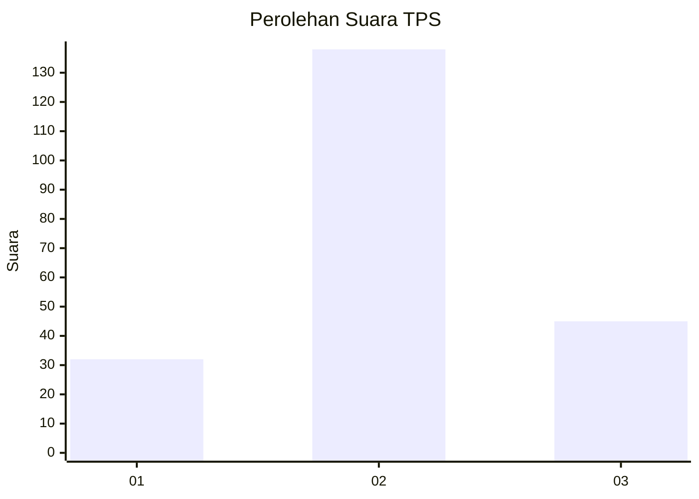
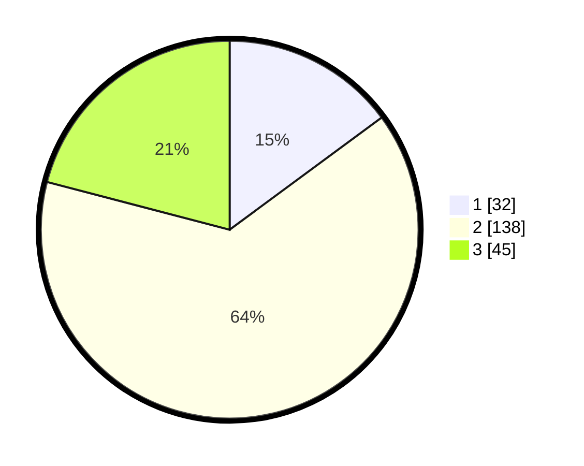

# Hasil

## Grafik

## Tabel

| No. | Nama Paslon    | Suara | Suara (raw) | Persentase |
|:--- |:-------------- | -----:| -----------:| ----------:|
| 1   | ANIES MUHAIMIN | 32    | [32][p-1]   | 14,88      |
| 2   | PRABOWO GIBRAN | 138   | [138][p-2]  | 64,19      |
| 3   | GANJAR MAHFUD  | 45    | [45][p-3]   | 20,93      |

[p-1]: https://github.com/gigit-pemilu/pemilu-2024-35-jawa-timur/blob/main/pilpres/hitung-suara/sub/35-jawa-timur/sub/04-tulungagung/sub/01-tulungagung/sub/1001-kedungsoko/sub/004-tps/sub/paslon-1.txt
[p-2]: https://github.com/gigit-pemilu/pemilu-2024-35-jawa-timur/blob/main/pilpres/hitung-suara/sub/35-jawa-timur/sub/04-tulungagung/sub/01-tulungagung/sub/1001-kedungsoko/sub/004-tps/sub/paslon-2.txt
[p-3]: https://github.com/gigit-pemilu/pemilu-2024-35-jawa-timur/blob/main/pilpres/hitung-suara/sub/35-jawa-timur/sub/04-tulungagung/sub/01-tulungagung/sub/1001-kedungsoko/sub/004-tps/sub/paslon-3.txt

## Foto C Plano

https://sirekap-obj-formc.kpu.go.id/8240/pemilu/ppwp/35/04/01/10/01/3504011001004-20240214-155513--366716c7-faf2-4fa9-9110-6be610e9c0e5.jpg

https://sirekap-obj-formc.kpu.go.id/8240/pemilu/ppwp/35/04/01/10/01/3504011001004-20240214-155611--ec802b91-fc71-41bb-b5d6-72c831d16ddd.jpg

https://sirekap-obj-formc.kpu.go.id/8240/pemilu/ppwp/35/04/01/10/01/3504011001004-20240214-155708--be9c31d6-e675-4439-9bfd-e1fc435c2d00.jpg

## Metadata

| Key        | Value               |
| ---------- | ------------------- |
| Time Stamp | 2024-02-15 12:00:28 |

## DATA PEMILIH TETAP

Jumlah pemilih dalam DPT: **259**.
 * L: **129**.
 * P: **130**.

## DATA PENGGUNA HAK PILIH

Jumlah pengguna hak pilih dalam DPT: **223**.
 * L: **105**.
 * P: **118**.

Jumlah pengguna hak pilih dalam DPTb: **0**.
 * L: **0**.
 * P: **0**.

Jumlah pengguna hak pilih dalam DPK: **0**.
 * L: **0**.
 * P: **0**.

Jumlah pengguna hak pilih: **223**.
 * L: **105**.
 * P: **118**.

## JUMLAH SUARA SAH DAN TIDAK SAH

JUMLAH SELURUH SUARA SAH: **215**.

JUMLAH SUARA TIDAK SAH: **8**.

JUMLAH SELURUH SUARA SAH DAN SUARA TIDAK SAH: **223**.

