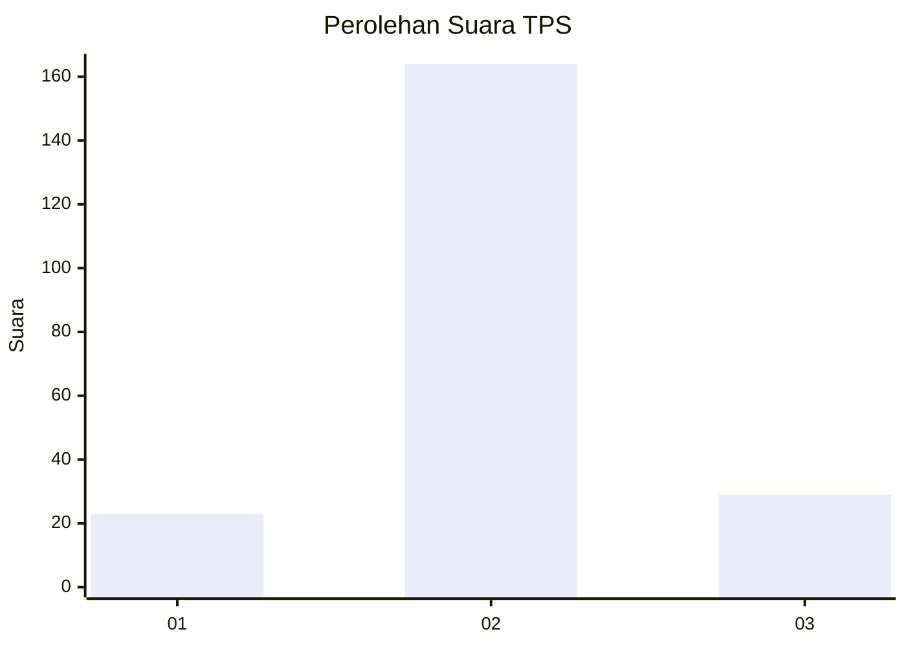
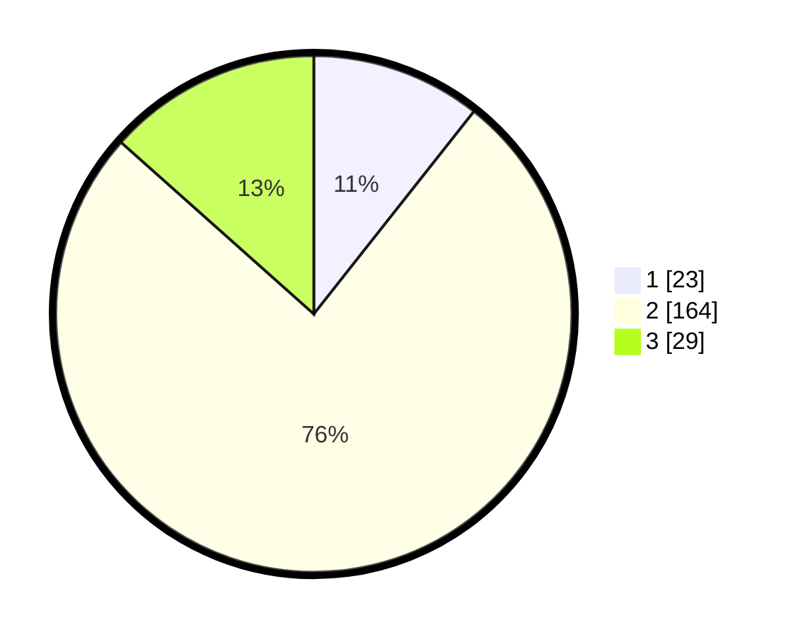

# Hasil

## Grafik

## Tabel

| No. | Nama Paslon    | Suara | Suara (raw) | Persentase |
|:--- |:-------------- | -----:| -----------:| ----------:|
| 1   | ANIES MUHAIMIN | 23    | [23][p-1]   | 10,65      |
| 2   | PRABOWO GIBRAN | 164   | [164][p-2]  | 75,93      |
| 3   | GANJAR MAHFUD  | 29    | [29][p-3]   | 13,43      |

[p-1]: https://github.com/gigit-pemilu/pemilu-2024-35-jawa-timur/blob/main/pilpres/hitung-suara/sub/35-jawa-timur/sub/04-tulungagung/sub/01-tulungagung/sub/1001-kedungsoko/sub/005-tps/sub/paslon-1.txt
[p-2]: https://github.com/gigit-pemilu/pemilu-2024-35-jawa-timur/blob/main/pilpres/hitung-suara/sub/35-jawa-timur/sub/04-tulungagung/sub/01-tulungagung/sub/1001-kedungsoko/sub/005-tps/sub/paslon-2.txt
[p-3]: https://github.com/gigit-pemilu/pemilu-2024-35-jawa-timur/blob/main/pilpres/hitung-suara/sub/35-jawa-timur/sub/04-tulungagung/sub/01-tulungagung/sub/1001-kedungsoko/sub/005-tps/sub/paslon-3.txt

## Foto C Plano

https://sirekap-obj-formc.kpu.go.id/780d/pemilu/ppwp/35/04/01/10/01/3504011001005-20240215-222338--e56b7948-86e5-45e0-a528-599765c2660d.jpg

https://sirekap-obj-formc.kpu.go.id/780d/pemilu/ppwp/35/04/01/10/01/3504011001005-20240215-222340--cd9eea04-cce9-429a-a9db-98dd816d5864.jpg

https://sirekap-obj-formc.kpu.go.id/780d/pemilu/ppwp/35/04/01/10/01/3504011001005-20240215-222339--c43f4399-4bf6-4794-93a5-1b000fcc5fb2.jpg

## Metadata

| Key        | Value               |
| ---------- | ------------------- |
| Time Stamp | 2024-02-15 23:29:50 |

## DATA PEMILIH TETAP

Jumlah pemilih dalam DPT: **249**.
 * L: **132**.
 * P: **117**.

## DATA PENGGUNA HAK PILIH

Jumlah pengguna hak pilih dalam DPT: **216**.
 * L: **108**.
 * P: **108**.

Jumlah pengguna hak pilih dalam DPTb: **0**.
 * L: **0**.
 * P: **0**.

Jumlah pengguna hak pilih dalam DPK: **4**.
 * L: **2**.
 * P: **2**.

Jumlah pengguna hak pilih: **220**.
 * L: **110**.
 * P: **110**.

## JUMLAH SUARA SAH DAN TIDAK SAH

JUMLAH SELURUH SUARA SAH: **216**.

JUMLAH SUARA TIDAK SAH: **4**.

JUMLAH SELURUH SUARA SAH DAN SUARA TIDAK SAH: **220**.

