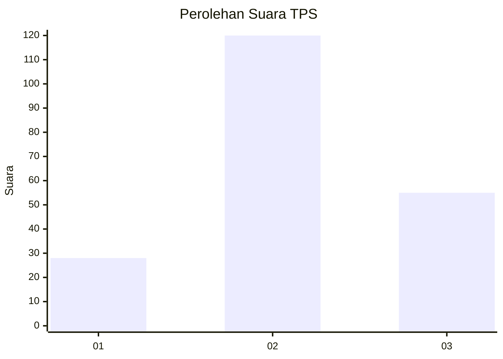
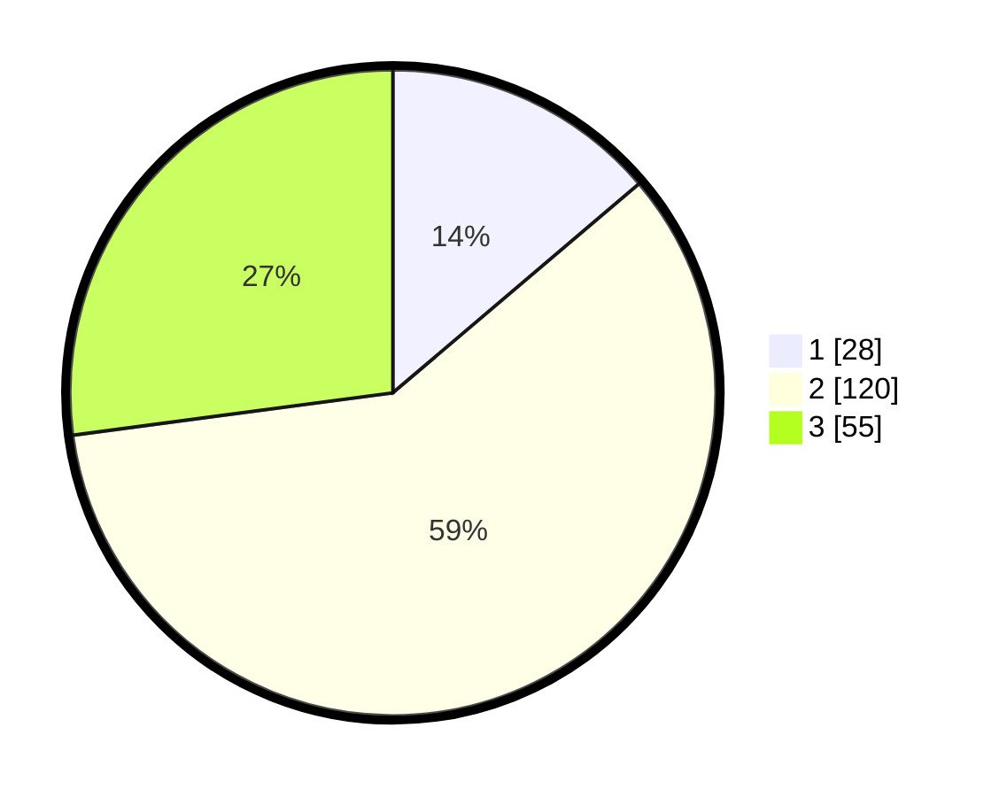

# Hasil

## Grafik

## Tabel

| No. | Nama Paslon    | Suara | Suara (raw) | Persentase |
|:--- |:-------------- | -----:| -----------:| ----------:|
| 1   | ANIES MUHAIMIN | 28    | [28][p-1]   | 13,79      |
| 2   | PRABOWO GIBRAN | 120   | [120][p-2]  | 59,11      |
| 3   | GANJAR MAHFUD  | 55    | [55][p-3]   | 27,09      |

[p-1]: https://github.com/gigit-pemilu/pemilu-2024/blob/main/pilpres/hitung-suara/sub/35-jawa-timur/sub/04-tulungagung/sub/01-tulungagung/sub/1002-tertek/sub/012-tps/sub/paslon-1.txt
[p-2]: https://github.com/gigit-pemilu/pemilu-2024/blob/main/pilpres/hitung-suara/sub/35-jawa-timur/sub/04-tulungagung/sub/01-tulungagung/sub/1002-tertek/sub/012-tps/sub/paslon-2.txt
[p-3]: https://github.com/gigit-pemilu/pemilu-2024/blob/main/pilpres/hitung-suara/sub/35-jawa-timur/sub/04-tulungagung/sub/01-tulungagung/sub/1002-tertek/sub/012-tps/sub/paslon-3.txt

## Foto C Plano

https://sirekap-obj-formc.kpu.go.id/6d7f/pemilu/ppwp/35/04/01/10/02/3504011002012-20240214-234653--25e3865b-5c3b-48d5-9fae-ffa216875d8c.jpg

https://sirekap-obj-formc.kpu.go.id/6d7f/pemilu/ppwp/35/04/01/10/02/3504011002012-20240215-025249--0dc49d57-b00a-4985-bcac-ada7dd104855.jpg

https://sirekap-obj-formc.kpu.go.id/6d7f/pemilu/ppwp/35/04/01/10/02/3504011002012-20240215-025720--3dac9243-a424-4d78-9751-ea007a6e8a1e.jpg

## Metadata

| Key        | Value               |
| ---------- | ------------------- |
| Time Stamp | 2024-02-25 17:00:00 |

