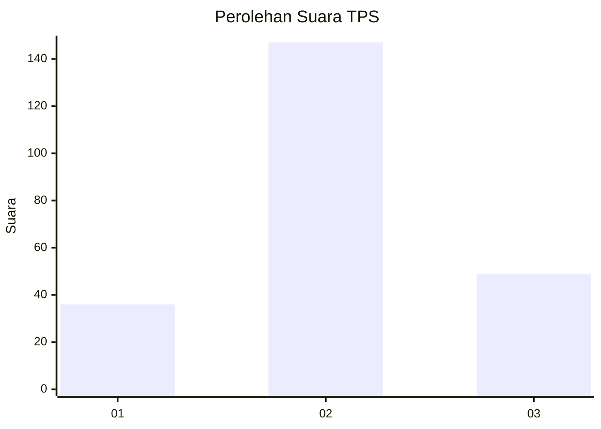
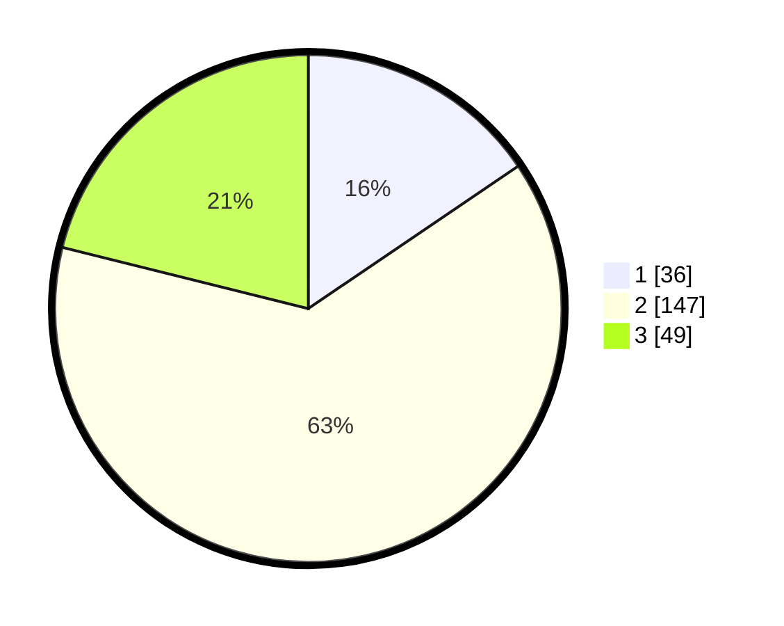

# Hasil

## Grafik

## Tabel

| No. | Nama Paslon    | Suara | Suara (raw) | Persentase |
|:--- |:-------------- | -----:| -----------:| ----------:|
| 1   | ANIES MUHAIMIN | 36    | [36][p-1]   | 15,52      |
| 2   | PRABOWO GIBRAN | 147   | [147][p-2]  | 63,36      |
| 3   | GANJAR MAHFUD  | 49    | [49][p-3]   | 21,12      |

[p-1]: https://github.com/gigit-pemilu/pemilu-2024/blob/main/pilpres/hitung-suara/sub/35-jawa-timur/sub/04-tulungagung/sub/01-tulungagung/sub/1009-kampungdalem/sub/009-tps/sub/paslon-1.txt
[p-2]: https://github.com/gigit-pemilu/pemilu-2024/blob/main/pilpres/hitung-suara/sub/35-jawa-timur/sub/04-tulungagung/sub/01-tulungagung/sub/1009-kampungdalem/sub/009-tps/sub/paslon-2.txt
[p-3]: https://github.com/gigit-pemilu/pemilu-2024/blob/main/pilpres/hitung-suara/sub/35-jawa-timur/sub/04-tulungagung/sub/01-tulungagung/sub/1009-kampungdalem/sub/009-tps/sub/paslon-3.txt

## Foto C Plano

https://sirekap-obj-formc.kpu.go.id/8d13/pemilu/ppwp/35/04/01/10/09/3504011009009-20240214-195504--984c9384-9249-4277-96f0-7a4134483829.jpg

https://sirekap-obj-formc.kpu.go.id/8d13/pemilu/ppwp/35/04/01/10/09/3504011009009-20240214-195704--c6eb4e52-8fa1-40aa-bba5-91460a58971b.jpg

https://sirekap-obj-formc.kpu.go.id/8d13/pemilu/ppwp/35/04/01/10/09/3504011009009-20240216-074050--e4288dcb-99a8-4960-9f8c-a92394fa0198.jpg

## Metadata

| Key        | Value               |
| ---------- | ------------------- |
| Time Stamp | 2024-02-16 08:00:28 |

