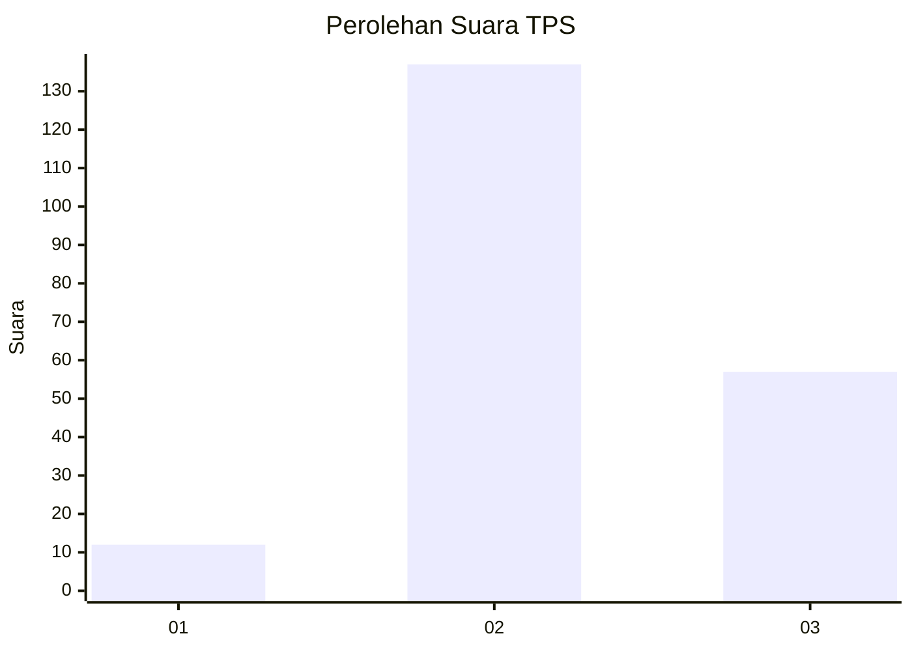

# Hasil

## Grafik

## Tabel

| No. | Nama Paslon    | Suara | Suara (raw) | Persentase |
|:--- |:-------------- | -----:| -----------:| ----------:|
| 1   | ANIES MUHAIMIN | 12    | [12][p-1]   | 5,83       |
| 2   | PRABOWO GIBRAN | 137   | [137][p-2]  | 66,50      |
| 3   | GANJAR MAHFUD  | 57    | [57][p-3]   | 27,67      |

[p-1]: https://github.com/gigit-pemilu/pemilu-2024/blob/main/pilpres/hitung-suara/sub/35-jawa-timur/sub/04-tulungagung/sub/02-boyolangu/sub/2001-wajak-kidul/sub/002-tps/sub/paslon-1.txt
[p-2]: https://github.com/gigit-pemilu/pemilu-2024/blob/main/pilpres/hitung-suara/sub/35-jawa-timur/sub/04-tulungagung/sub/02-boyolangu/sub/2001-wajak-kidul/sub/002-tps/sub/paslon-2.txt
[p-3]: https://github.com/gigit-pemilu/pemilu-2024/blob/main/pilpres/hitung-suara/sub/35-jawa-timur/sub/04-tulungagung/sub/02-boyolangu/sub/2001-wajak-kidul/sub/002-tps/sub/paslon-3.txt

## Foto C Plano

https://sirekap-obj-formc.kpu.go.id/d76b/pemilu/ppwp/35/04/02/20/01/3504022001002-20240214-191428--14e86a63-d12b-4773-aa3b-5f1332f4800e.jpg

https://sirekap-obj-formc.kpu.go.id/d76b/pemilu/ppwp/35/04/02/20/01/3504022001002-20240214-191505--89686dab-3544-4c3d-8b4c-0301c89c5c4a.jpg

https://sirekap-obj-formc.kpu.go.id/d76b/pemilu/ppwp/35/04/02/20/01/3504022001002-20240214-191924--80d8c616-6e22-44c3-8380-0d2d7b16469e.jpg

## Metadata

| Key        | Value               |
| ---------- | ------------------- |
| Time Stamp | 2024-02-14 21:46:01 |

## DATA PEMILIH TETAP

Jumlah pemilih dalam DPT: **253**.
 * L: **123**.
 * P: **130**.

## DATA PENGGUNA HAK PILIH

Jumlah pengguna hak pilih dalam DPT: **209**.
 * L: **103**.
 * P: **106**.

Jumlah pengguna hak pilih dalam DPTb: **1**.
 * L: **1**.
 * P: **0**.

Jumlah pengguna hak pilih dalam DPK: **2**.
 * L: **1**.
 * P: **1**.

Jumlah pengguna hak pilih: **212**.
 * L: **105**.
 * P: **107**.

## JUMLAH SUARA SAH DAN TIDAK SAH

JUMLAH SELURUH SUARA SAH: **206**.

JUMLAH SUARA TIDAK SAH: **6**.

JUMLAH SELURUH SUARA SAH DAN SUARA TIDAK SAH: **212**.

