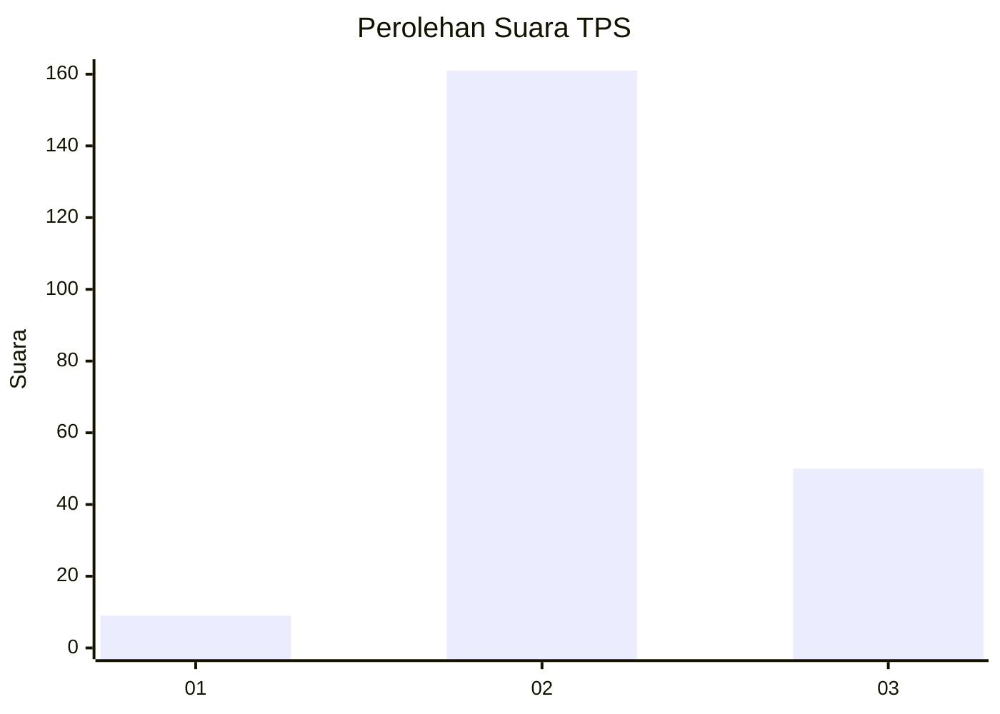
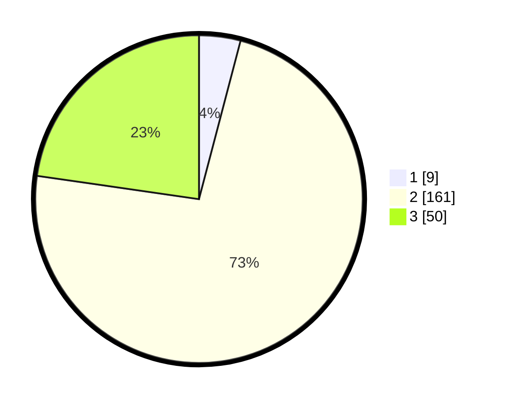

# Hasil

## Grafik

## Tabel

| No. | Nama Paslon    | Suara | Suara (raw) | Persentase |
|:--- |:-------------- | -----:| -----------:| ----------:|
| 1   | ANIES MUHAIMIN | 9     | [9][p-1]    | 4,09       |
| 2   | PRABOWO GIBRAN | 161   | [161][p-2]  | 73,18      |
| 3   | GANJAR MAHFUD  | 50    | [50][p-3]   | 22,73      |

[p-1]: https://github.com/gigit-pemilu/pemilu-2024/blob/main/pilpres/hitung-suara/sub/35-jawa-timur/sub/04-tulungagung/sub/02-boyolangu/sub/2001-wajak-kidul/sub/009-tps/sub/paslon-1.txt
[p-2]: https://github.com/gigit-pemilu/pemilu-2024/blob/main/pilpres/hitung-suara/sub/35-jawa-timur/sub/04-tulungagung/sub/02-boyolangu/sub/2001-wajak-kidul/sub/009-tps/sub/paslon-2.txt
[p-3]: https://github.com/gigit-pemilu/pemilu-2024/blob/main/pilpres/hitung-suara/sub/35-jawa-timur/sub/04-tulungagung/sub/02-boyolangu/sub/2001-wajak-kidul/sub/009-tps/sub/paslon-3.txt

## Foto C Plano

https://sirekap-obj-formc.kpu.go.id/0ace/pemilu/ppwp/35/04/02/20/01/3504022001009-20240214-222740--98e9356e-ee07-488c-8d99-a5ad938aabff.jpg

https://sirekap-obj-formc.kpu.go.id/0ace/pemilu/ppwp/35/04/02/20/01/3504022001009-20240214-222917--6de01de9-2284-4f1e-a171-4b07032ee1fa.jpg

https://sirekap-obj-formc.kpu.go.id/0ace/pemilu/ppwp/35/04/02/20/01/3504022001009-20240214-223108--cb40be01-3352-41aa-88f5-8c7596a2df28.jpg

## Metadata

| Key        | Value               |
| ---------- | ------------------- |
| Time Stamp | 2024-02-16 23:30:00 |

