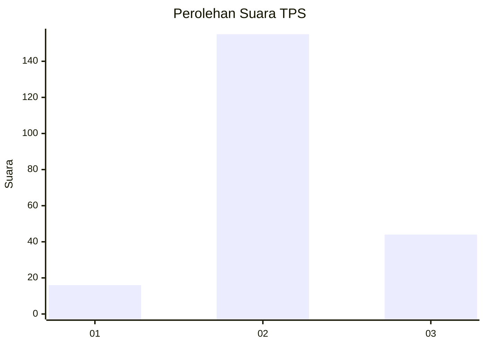

# Hasil

## Grafik

## Tabel

| No. | Nama Paslon    | Suara | Suara (raw) | Persentase |
|:--- |:-------------- | -----:| -----------:| ----------:|
| 1   | ANIES MUHAIMIN | 16    | [16][p-1]   | 7,44       |
| 2   | PRABOWO GIBRAN | 155   | [155][p-2]  | 72,09      |
| 3   | GANJAR MAHFUD  | 44    | [44][p-3]   | 20,47      |

[p-1]: https://github.com/gigit-pemilu/pemilu-2024/blob/main/pilpres/hitung-suara/sub/35-jawa-timur/sub/04-tulungagung/sub/02-boyolangu/sub/2003-pucung-kidul/sub/001-tps/sub/paslon-1.txt
[p-2]: https://github.com/gigit-pemilu/pemilu-2024/blob/main/pilpres/hitung-suara/sub/35-jawa-timur/sub/04-tulungagung/sub/02-boyolangu/sub/2003-pucung-kidul/sub/001-tps/sub/paslon-2.txt
[p-3]: https://github.com/gigit-pemilu/pemilu-2024/blob/main/pilpres/hitung-suara/sub/35-jawa-timur/sub/04-tulungagung/sub/02-boyolangu/sub/2003-pucung-kidul/sub/001-tps/sub/paslon-3.txt

## Foto C Plano

https://sirekap-obj-formc.kpu.go.id/8a02/pemilu/ppwp/35/04/02/20/03/3504022003001-20240214-215108--de762c9e-0045-44ba-9f62-14e883b11762.jpg

https://sirekap-obj-formc.kpu.go.id/8a02/pemilu/ppwp/35/04/02/20/03/3504022003001-20240214-215329--fa2cf89d-a5c0-4455-b28a-12fd6705349a.jpg

https://sirekap-obj-formc.kpu.go.id/8a02/pemilu/ppwp/35/04/02/20/03/3504022003001-20240214-231326--89dfad68-e48a-4a90-be1d-e106b4cb02d7.jpg

## Metadata

| Key        | Value               |
| ---------- | ------------------- |
| Time Stamp | 2024-02-19 06:16:00 |

