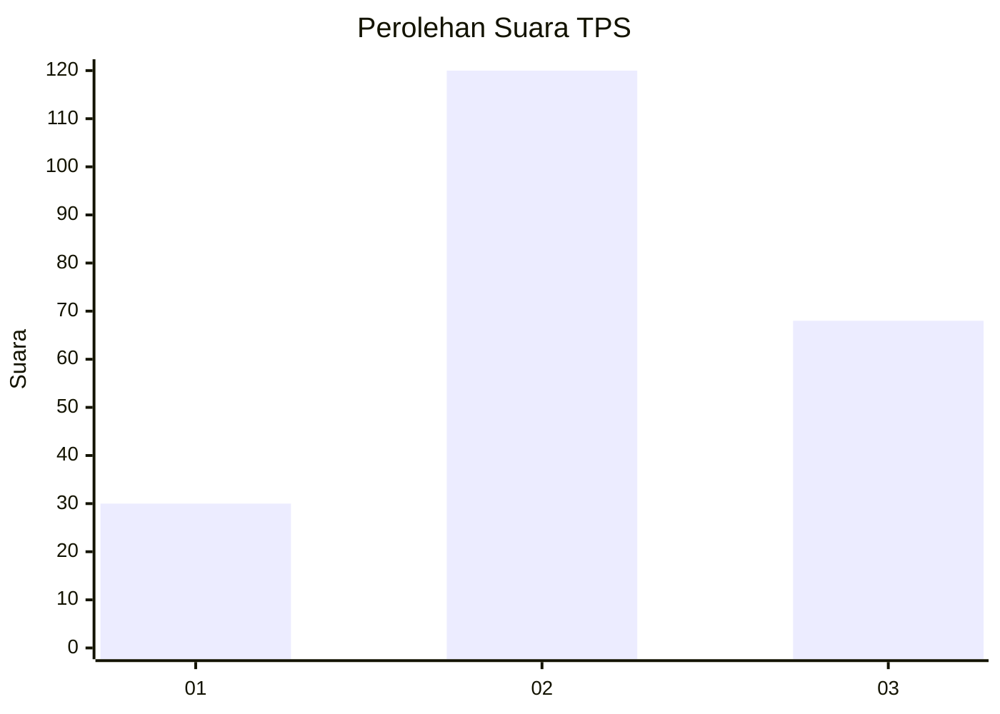
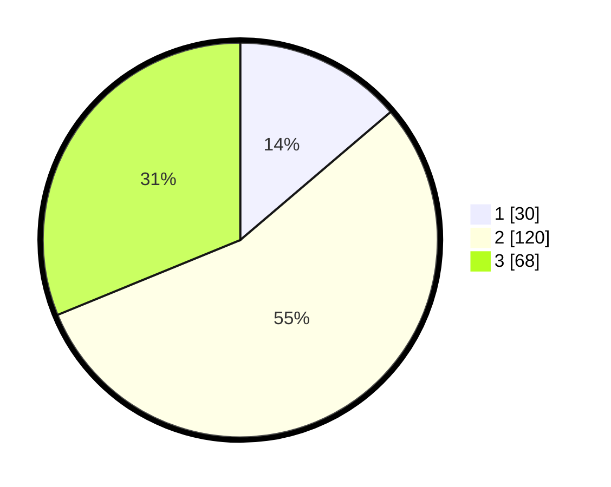

# Hasil

## Grafik

## Tabel

| No. | Nama Paslon    | Suara | Suara (raw) | Persentase |
|:--- |:-------------- | -----:| -----------:| ----------:|
| 1   | ANIES MUHAIMIN | 30    | [30][p-1]   | 13,76      |
| 2   | PRABOWO GIBRAN | 120   | [120][p-2]  | 55,05      |
| 3   | GANJAR MAHFUD  | 68    | [68][p-3]   | 31,19      |

[p-1]: https://github.com/gigit-pemilu/pemilu-2024-35-jawa-timur/blob/main/pilpres/hitung-suara/sub/35-jawa-timur/sub/04-tulungagung/sub/02-boyolangu/sub/2003-pucung-kidul/sub/008-tps/sub/paslon-1.txt
[p-2]: https://github.com/gigit-pemilu/pemilu-2024-35-jawa-timur/blob/main/pilpres/hitung-suara/sub/35-jawa-timur/sub/04-tulungagung/sub/02-boyolangu/sub/2003-pucung-kidul/sub/008-tps/sub/paslon-2.txt
[p-3]: https://github.com/gigit-pemilu/pemilu-2024-35-jawa-timur/blob/main/pilpres/hitung-suara/sub/35-jawa-timur/sub/04-tulungagung/sub/02-boyolangu/sub/2003-pucung-kidul/sub/008-tps/sub/paslon-3.txt

## Foto C Plano

https://sirekap-obj-formc.kpu.go.id/4743/pemilu/ppwp/35/04/02/20/03/3504022003008-20240214-175308--db3b3075-736d-4d6c-bb73-ad48ee5b6d72.jpg

https://sirekap-obj-formc.kpu.go.id/4743/pemilu/ppwp/35/04/02/20/03/3504022003008-20240214-175313--a5ced9bf-ed1d-4abc-b2ab-46f4c97120d4.jpg

https://sirekap-obj-formc.kpu.go.id/4743/pemilu/ppwp/35/04/02/20/03/3504022003008-20240214-175320--7772bbf8-ede4-4ab1-a9ef-e2e3a54b1c35.jpg

## Metadata

| Key        | Value               |
| ---------- | ------------------- |
| Time Stamp | 2024-02-24 22:31:28 |

