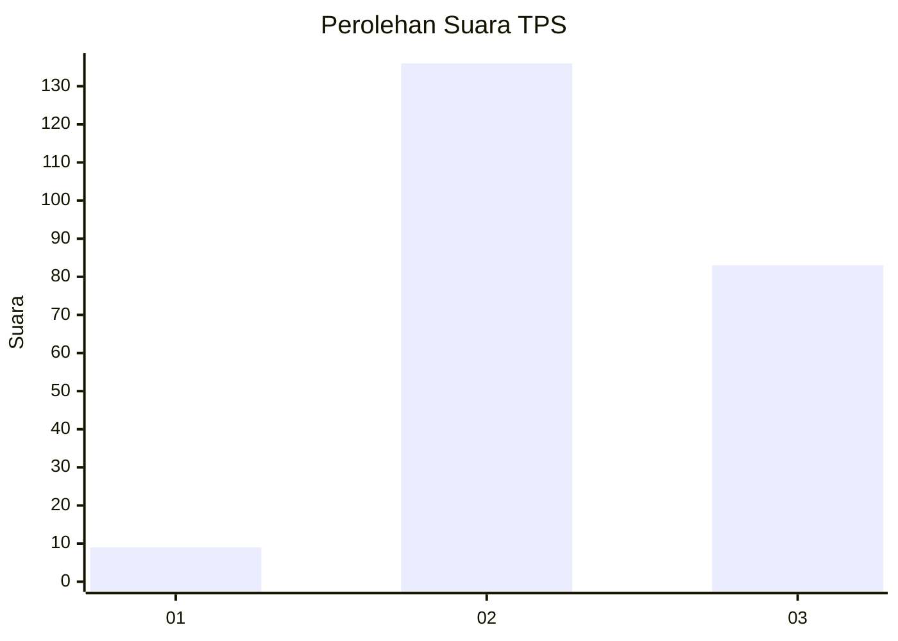
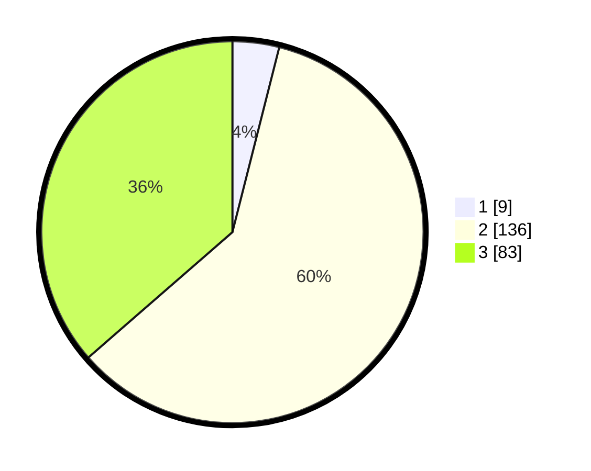

# Hasil

## Grafik

## Tabel

| No. | Nama Paslon    | Suara | Suara (raw) | Persentase |
|:--- |:-------------- | -----:| -----------:| ----------:|
| 1   | ANIES MUHAIMIN | 9     | [9][p-1]    | 3,95       |
| 2   | PRABOWO GIBRAN | 136   | [136][p-2]  | 59,65      |
| 3   | GANJAR MAHFUD  | 83    | [83][p-3]   | 36,40      |

[p-1]: https://github.com/gigit-pemilu/pemilu-2024-35-jawa-timur/blob/main/pilpres/hitung-suara/sub/35-jawa-timur/sub/04-tulungagung/sub/02-boyolangu/sub/2006-kendalbulur/sub/004-tps/sub/paslon-1.txt
[p-2]: https://github.com/gigit-pemilu/pemilu-2024-35-jawa-timur/blob/main/pilpres/hitung-suara/sub/35-jawa-timur/sub/04-tulungagung/sub/02-boyolangu/sub/2006-kendalbulur/sub/004-tps/sub/paslon-2.txt
[p-3]: https://github.com/gigit-pemilu/pemilu-2024-35-jawa-timur/blob/main/pilpres/hitung-suara/sub/35-jawa-timur/sub/04-tulungagung/sub/02-boyolangu/sub/2006-kendalbulur/sub/004-tps/sub/paslon-3.txt

## Foto C Plano

https://sirekap-obj-formc.kpu.go.id/6efe/pemilu/ppwp/35/04/02/20/06/3504022006004-20240215-024836--fbd1af87-445f-4b4c-88d2-c15f6e50584d.jpg

https://sirekap-obj-formc.kpu.go.id/6efe/pemilu/ppwp/35/04/02/20/06/3504022006004-20240215-024956--fc7ec480-d62c-47e6-ba58-583458cd7a0e.jpg

https://sirekap-obj-formc.kpu.go.id/6efe/pemilu/ppwp/35/04/02/20/06/3504022006004-20240215-025117--b1c19f30-e433-4793-be92-db9f5fc457c1.jpg

## Metadata

| Key        | Value               |
| ---------- | ------------------- |
| Time Stamp | 2024-02-24 22:31:28 |

